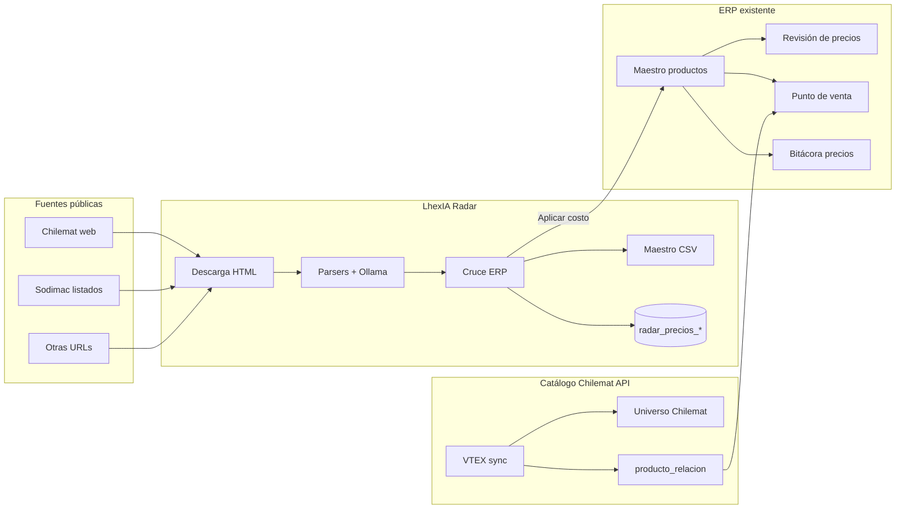
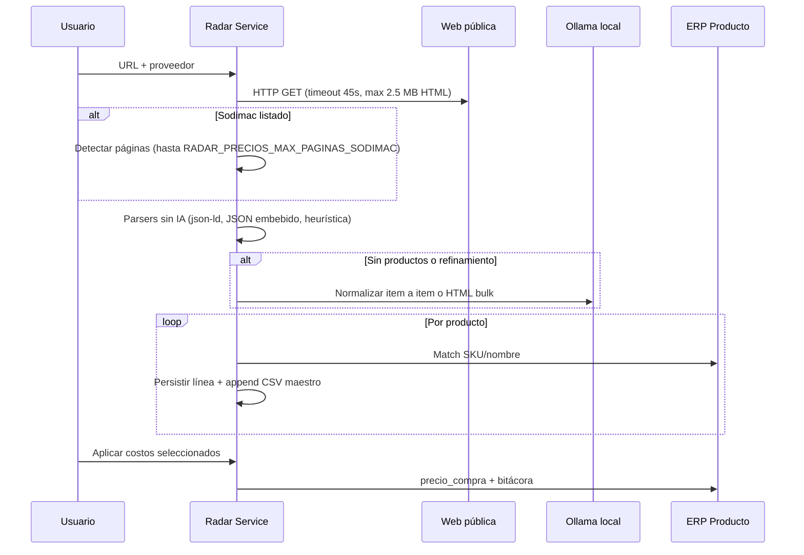
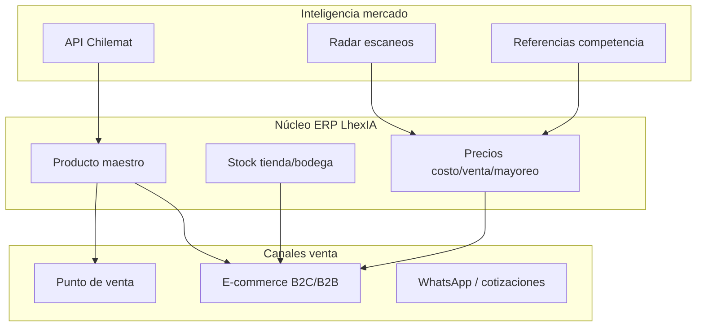

# LhexIA Radar Precios — Documento para el equipo

**Producto:** LhexIA ERP Ferretería (Santo Domingo / LhexIA VERTEX)  
**Módulo:** Radar Precios + ecosistema de precios y catálogo  
**Versión doc:** 2026-05-26  
**Audiencia:** Dueño, compras, pricing, TI — reunión de potenciación y e-commerce  

---

## 1. Resumen ejecutivo (30 segundos)

**LhexIA Radar Precios** es el “radar de mercado” del ERP: toma **enlaces públicos** de catálogos web (Chilemat, Sodimac, Easy, otros), **extrae productos y precios**, los **cruza con el maestro** de productos y permite **actualizar costos de compra** con trazabilidad. Opcionalmente usa **Ollama local** (IA en la PC de la tienda) cuando el HTML no es estructurado.

No es un e-commerce hoy; es la **capa de inteligencia de precios y catálogo externo** que alimenta compras, revisión de márgenes y (a futuro) una tienda online propia.

---

## 2. Problema de negocio que resuelve

| Dolor actual | Qué hace Radar |
|--------------|----------------|
| Precios de proveedor y competencia cambian sin aviso | Escaneo periódico de URLs de listado |
| Costo en ERP desactualizado → margen perdido | Propuesta de `precio_compra` desde web + aplicación selectiva |
| Catálogo web ≠ códigos de factura | Mapeo por código proveedor, código ERP o nombre (con confianza) |
| Incorporar referencias nuevas es lento | CSV maestro acumulado listo para homologación / carga |
| Decisiones de surtido sin referencia externa | Histórico de escaneos + dashboard de riesgo de margen |

**Proveedor principal (~90%):** Chilemat. **Competencia / referencia:** Sodimac y otros retail.

---

## 3. Qué incluye el ecosistema (no solo una pantalla)



| Pieza | Ruta / ubicación | Rol |
|-------|------------------|-----|
| **Radar — escaneo en vivo** | `/precios/radar` | Operador pega URL(s), ve progreso SSE, selecciona líneas y aplica costos |
| **Radar — dashboard** | `/precios/radar/dashboard` | KPIs margen, productos en riesgo, historial de escaneos |
| **Revisión de precios** | `/precios/revision` | Ajuste de **precio de venta** según costo y margen objetivo (complemento natural post-Radar) |
| **Maestro CSV Radar** | `CARGA DE DATOS/radar_maestro_acumulado.csv` | Acumula SKUs vistos en escaneos; formato compatible con carga masiva de productos |
| **Universo Chilemat** | `/compras/chilemat/explorador` | Catálogo oficial VTEX (~4.9k ítems, categorías); no reemplaza Radar en páginas arbitrarias |
| **Sync Chilemat CLI** | `scripts/sync_chilemat_catalogo.py` | Categorías, productos API, relaciones cross-sell, histórico ventas SD |

---

## 4. Funcionalidades actuales (detalle operativo)

### 4.1 Pantalla principal — Escaneo

**URL:** `GET /precios/radar`  
**Permisos:** `radar_precios`, `revision_precios`, `gestionar_usuarios`, `ver_gerencia` (cualquiera de la lista)

**El usuario puede:**

1. Pegar **una o varias URLs** (hasta 10, una por línea).
2. Elegir **proveedor ERP** opcional (mejora el match por `ProductoCodigoProveedor`).
3. Iniciar escaneo → progreso en tiempo real (**Server-Sent Events**, la UI no se congela).
4. Ver tabla con: SKU web, descripción, precio lista CLP, costo actual ERP, delta %, estado de mapeo, confianza.
5. Marcar filas y **aplicar costo de compra** al producto ERP vinculado.
6. Ver estado de **Ollama** (habilitado / disponible / modelo).
7. Consultar **maestro CSV** (total filas, preview API, descarga `radar_maestro_acumulado.csv`).

**Estados de línea:**

| Estado | Significado |
|--------|-------------|
| `mapeado_auto` | Match con confianza ≥ 70% |
| `revisar` | Match débil o ambiguo |
| `sin_match` | No hay producto ERP; igual puede ir al CSV maestro |
| `aplicado` | Costo ya actualizado en esta sesión |

**Métodos de match (orden de prioridad):**

1. Código factura proveedor (`ProductoCodigoProveedor` + `proveedor_id`)
2. Código de barras o código interno ERP exacto
3. Nombre único (ILIKE)
4. Nombre ambiguo (primer candidato, baja confianza)

### 4.2 APIs Radar

| Método | Ruta | Uso |
|--------|------|-----|
| POST | `/api/precios/radar/iniciar` | Crea job async, devuelve `job_id` |
| GET | `/api/precios/radar/ejecutar?url=...` | Crea job + stream SSE en una llamada |
| GET | `/api/precios/radar/stream/<job_id>` | SSE de job existente |
| GET | `/api/precios/radar/estado/<job_id>` | JSON estado + líneas |
| POST | `/api/precios/radar/aplicar` | Aplica costos (`job_id`, `linea_ids`, `motivo`) |
| GET | `/api/precios/radar/ollama` | Health Ollama |
| GET | `/api/precios/radar/maestro` | Estadísticas CSV maestro |
| GET | `/api/precios/radar/maestro/preview` | Paginación preview CSV |
| GET | `/precios/radar/maestro.csv` | Descarga archivo |

### 4.3 Pipeline técnico de extracción



**Parsers nativos (sin IA):**

- `json_ld` — Schema.org Product en la página
- `json_embebido` — Next.js / `__NEXT_DATA__` (optimizado Sodimac)
- `heuristica_html` — Patrones genéricos título + precio CLP

**IA opcional (Ollama en PC tienda):**

- Por ítem: fragmentos de texto → JSON `{sku, nombre, precio}`
- Bulk: HTML recortado → array de productos
- Variable: `RADAR_PRECIOS_OLLAMA_POR_ITEM` (default activo si Ollama disponible)

**Límites de seguridad y rendimiento:**

- No URLs localhost / redes internas
- Máx. **1200 líneas** por job (`RADAR_PRECIOS_MAX_LINEAS`)
- Sodimac: hasta **25 páginas** por URL base (`RADAR_PRECIOS_MAX_PAGINAS_SODIMAC`, configurable hasta 60)
- Deduplicación por SKU dentro del mismo escaneo
- Re-escaneo mismo SKU en CSV maestro → **actualiza** fila, no duplica

### 4.4 Persistencia

**En memoria (sesión del servidor):** jobs activos + historial últimos 30 escaneos.

**PostgreSQL (auto-create al primer uso):**

- `radar_precios_escaneo` — cabecera del escaneo
- `radar_precios_linea` — detalle por producto extraído

**Archivo CSV:**

- Ruta default: `CARGA DE DATOS/radar_maestro_acumulado.csv`
- Override: `RADAR_MAESTRO_CSV_PATH`
- Columnas alineadas con `homologar_productos_excel` (carga masiva): nombre, códigos, precio_compra, stock=0, categoría inferida por dominio (chilemat / sodimac / easy…)

### 4.5 Dashboard premium

**URL:** `/precios/radar/dashboard`

Muestra (sobre muestra de hasta 3000 productos activos):

- Total productos, alertas de margen, sin costo
- “Dinero en riesgo” estimado (top 12 SKUs con margen bajo vs precio sugerido)
- Historial de escaneos (DB o memoria)
- Estado Ollama

### 4.6 Revisión de precios (módulo hermano)

**URL:** `/precios/revision` — permiso `revision_precios`

Radar actualiza **costo** (`precio_compra`). Revisión de precios ajusta **venta** según margen objetivo (default 30%), terminación en 90, filtros categoría/subcategoría, aplicación masiva.

**Flujo recomendado en equipo:**

1. Radar → detectar subidas de lista / competencia  
2. Aplicar costos con confianza alta  
3. Revisión de precios → subir venta donde el margen quedó bajo  

### 4.7 Universo Chilemat (complemento, no duplicado)

| Radar (HTML) | Universo Chilemat (API VTEX) |
|--------------|------------------------------|
| Cualquier URL pública pegada | Catálogo oficial estructurado |
| Precio de la página escaneada | Nombre, categoría, link, VTEX ID |
| Match contra ERP en el acto | Exploración BI; sync relaciones si hay `producto_id` |
| CSV para productos nuevos | Tablas `chilemat_categoria`, `chilemat_vtex_producto` |

**Hoy el cuello de botella común:** códigos de factura (`FERSOL…`, `INT-…`) ≠ `productReference` web → pocos matches automáticos hasta construir tabla de equivalencias.

---

## 5. Configuración (.env)

```env
# Ollama (PC tienda; en Render/prod típicamente OFF)
AGENTE_OLLAMA_ENABLED=1
OLLAMA_BASE_URL=http://127.0.0.1:11434
OLLAMA_MODEL=qwen2.5:7b-instruct-q4_K_M

# Radar
RADAR_PRECIOS_MAX_LINEAS=1200
RADAR_PRECIOS_MAX_PAGINAS_SODIMAC=25
RADAR_PRECIOS_OLLAMA_POR_ITEM=1
RADAR_SSE_TIMEOUT_SEC=3600
RADAR_MAESTRO_CSV_PATH=CARGA DE DATOS/radar_maestro_acumulado.csv
```

---

## 6. Valor de negocio por área

| Área | Valor con Radar bien operado |
|------|------------------------------|
| **Compras** | Lista de referencia actualizada; negociación con datos (delta % vs costo ERP) |
| **Pricing** | Menos productos vendiendo bajo margen; bitácora de cambios de costo |
| **Surtido** | CSV de ítems vistos en web aún no en maestro → pipeline de alta |
| **POS / ventas** | Indirecto vía costos y precios correctos; cross-sell mejora con Chilemat + histórico |
| **Dueño / gerencia** | Dashboard de riesgo + visibilidad de escaneos |

---

## 7. Limitaciones actuales (ser honestos en la reunión)

1. **No hay job nocturno programado** en el ERP — solo script manual o futuro Task Scheduler / cron externo llamando API o CLI.
2. **No actualiza precio de venta automáticamente** — solo costo; venta va por Revisión de precios.
3. **Match automático limitado** si no hay `ProductoCodigoProveedor` cargado para Chilemat.
4. **Sitios con anti-bot fuerte** pueden fallar con HTTP simple; Sodimac tiene parser dedicado; algunos listados requieren Playwright (scripts aparte, no integrados al botón Radar).
5. **Jobs en memoria** — reiniciar el servidor pierde jobs en curso (histórico en DB/CSV permanece).
6. **No es tienda online** — no hay carrito, checkout ni stock e-commerce propio.

---

## 8. Visión: potenciar al máximo + portal e-commerce

### 8.1 Tres niveles de madurez

| Nivel | Nombre | Qué es | Esfuerzo |
|-------|--------|--------|----------|
| **A** | Radar operativo | Escaneos semanales, match mejorado, costos + revisión venta | Bajo — proceso + datos |
| **B** | Catálogo unificado | ERP ↔ Chilemat VTEX ↔ Sodimac ref.; fotos, categorías, SEO | Medio |
| **C** | E-commerce LhexIA | Tienda propia (VTEX headless, Woo, Medusa, o storefront custom) alimentada por el mismo maestro | Alto |

### 8.2 Arquitectura objetivo (nivel C simplificado)



**Principio:** una sola fuente de verdad en `Producto` + stock; Radar y APIs externas **alimentan** precios y fichas, no compiten con el maestro.

### 8.3 Casos de uso e-commerce que Radar + Chilemat habilitan

| Caso | Fuente datos | Beneficio |
|------|--------------|-----------|
| Ficha producto con foto y descripción | VTEX Chilemat + ERP | Tienda profesional sin redactar todo a mano |
| Precio web vs precio tienda | Radar + reglas margen | “Compra online” vs “retira en tienda” |
| Solo publicar lo con stock > 0 | `StockPorAlmacen` | No vender lo que no hay |
| Productos relacionados | `producto_relacion` + VTEX | Carrito sugerido (como Sodimac/Chilemat) |
| Novedades | Diff sync Chilemat vs ERP | Campaña “recién llegó” |
| Mayorista login | Precio mayoreo ERP | Canal B2B en el mismo portal |

### 8.4 Opciones de portal e-commerce (para decidir en reunión)

| Opción | Pros | Contras |
|--------|------|---------|
| **A. Chilemat / marketplace** | Cero desarrollo tienda | No es marca propia; margen y datos limitados |
| **B. VTEX headless** (mismo stack proveedor) | Reutiliza sync ya hecho | Costo licencia; complejidad |
| **C. Shopify / Woo + conector ERP** | Rápido go-live | Doble maestro si no se integra bien |
| **D. Storefront LhexIA** (Flask/API + React) | Control total, multi-sucursal futuro | Mayor desarrollo inicial |

**Recomendación SD-1:** cerrar **nivel A + B parcial** (vinculación masiva Chilemat, escaneos programados, revisión precios disciplinada) antes de comprometer nivel C completo.

---

## 9. Plan de acción sugerido (90 días)

### Fase 1 — Quick wins (semanas 1–4)

- [ ] Definir **URLs fijas** a escanear (top categorías Chilemat + 5 listados Sodimac competencia).
- [ ] Cargar **códigos proveedor** en `ProductoCodigoProveedor` para top 200 SKUs rotación.
- [ ] Rutina semanal: Radar → aplicar costos alta confianza → Revisión precios alertas.
- [ ] Ollama activo en PC administración (`AGENTE_OLLAMA_ENABLED=1`).

### Fase 2 — Datos (semanas 5–8)

- [ ] Proyecto **homologación** factura ↔ VTEX ID ↔ ERP (pantalla o import CSV).
- [ ] Sync Chilemat semanal (`sync_chilemat_catalogo.py`) + revisar gaps en Universo Chilemat.
- [ ] Job nocturno Windows Task Scheduler → escaneo + log (script o endpoint interno).

### Fase 3 — E-commerce piloto (semanas 9–12)

- [ ] Decidir opción B/C/D (tabla §8.4).
- [ ] MVP: 50–100 SKUs con foto, precio venta, stock tienda, retiro en local.
- [ ] Medir: conversión, ticket, consultas WhatsApp con link producto.

---

## 10. KPIs para medir “máximo rendimiento”

| KPI | Meta inicial | Cómo medirlo |
|-----|--------------|--------------|
| % SKUs rotación con costo actualizado < 30 días | > 80% | Auditoría `precio_compra` + bitácora |
| % líneas Radar mapeadas auto | > 60% tras homologación | `estado=mapeado_auto` / total líneas |
| Productos en alerta margen | ↓ 20% en 90 días | Dashboard Radar + Revisión |
| Tiempo ciclo pricing (escaneo → venta ajustada) | < 48 h | Proceso equipo |
| SKUs en CSV maestro pendientes de alta | Cola priorizada | Filas sin match recurrentes |
| (E-commerce) Pedidos web / mes | Según piloto | Canal nuevo |

---

## 11. Preguntas para la reunión del equipo

1. **¿Quién es dueño del proceso pricing?** (compras vs administración vs dueño)  
2. **¿Con qué frecuencia escaneamos?** (semanal categorías rotación vs mensual completo)  
3. **¿Aplicamos costo automático** solo confianza ≥ 90% o siempre manual?  
4. **¿Política precio web vs tienda?** (igual, +X%, solo retiro)  
5. **¿E-commerce es marca propia o solo presencia en Chilemat?**  
6. **¿Presupuesto y plazo** para tienda propia vs conector simple  
7. **¿Qué categorías son “sagradas”** para margen fijo vs competencia flexible?  

---

## 12. Referencia técnica rápida

| Recurso | Ubicación |
|---------|-----------|
| Blueprint rutas | `blueprints/precios_radar.py` |
| Lógica jobs / SSE / aplicar | `services/radar_precios_service.py` |
| Fetch y parsers | `services/radar_precios_fetch.py` |
| Tablas DB | `services/radar_precios_db.py` |
| CSV maestro | `services/radar_maestro_csv.py` |
| UI escaneo | `templates/precios_radar.html` |
| UI dashboard | `templates/precios_radar_dashboard.html` |
| Tests smoke | `tests/test_radar_precios.py` |
| Sync Chilemat | `scripts/sync_chilemat_catalogo.py`, `services/chilemat_catalogo_service.py` |
| Explorador Chilemat | `/compras/chilemat/explorador` |

**Comandos útiles:**

```powershell
# Servidor local
.\iniciar_servidor.ps1
# Radar: http://127.0.0.1:5000/precios/radar

# Tests
.\.venv\Scripts\python.exe -m pytest tests/test_radar_precios.py -q

# Sync catálogo Chilemat (API)
.\.venv\Scripts\python.exe scripts/sync_chilemat_catalogo.py
```

---

## 13. Glosario

| Término | Significado |
|---------|-------------|
| **Radar** | Módulo de escaneo de precios desde web |
| **SSE** | Server-Sent Events — progreso en vivo en el navegador |
| **Maestro CSV** | Archivo acumulativo de productos detectados por Radar |
| **VTEX ID** | Identificador interno catálogo Chilemat (API) |
| **Match** | Vincular línea web con `Producto` ERP |
| **Ollama** | IA local para parsear HTML difícil |
| **Revisión precios** | Pantalla de ajuste de precio venta por margen |

---

*Documento para discusión interna LhexIA / Ferretería Santo Domingo. Actualizar cuando se implementen job nocturno, vinculación masiva Chilemat o piloto e-commerce.*
