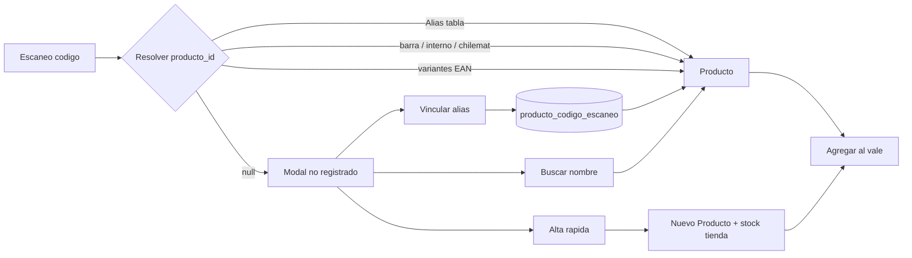

# Arquitectura: códigos escaneados en POS (retail ferretería)

Documento técnico y de producto para desarrollo, TI y dueño. El procedimiento de piso está en **`POS_CODIGO_NO_REGISTRADO_VENDEDORAS.md`**.

| Campo | Valor |
|-------|--------|
| **Versión** | 1.0 — 2026-06-02 |
| **Alcance SD-1** | Fase 1: vincular código + UI modal |
| **Fuera de alcance SD-1** | Multi-tenant, refactor masivo `app.py` |

---

## 1. Problema de negocio

En mostrador, el escaneo es el camino crítico (< 2 s). Si el código no resuelve:

- **Duplicar SKU** (alta rápida innecesaria) → stock partido, toma física imposible.
- **No vender** → cola en caja y cliente esperando.
- **Vincular mal** → kardex y márgenes incorrectos.

Tres causas habituales en ferretería:

1. Referencia **nueva** (nunca cargada).
2. **Mismo** ítem, **otro** EAN (fabricante, empaque, etiqueta).
3. **Código erróneo** o lectura dudosa → búsqueda por nombre.

---

## 2. Principio invariante (stock)

```
producto_id (1) ──► StockPorAlmacen (tienda | bodega)
                 ──► MovimientoInventario / kardex
                 ──► DetalleVenta (vale POS)
```

Los códigos escaneados son **alias de resolución** hacia `producto_id`, no entidades de stock.

| Operación | Efecto en stock |
|-----------|-----------------|
| `escanear-agregar` (match) | Consumo según política vale (tienda / a pedido) |
| `producto_alta_rapida` | Crea `Producto` + ajuste stock **tienda** |
| `vincular-codigo` | Solo fila alias + audit; **sin** kardex |

---

## 3. Estado actual en código

| Componente | Ubicación | Rol |
|------------|-----------|-----|
| Escaneo y agregar | `POST /api/pos/escanear-agregar` (`app.py`) | Resuelve producto, errores `no_encontrado`, `ofrecer_apedido`, etc. |
| Variantes EAN | `services/pos_codigo_escaneo_service.py` | `variantes_codigo_barras_escaneo`, sugerencias por dígitos |
| Búsqueda POS | `buscar_producto` + `pos.js` | Panel unificado vendedora |
| Alta rápida | `POST /api/pos/producto-alta-rapida` | Crea producto + stock tienda + opcional vale |
| Maestro | `Producto.codigo_barra` UNIQUE | Un solo código “maestro” pistola por ficha |
| Crosswalk proveedor | `ProductoCodigoProveedor` | Factura DTE, no mostrador |

| Vincular alias POS | `ProductoCodigoEscaneo` + `services/producto_codigo_escaneo_service.py` | Tabla `producto_codigo_escaneo`; bootstrap en `_asegurar_tabla_producto_codigo_escaneo()` |
| Vincular API | `POST /api/pos/vincular-codigo` (`api_pos_vincular_codigo`) | Audit `pos_vinculo_codigo` |
| UI vincular | `modalPosVincularCodigo`, `pos.js` | Botón verde + atajo en «¿Quiso decir?» |

`codigo_homologado` en respuesta de escaneo sigue indicando match por **variante algorítmica** sin alias guardado (Fase 2 opcional: ofrecer guardar vínculo).

---

## 4. Flujo objetivo (TO-BE)



---

## 5. Modelo de datos (Fase 1 — implementado)

### Tabla `producto_codigo_escaneo`

| Columna | Tipo | Notas |
|---------|------|--------|
| `id` | PK | |
| `codigo` | String(50) UNIQUE | Normalizado (`_enrol_normalizar_codigo`) |
| `producto_id` | FK `productos.id` | |
| `tipo` | Enum/string | `fabricante`, `correccion`, `empaque`, `pos_vinculo` |
| `activo` | Boolean | default true |
| `origen` | String | `pos`, `enrolamiento`, `admin` |
| `usuario` | String | |
| `creado_at` | DateTime | |

### Resolución (orden en `_pos_buscar_producto_por_codigo`)

1. `producto_codigo_escaneo` activo por `codigo`
2. `Producto.codigo_barra` / `codigo_interno` / `codigo_chilemat`
3. `buscar_producto_por_variantes_codigo`
4. No encontrado → modal

### API

- `POST /api/pos/vincular-codigo` — operativo  
  - Body: `{ codigo_escaneado, producto_id, agregar_vale?: true }`  
  - Valida: permiso `pos_emitir_vale`, código libre, producto activo.  
  - Inserta alias + opcional agregar al vale.  
  - `ErpAuditLog`: acción `pos_vinculo_codigo`.

Tests: `tests/test_pos_vincular_codigo.py` (smoke).

---

## 6. UI modal (implementado)

**ID:** `modalPosProductoNoEncontrado`

Botones (orden recomendado):

1. **Alta rápida y agregar al vale** (primario) — existente  
2. **Mismo producto — vincular código** (verde) — operativo  
3. **Buscar por nombre en catálogo** — existente  

Sub-flujo vincular: modal o panel con búsqueda POS reutilizada (`initPosManualSearch`), confirmación explícita, sin campo stock.

**Sugerencias:** en filas de «¿Quiso decir?», acción **Vincular y agregar** además de solo agregar por id.

**Pantalla vendedora:** mantener `posPrepararModalEscaneo()` (anclar modal en `body`, cerrar panel búsqueda, z-index 1310) para evitar desalineación de clics.

---

## 7. Casuísticas y reglas

| ID | Caso | Regla sistema |
|----|------|----------------|
| C1 | Código nuevo real | Alta rápida; kardex entrada tienda |
| C2 | Mismo ítem, otro EAN | Vincular; sin kardex |
| C3 | Match por variante EAN sin guardar alias | Comportamiento actual; opcional ofrecer «¿Guardar vínculo?» post-venta (Fase 2) |
| C4 | Código ya ocupado por otro producto | 409 `barras_duplicado`; UI muestra conflicto |
| C5 | Alta rápida con código ya existente | API devuelve `ya_existia` y agrega al vale |
| C6 | Sin precio SD | Bloqueo o flujo a pedido según `precio_venta_sd` |
| C7 | Sin stock tienda | `ofrecer_apedido` si política verde activa |

---

## 8. Seguimiento post-alta / post-vínculo

| Evento | Trazabilidad | Acción back-office |
|--------|--------------|-------------------|
| Alta rápida POS | `ErpAuditLog` + producto reciente | Cola revisión: categoría, `precio_venta_sd`, foto |
| Vínculo POS | `ErpAuditLog` | Ninguna en stock; opcional validación supervisor |
| Enrolamiento | Sesión toma | Consolidar alias duplicados en salud inventario |

Reporte sugerido (Fase 2): **Altas y vínculos POS del día** en panel del día.

---

## 9. Fases de entrega

| Fase | Entregable | Criterio aceptación |
|------|------------|---------------------|
| **1 — SD-1** | Tabla alias + API + botón modal + tests smoke | Vendedora vincula en < 30 s; no duplica stock |
| **2** | Enrolamiento: mismo Caso B con tabla alias | Un solo maestro de códigos |
| **3** | Supervisor si producto stock > umbral | Evitar vínculos erróneos caros |
| **4 — LX** | Sync Chilemat / multi-local | Fuera SD-1 |

---

## 10. Tests smoke sugeridos

- Escanear código inexistente → 404 `no_encontrado` + sugerencias.  
- Vincular código → segundo escaneo resuelve mismo `producto_id`.  
- Vincular código ya usado por otro producto → 409.  
- Alta rápida + vincular mismo código después → `ya_existia` o rechazo coherente.  
- Modal: botones clicables con `pos-pantalla-vendedora` (regresión UI).

---

## 11. Referencias código

- `templates/punto_venta.html` — modales `modalPosProductoNoEncontrado`, `modalPosProductoAltaRapida`  
- `static/js/pos.js` — `openPosProductoNoEncontradoModal`, `posPrepararModalEscaneo`  
- `static/css/pos-premium-layout.css` — z-index modales escaneo  
- `MANUALES DE OPERACIÓN/POS_CODIGO_NO_REGISTRADO_VENDEDORAS.md` — procedimiento vendedoras  

---

*LhexIA VERTEX · Solución ERP Ferretería · Cliente SD-1 Santo Domingo*
