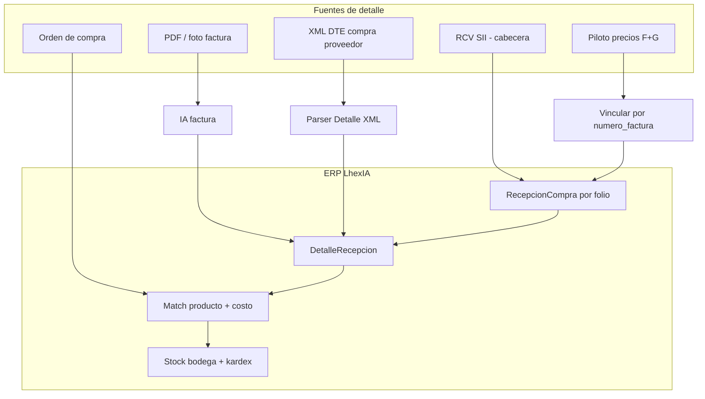

# Plan — Detalle de facturas proveedor (sin líneas en SII/RCV)

**Producto:** LhexIA ERP · Ferretería Santo Domingo (SD-1)  
**Actualizado:** 2026-06-02  
**Estado:** Plan acordado (sin implementación masiva hasta priorización explícita)  
**Regla SD-1:** no bloquear POS, inventario ni caja. Compras/documentos = carril paralelo con OT propia.

---

## 1. Problema de negocio

En Chile el **SII** valida y registra el DTE, pero el **receptor** no recibe por RCV el **detalle de ítems** (cantidad, SKU proveedor, precio unitario) de forma usable para cargar stock y costo automáticamente.

En piso hoy aparece:

- RCV / resumen SII: folio, proveedor, monto total, fecha.
- Operación real: mercadería llega con **guía** y/o **factura PDF**; el detalle se conoce en el papel o en el XML que envía el proveedor (canal directo, no SII).

**Objetivo del plan:** un solo flujo en ERP donde cada factura/guía quede con **líneas en `DetalleRecepcion`**, trazables a producto, costo y kardex — sin depender del detalle del SII.

---

## 2. Cómo lo hace el mercado (referencia)

| Método | Automatización | Encaje SD / LhexIA |
|--------|----------------|-------------------|
| XML DTE compra (tag `Detalle`) del emisor | Alta | Fase C — parser XML |
| 3-way matching OC ↔ recepción ↔ factura | Alta | Fase B — core ferretería |
| OCR / IA sobre PDF | Media | **Ya existe** IA factura en recepciones |
| RCV SII solo cabecera | Baja (control tributario) | **Ya existe** import RCV |
| Captura manual / pistola en piso | Media | **Ya existe** piloto precios + informe por factura |
| Portal obligatorio proveedor | Media | Post SD-1 / solo Chilemat si exige |
| API directa proveedor | Muy alta | Post SD-1 (Chilemat, consolidados) |

**Combinación recomendada para este proyecto:** RCV (cabecera) + OC/recepción (detalle negocio) + IA PDF + piloto factura/guía (red de seguridad) + XML compra cuando haya capacidad DEV.

---

## 3. Lo que ya existe en el repo (no rehacer)

| Pieza | Ruta / módulo | Rol |
|-------|---------------|-----|
| Recepción compra + líneas | `RecepcionCompra`, `DetalleRecepcion`, `/recepciones/*` | Contenedor del detalle |
| Import RCV | `services/rcv_sii_import_service.py` | Cabecera; estado **Pendiente de ítems** |
| IA factura (PDF/imagen) | `/recepciones/<id>/ia-factura/analizar` y `aplicar` | Extrae líneas propuestas |
| Match proveedor | `tests/test_match_factura_chilemat.py`, puente códigos | Vincular línea → `Producto` |
| Órdenes de compra | `/compras/ordenes/*` | Origen del detalle esperado (3-way) |
| Piloto mostrador | `/precios/piloto`, bitácora `numero_factura` / `numero_guia` | Trazabilidad cuando no hay detalle SII |
| Informe por factura piloto | `/precios/piloto/informe-facturas` | Auditoría por folio |

---

## 4. Arquitectura objetivo (flujo único)

**Principio:** el **folio SII** (o número factura proveedor) es la llave; las líneas pueden venir de varias fuentes, pero **solo una recepción activa** por folio+proveedor (evitar duplicados).

---

## 5. Fases de implementación

### Fase A — Operación hoy (mantener y endurecer) — *en curso*

**Alcance**

- RCV → recepción en **Pendiente de ítems**.
- Completar líneas: manual, IA factura, o copia desde OC.
- Piloto: obligar cultura **Nº factura + guía** en carga de precios nuevos.
- Informe piloto por factura para conciliación con resumen SII.

**Criterios de aceptación**

- Todo producto nuevo con factura en piloto aparece en informe por `numero_factura`.
- Recepción RCV localizable por folio en listado recepciones.
- IA factura: al menos un camino documentado en piso (PDF adjunto → analizar → aplicar).

**No incluye:** parser XML masivo ni portal proveedor.

---

### Fase B — Puente compras ↔ piso (recomendada post estabilización piloto)

**Alcance**

| # | Historia | Descripción |
|---|----------|-------------|
| B1 | **Vincular piloto → recepción** | Desde informe o bitácora piloto: «Abrir / crear recepción» para ese folio; prellenar proveedor si se conoce. |
| B2 | **3-way matching OC** | Al importar RCV o abrir recepción: si existe OC con mismo proveedor + folio referencia, sugerir líneas desde `DetalleOrdenCompra`. |
| B3 | **Bandeja «sin detalle»** | Listado recepciones `Pendiente de ítems` + antigüedad + acceso rápido a IA factura. |
| B4 | **Reglas match** | Prioridad: código proveedor → código barras → nombre (rechazar match débil; ya iniciado en tests match). |

**Criterios de aceptación**

- Recepción con OC asociada: ≥80 % líneas sugeridas automáticamente (meta operativa, ajustar en QAS).
- Desde informe piloto se llega a recepción del mismo folio en ≤3 clics.
- Tests smoke: RCV + OC + aplicar líneas (fixtures QA).

**Archivos estimados:** `services/recepcion_match_service.py`, `app.py` (rutas recepciones), templates `recepcion_detalle.html`, `precios_piloto_informe_facturas.html`, tests.

---

### Fase C — Automatización alta (post SD-1 sign-off)

**Alcance**

| # | Historia | Descripción |
|---|----------|-------------|
| C1 | **Import XML DTE compra** | Subir XML proveedor; parsear `<Detalle>`; crear/actualizar `DetalleRecepcion`. |
| C2 | **Mailbox / carpeta** | Opcional: carpeta `uploads/dte_compra/` o correo reenviado (evaluar costo). |
| C3 | **API Chilemat / mayoristas** | Solo si proveedor entrega JSON/API; reutilizar maestro y puentes existentes. |
| C4 | **Conciliación total** | Comparar suma líneas vs monto RCV; alerta diferencia > umbral. |

**Criterios de aceptación**

- XML de prueba (ambiente certificación o muestra proveedor) carga ≥1 línea correcta en recepción.
- Diferencia cabecera RCV vs suma detalle visible en UI.

---

## 6. Decisiones de producto (1 reunión piso)

Registrar acuerdo antes de Fase B:

1. ¿La **llave** operativa es folio SII, número factura proveedor, o ambos (con alias)?
2. ¿Toda mercadería con factura debe pasar por **recepción bodega** o basta piloto + recepción posterior?
3. ¿Proveedores con OC obligatoria (Chilemat) vs compra spot sin OC?
4. ¿Quién completa líneas cuando IA falla — bodega o administración?

---

## 7. Paisaje TMS (cuando se implemente)

| Fase | Sistema | OT sugerida |
|------|---------|------------|
| A | Ya en DEV/QAS | — (operación + fixes puntuales) |
| B | DEV → QAS | `OT-COMPRAS-DETALLE-B-YYYYMMDD` |
| C | QAS → PRD | Tras sign-off compras en SAMBOX |

No mezclar Fase C con releases críticos de POS/caja en el mismo OT.

---

## 8. Fuera de alcance (explícito)

- Portal tipo SAP Ariba para todos los proveedores.
- Esperar que el SII entregue detalle de líneas al receptor (no ocurre en la práctica RCV).
- Multi-tenant / multi-sucursal en queries de compras (post SD-1 / VERTEX).
- Reemplazar Multicaja en boletas de mostrador.

---

## 9. Métricas de éxito (SAMBOX / piso)

| Métrica | Meta inicial |
|---------|----------------|
| Recepciones RCV con ítems completos en &lt;48 h | ≥70 % |
| Líneas piloto con `numero_factura` | ≥90 % en carga nueva |
| Tiempo medio completar recepción pendiente | Medir baseline QAS, luego −30 % |
| Errores costo por línea sin producto | Tendencia a cero (alertas match) |

---

## 10. Referencias en código

- `services/rcv_sii_import_service.py`
- `RecepcionCompra`, `DetalleRecepcion` en `app.py`
- `/recepciones/<rid>/ia-factura/*`
- `services/precios_piloto_service.py` — `numero_factura`, `numero_guia`, informe
- `tests/test_ia_factura_recepcion.py`, `tests/test_rcv_sii_import.py`, `tests/test_match_factura_chilemat.py`
- Plan pendientes general: `PLAN_PENDIENTES_DESARROLLO.md`

---

## 11. Próximo paso sugerido

Cuando Mario indique **«aplícalo Fase B»**:

1. Checkpoint git `checkpoint/compras-detalle-YYYY-MM-DD`.
2. Implementar **B3** (bandeja sin detalle) + **B1** (vínculo piloto → recepción).
3. UAT en SAMBOX con 3 facturas reales (RCV + PDF + piloto).

Hasta entonces: **solo operar Fase A** (RCV, IA, piloto, informe por factura).
