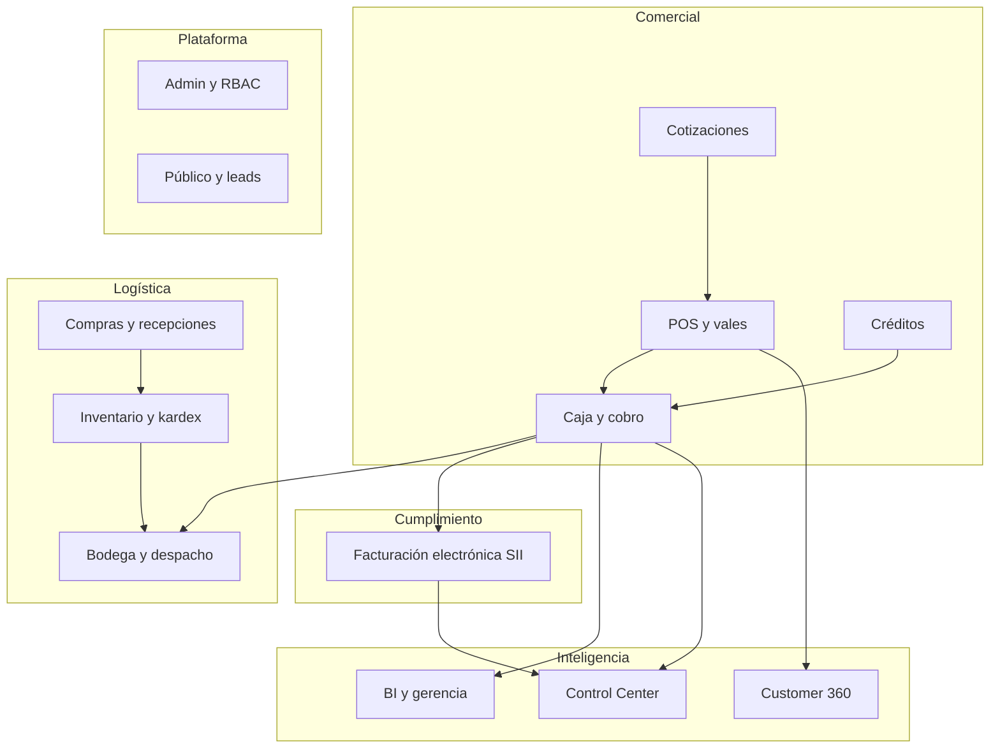
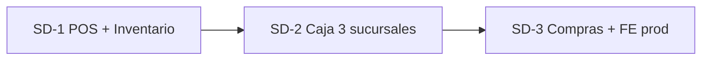

# ERP LhexIA — Documento Maestro

> **LhexIA ERP** ([www.lhexia.cl](https://www.lhexia.cl)) — Sistema integral para ferretería y retail en Chile: ventas POS, caja con arqueo ciego, inventario multi-almacén, bodega con IA por voz, compras, créditos, facturación electrónica SII, BI gerencial, Customer 360 y torre de control para administración.

**Última actualización:** 2026-05-23  
**Versión operativa:** v2.0 (TEC cerrado) + **módulos v3** + **SD-1** (Santo Domingo) + **PLAT-1.1** (arqueo ciego) + **Control Center** + **VERTEX Centro de Mandos** + **LhexIA Academy / Mentor piso**  
**Líneas `app.py`:** ~22.200 (monolito; rutas también en `blueprints/*`)  
**Paquete `core/`:** dominio venta/cobro/stock (Clean Architecture ligera)  
**Templates:** ~122 vistas Jinja2 · **Suite de tests:** ~344 tests (`pytest tests/ --collect-only`)  

### Cómo leer este documento

| Sección | Para quién | Contenido |
|---------|------------|-----------|
| **[§0 Especificación funcional](#0-especificación-funcional-integral)** | Dueño, gerente, onboarding técnico | **Qué hace cada módulo**, flujos, permisos, potencial del producto |
| **[§19 Planes estratégicos](#19-planes-estratégicos-y-roadmap-lhexia)** | Producto, arquitectura, socios | Carpetas `docs/planes/`, prefijos SD/POS/TEC/PLAT/LX/IA/META |
| **§1–18** | Desarrollo, QA, DevOps | Stack, modelos, rutas HTTP, RBAC, deploy, tests |

**Documentación complementaria:**

| Tipo | Dónde |
|------|--------|
| Planes producto, SD-1, comercial, agentes | [`docs/planes/README.md`](planes/README.md) |
| Índice fases (SD-, POS-, TEC-, PLAT-, LX-, IA-, META-) | [`docs/planes/00-alineacion/PLAN_INDICE_LHEXIA.md`](planes/00-alineacion/PLAN_INDICE_LHEXIA.md) |
| Roadmap Plataforma Madre (3 etapas) | [`docs/planes/05-roadmap_plataforma_madre.md`](planes/05-roadmap_plataforma_madre.md) |
| Producto comercial LhexIA | [`docs/planes/02-producto-lhexia/LHEXIA_PRODUCTO.md`](planes/02-producto-lhexia/LHEXIA_PRODUCTO.md) |
| Entrega Santo Domingo | [`docs/planes/01-entrega-santo-domingo/SANTO_DOMINGO_ENTREGA.md`](planes/01-entrega-santo-domingo/SANTO_DOMINGO_ENTREGA.md) |
| Memoria viva sesiones | [`docs/memory.md`](memory.md) |
| Casuísticas venta QA | [`docs/CASUISTICAS_VENTAS_QA.md`](CASUISTICAS_VENTAS_QA.md) |
| Rendimiento BD (~4k SKU) | [`docs/planes/04-tecnico/PLAN_RENDIMIENTO_BD_SD1.md`](planes/04-tecnico/PLAN_RENDIMIENTO_BD_SD1.md) |
| **PDF de este documento** | [`docs/export/ERP_MAESTRO.pdf`](export/ERP_MAESTRO.pdf) — regenerar: `python scripts/export_erp_maestro_pdf.py` |

---

## 0. Especificación funcional integral

Esta sección describe **toda la funcionalidad operativa y el potencial** del ERP para que cualquier lector — dueño de ferretería, gerente, implementador o desarrollador — entienda qué puede hacer el sistema hoy y hacia dónde evoluciona.

### 0.1 Propuesta de valor

| Dimensión | Qué resuelve LhexIA |
|-----------|---------------------|
| **Mostrador** | POS rápido, vale pendiente, cobro en caja, ticket y despacho sin perder trazabilidad |
| **Inventario** | Stock **tienda + bodega**, kardex, toma física por escaneo, salud maestro vs almacenes |
| **Finanzas tienda** | Caja con arqueo ciego, cuadratura CLP enteros, histórico de descuadres, medios de pago |
| **Abastecimiento** | OC, recepción con impacto en costo y stock, proveedores |
| **Crédito ferretero** | Fiado con cupo, cuotas 30/60/90, abonos, estado de cuenta PDF |
| **Cumplimiento Chile** | Facturación electrónica (CAF, XML, firma, cola DTE) — envío SII en pausa certificación |
| **Inteligencia** | Bodega por voz, cross-sell en TV cliente, Customer 360, dashboards gerencia, Control Center |
| **Gobernanza** | RBAC granular, auditoría `erp_audit_log`, módulos activables por empresa |

**Cliente laboratorio:** Ferretería Santo Domingo (~20 personas, **1 establecimiento** en piso, inventario por almacenes tienda/bodega, ~4.000 SKU). El mismo código base es la semilla del **producto SaaS LhexIA** (multi-sucursal en producto; multi-tenant post SD-1).

### 0.2 Actores y perfiles

| Perfil | Rol típico | Pantalla principal al login | Permisos clave |
|--------|------------|----------------------------|----------------|
| **Vendedor/a** | Mostrador emisión vale | `/punto_venta` | `pos_emitir_vale` |
| **Cajero/a** | Cobro y cierre | `/caja/vales_pendientes` | `caja_cobrar_vale`, `caja_abrir`, `caja_cerrar`, `caja_movimientos` |
| **Supervisor** | Descuentos, anulaciones | POS + caja | + `anular_vale_caja`, `autorizar_descuento_pos` |
| **Bodeguero/a** | Preparación y despacho | `/bodega/plataforma` | `bodega_operador`, `ver_inventario` |
| **Gerente** | BI, precios, compras | `/owner-mobile`, `/bi` | `ver_gerencia`, `panel_gerencia`, `gestionar_compras` |
| **Dueño / Admin** | Configuración total | Hub módulos, mantenedores | `gestionar_usuarios` (+ bypass admin) |

Los permisos se combinan por **rol** en Mantenedores; el menú lateral se genera automáticamente desde `_NAV_MAP` según lo que el usuario puede ver.

### 0.3 Mapa de módulos funcionales



---

#### 0.3.1 Módulo POS — Punto de venta

**Propósito:** Emitir ventas en mostrador sin cobrar en el acto; el vale queda **Pendiente** hasta que caja lo cobra (ahí se descuenta stock).

| Capacidad | Detalle |
|-----------|---------|
| Búsqueda producto | Código de barras, nombre, filtros Operativo / Tienda / Catálogo; semáforo stock (verde/amarillo/azul) |
| Carrito | Cantidades, precios, descuentos con autorización supervisor (tarjeta LHX-SUP + PIN) |
| Cliente | RUT opcional u obligatorio según config; cliente final `66.666.666-6` |
| Retiro | Por línea: Tienda / Bodega / Mixto; compromiso entrega (venta a pedido) |
| Documento | Boleta, factura (según permisos y datos cliente) |
| Finalizar | Estado **Pendiente** + número vale; **no** mueve stock aún |
| Layout vendedor | Pantalla fullwidth (`pos_emitir_vale` sin visión admin total) |
| Command Deck | Panel cajero alternativo (`/pos/command-deck`) |
| TV cliente | Live Wall / Experience Wall: carrito + recomendaciones cross-sell coherentes |
| APIs | `/api/pos/live-wall/snapshot`, escaneo, pedidos a pedido, vincular cliente vitrina |

**Reglas críticas:** requiere caja abierta (`@caja_requerida`); venta **Abierta** es borrador editable; al emitir pasa a **Pendiente**.

**Potencial:** modo offline (IndexedDB + sync batch), fidelización TV, más perfiles cross-sell por vertical.

---

#### 0.3.2 Módulo Caja — Cobro, movimientos y cierre

**Propósito:** Convertir vales pendientes en ventas **Pagado**, registrar flujo de efectivo y cerrar turno con cuadratura.

| Capacidad | Detalle |
|-----------|---------|
| Cola cobro | `/caja/vales_pendientes` — filtros, cobro multi-medio |
| Medios | Efectivo, débito, tarjeta crédito, transferencia, crédito (fiado) |
| Post-cobro | Descuento stock tienda, kardex SALIDA, movimiento caja, FE si aplica |
| Apertura / movimientos | Fondo inicial, ingresos/egresos manuales |
| Cambios y devoluciones | `/caja/cambios` — operaciones con reversión stock |
| Saldos a favor | Aplicación al cobro, historial |
| Anulación vale | Con motivo; revierte stock si ya se movió |
| Cierre turno | **Arqueo ciego** (`PLAT-1.1`): cajero declara efectivo + tarjetas sin ver teórico en GET |
| Cuadratura | `diferencia_cierre` = declarado efectivo − teórico gaveta (solo efectivo); umbral supervisor |
| Indicadores SII turno | Boletas emitidas vs sincronizadas en cierre |
| Historial | `/caja/historial_cierres`, ticket reimpresión, panel admin `/admin/caja/arqueo/<id>` |
| Limpieza cola | Admin anula lote vales pendientes para desbloquear cierre |

**Servicio:** `services/cuadratura_arqueo_service.py` — teórico gaveta, tarjeta esperada, indicadores SII.

**Potencial:** multi-sucursal SD-2 (una caja por tienda), arqueo por denominaciones billetes (UI ya maquetada).

---

#### 0.3.3 Módulo Inventario y productos

**Propósito:** Maestro SKU, stock por almacén, trazabilidad y conteo físico.

| Capacidad | Detalle |
|-----------|---------|
| Productos | CRUD, código barra, precios, mínimos, ubicación, unidades |
| Stock dual | `Producto.stock` (total) + `StockPorAlmacen` (tienda/bodega) |
| Kardex | `/kardex` — entradas/salidas con referencia venta/OC/ajuste |
| Ajustes | Unitario y masivo (CSV/Excel) con permiso `admin_inventario` |
| Toma física | `/inventario/enrolamiento` — sesión, escaneo, líneas |
| Salud inventario | `/inventario/salud` — desajustes maestro vs suma almacenes |
| Panel inventario premium | `/inventario/dashboard-premium` — métricas reales (`inventario_dashboard_service.py`) |
| Carga masiva catálogo | `/cargar_productos` — CSV; lotes cada 400 filas; stock 0 no exige `producto.id` previo (fix mayo 2026) |
| Maestro Chilemat (D0) | `scripts/cargar_maestro_productos_neon.py --neon` desde `productos_homologados_sd.csv` (~4.913 SKU, `PEND-*`, stock 0) |
| Categorías | Catálogo 2 niveles (categoría / subcategoría) |
| Unidades | Factores conversión venta ↔ stock ↔ compra |
| Stock crítico | Alertas bajo mínimo |
| Invariante | Consumo bodega + tienda ≤ total por línea venta |

**Potencial:** optimistic locking por SKU, integración balanza, RFID (backlog).

---

#### 0.3.4 Módulo Bodega — Preparación y despacho

**Propósito:** Cumplir retiros **Bodega** o mixtos después del cobro; priorizar cola y medir SLA.

| Capacidad | Detalle |
|-----------|---------|
| Plataforma retiro | Cola vales con estado despacho (pendiente, en preparación, listo…) |
| Cuadro de mando | KPIs, ranking operador, semáforos SLA por estado |
| Modo TV | Auto-refresh 30s para pantalla piso |
| Despacho por voz | Whisper → GPT → JSON → movimiento stock bodega→tienda + kardex |
| Preparación parcial | Cantidades parciales por línea |
| Export día | CSV operaciones |
| APIs | Snapshot cola retiros para polling sidebar |

**SLA (minutos):** colores normal / atención / urgente según tiempo en cada estado (ver §7.5).

**Potencial:** picking por oleadas, integración balanza despacho (doc `BODEGA_ULTRA_PREMIUM`).

---

#### 0.3.5 Módulo Compras y recepciones

**Propósito:** Abastecer ferretería con trazabilidad de costo.

| Capacidad | Detalle |
|-----------|---------|
| Proveedores | Maestro, contacto, condiciones |
| Orden de compra | Borrador → enviada; líneas con cantidades y costos |
| Recepción | Ingreso stock + actualización costo + kardex ENTRADA |
| Tablet recepción | UI simplificada piso |
| OCR factura | OpenAI Vision (opcional) para líneas recepción |

**Estado:** 🟡 operativo; requiere migraciones SQL en BD legacy de algunos clientes.

---

#### 0.3.6 Módulo Créditos y cobranza

**Propósito:** Fiado controlado con cupo y recuperación.

| Capacidad | Detalle |
|-----------|---------|
| Cupo y deuda | Por cliente; validación al cobrar a crédito |
| Plan único | Cuotas a 30, 60 y 90 días corridos |
| Abonos | Registro en caja; ticket abono |
| Estado cuenta | HTML + PDF |
| Cobranza WA | Recordatorios WhatsApp Cloud API (cuotas) |
| API sugerencias | Priorización cobranza |

---

#### 0.3.7 Módulo Cotizaciones

**Propósito:** Oferta comercial previa convertible a venta POS.

| Capacidad | Detalle |
|-----------|---------|
| CRUD cotización | Cliente, líneas, vigencia |
| PDF | Export para cliente |
| Convertir | Genera vale pendiente en POS |

---

#### 0.3.8 Módulo Facturación electrónica (Chile / SII)

**Propósito:** DTE boleta/factura tras cobro, sin bloquear venta si falla envío.

| Capacidad | Detalle |
|-----------|---------|
| CAF | Carga folios autorizados (tipos 33, 39…) |
| Post-cobro | Asigna folio, genera XML, firma PKCS#12 |
| Persistencia | `storage/dtes/emitidos/` |
| Cola | Estados `PENDIENTE_ENVIO`, reintento manual |
| Certificación | Set casos prueba SII en storage |
| Gate Maullín | **Congelado** hasta Form. 3230 *Recepcionada* (folio 77326378627) |

**Política:** el cobro **nunca** se revierte por error DTE.

---

#### 0.3.9 Módulo BI, gerencia y Control Center

**Propósito:** Visión ejecutiva del negocio y salud operativa multi-módulo.

| Capacidad | Detalle |
|-----------|---------|
| Panel del día | `/inicio` — KPIs operativos |
| Owner mobile | Vista dueño mobile-first |
| BI clásico | `/bi`, export CSV, demos premium |
| Simulador margen | Escenarios precio/costo |
| Informes dueño | Consolidados |
| C360 IA dashboard | ROI IA, cola llamadas, ofertas |
| SEO rankings | Monitor keywords (sync externo stub) |
| Analítica web | Embudo, telemetría landing |
| Revisión precios | Flujo aprobación masiva |
| **LhexIA Control Center** | `/admin/control-center` — sucursales/caja, salud SII, telemetría IA (HITL) |

---

#### 0.3.10 Módulo Customer 360

**Propósito:** Inteligencia comercial por cliente (obra, etapa, predicción recompra).

| Capacidad | Detalle |
|-----------|---------|
| Ficha cliente admin | Historial, scoring, etapa obra |
| Predicción 21 días | Próxima compra estimada |
| Ofertas proactivas IA | Cola aprobación / envío |
| Llamadas del día | Snapshot operativo |
| APIs | Resumen C360 para integraciones |

**Estado:** 🟡 P0 en producción; roadmap P1+ en `roadmap_customer_360_ferreteria_2026.md`.

---

#### 0.3.11 Módulo Administración y plataforma

**Propósito:** Configurar empresa, usuarios, permisos y datos maestros.

| Capacidad | Detalle |
|-----------|---------|
| Empresa | Datos fiscales, logo, **flags módulos** (`mod_ventas`, `mod_caja`, …) |
| Usuarios y roles | RBAC 17 permisos, perfiles predefinidos |
| Almacenes | Tienda, bodega, futuras sucursales |
| Clientes / catálogo / unidades | Mantenedores CRUD |
| POS autorización descuentos | Tarjetas supervisor |
| Auditoría ERP | `admin_erp_audit_log` — eventos críticos |
| Hub módulos | `/erp_hub` — tarjetas por perfil |

---

#### 0.3.12 Módulo Público y captación

| Capacidad | Detalle |
|-----------|---------|
| Landing / SEO | Páginas comerciales, aliases 301 |
| Catálogo público | Consulta sin login |
| Consulta stock | Público |
| Leads | `POST /api/landing/lead` → JSONL |

---

#### 0.3.13 Capa `core/` (dominio limpio)

Casos de uso extraídos para **venta, cobro, stock al cobro y post-cobro** (crédito, saldo favor):

- Entidades y value objects en `core/domain/venta/`
- `EmitirVenta`, `CobrarVenta` en `core/application/`
- Tests dedicados: `test_core_domain_venta.py`, `test_core_post_cobro.py`
- Convive con monolito; migración progresiva (CORE-1.x)

---

### 0.4 Flujo de negocio de punta a punta (resumen)

```
Vendedor: POS → vale PENDIENTE (stock intacto)
    ↓
Cajero: cobro → PAGADO → stock tienda ↓ → kardex → caja → (DTE cola)
    ↓
Bodeguero (si retiro bodega): preparar → despachar → stock bodega ↓ tienda ↑
    ↓
Gerente: BI / Control Center / C360
    ↓
Cajero fin turno: cierre ciego → cuadratura → historial / admin arqueo
```

Casos extendidos documentados en [`CASUISTICAS_VENTAS_QA.md`](CASUISTICAS_VENTAS_QA.md) (tienda, bodega, mixto, crédito, saldo favor, anulación).

### 0.5 Integraciones y canales

| Canal | Uso en producción |
|-------|-------------------|
| OpenAI Whisper / GPT | Bodega voz, parsing, sugerencias |
| OpenAI Vision | OCR recepciones |
| WhatsApp Cloud | Cobranza, alertas |
| Slack | Vales sin cobro > N horas |
| Neon PostgreSQL | BD producción |
| Render + Gunicorn | Hosting app |
| SII (futuro) | SOAP envío DTE post-certificación |

### 0.6 Potencial del producto (visión 12–24 meses)

| Horizonte | Capacidad |
|-----------|-----------|
| **Corto (SD-1)** | POS + inventario estables en **un local** (almacenes); índices BD; casuísticas QA verdes |
| **Medio (PLAT 1–2)** | Offline 8h, Control Center con datos reales multi-sucursal, logs IA HITL |
| **Medio (SD-3)** | FE Maullín producción, OC/recepción masivo |
| **Largo (LX-)** | Multi-tenant SaaS, onboarding tenant, licencias |
| **Largo (IA-)** | Agentes CrewAI: compras, pricing, contenidos, cobranza autónoma supervisada |
| **Largo (META-)** | Agentes que desarrollan el ERP (architect, QA, docs) |

La priorización explícita está en [§19 Planes estratégicos](#19-planes-estratégicos-y-roadmap-lhexia).

---

## 1. Stack tecnológico

| Componente | Tecnología |
|---|---|
| Backend | **Python 3.14**, Flask, Flask-SQLAlchemy, Flask-Login |
| BD producción | PostgreSQL (Neon/Render) |
| BD desarrollo / QA | **PostgreSQL local** (recomendado; suite `pytest`). Sigue existiendo driver **MySQL (PyMySQL)** para entornos legacy. |
| ORM | SQLAlchemy (modelos en `app.py`) |
| Frontend | Jinja2 + Bootstrap 5 + Font Awesome + CSS propio (`design-system.css`) |
| JS interactivo | Vanilla JS (`pos.js`, timers SLA, etc.) |
| IA | OpenAI Whisper (transcripción voz), GPT-4o-mini (parsing comandos bodega), OCR facturas |
| Reportes | pandas + openpyxl (Excel), pdfkit (PDF), QR codes |
| Deploy | Gunicorn en Render (`render.yaml`: plan **standard**, 1 worker × **6 threads**); BD Neon con pooler |
| WhatsApp | API Cloud (cobranza, alertas) |
| Notificaciones | Slack webhooks (alertas operativas) |

### Dependencias (`requirements.txt`)

```
Flask, Flask-SQLAlchemy, Flask-Login, SQLAlchemy, PyMySQL
gunicorn, psycopg2-binary, pandas, openpyxl
qrcode, Pillow, PyMuPDF, pdfkit, requests
```

---

## 2. Arquitectura del repositorio

```
sistema_ventas_limpio/
├── app.py                    # App Flask monolítica (modelos + rutas + lógica)
├── init_db.py                # Sync esquema + roles base + admin bootstrap
├── schema_sync.py            # Sincronización modelos ↔ BD
├── requirements.txt          # Dependencias Python
├── render.yaml               # Config deploy (gunicorn app:app)
├── memory.md                 # Memoria viva (Cursor: @memory.md); copia en docs/memory.md
│
├── blueprints/               # Registro vía add_url_rule (no decoradores @route)
│   ├── bodega.py             #   ~12 reglas (despacho, plataforma, voz, SLA, TV)
│   ├── caja.py               #   ~15 reglas (cobro, cambios, saldos, cierres, limpiar cola)
│   ├── pos.py                #   ~22 reglas (POS, command deck, experience wall, live wall, APIs /api/pos/*)
│   └── c360.py               #   ~10 reglas (Customer 360, IA, ofertas proactivas)
│
├── services/                 # Lógica de negocio extraída
│   ├── stock_service.py      #   Stock multi-almacén, invariante, reversión bodega
│   ├── kardex_service.py     #   Movimientos kardex, bitácoras costo/precio
│   ├── venta_service.py      #   transaccion_critica() context manager
│   ├── pos_busqueda_service.py      # Semáforo POS, enriquecimiento búsqueda
│   ├── pos_compromiso_entrega_service.py
│   ├── whatsapp_service.py   #   WhatsApp Cloud API (cobranza, alertas)
│   ├── audit_service.py      #   erp_audit_log (eventos críticos)
│   ├── unidades_service.py   #   Unidades de medida, factores conversión
│   ├── c360_service.py       #   Customer 360, predicción compra, scoring
│   ├── sistema_health_service.py  # GET /api/sistema/salud
│   ├── facturacion_electronica_service.py  # FE Chile: XML, firma PKCS#12, post-cobro, cola DTE
│   ├── facturacion_caf_service.py          # Parseo e inserción CAF (folios SII)
│   ├── facturacion_dte_storage.py          # Persistencia XML firmado en storage/dtes/emitidos/
│   ├── facturacion_sii_certificacion.py    # Set de prueba certificación SII (XML casos 33/39/61)
│   ├── cuadratura_arqueo_service.py        # Teórico gaveta, SII turno, arqueo ciego
│   └── control_center_service.py           # KPIs Control Center (sucursales, DTE, IA)
│
├── core/                     # Dominio + casos de uso (CORE-1.x, post TEC-1)
│   ├── domain/venta/         #   Entidades, value objects, excepciones
│   ├── application/ventas/   #   Emitir/cobrar, post-cobro saldo favor
│   ├── application/creditos/
│   ├── application/inventario/  # Stock al cobro
│   └── infrastructure/       #   Repositorios y adapters hacia services/ORM
│
├── templates/                # 89 templates Jinja2
│   ├── base.html             #   Layout principal (sidebar dinámico por permisos)
│   ├── base_tv.html          #   Layout kiosk/TV (auto-refresh 30s)
│   ├── base_movil.html       #   Layout mobile
│   ├── punto_venta.html      #   POS completo
│   ├── caja_pendientes.html  #   Cola de cobro
│   └── ...                   #   (89 archivos total)
│
├── static/                   # CSS, JS, logos, imágenes
│   ├── design-system.css     #   Sistema de diseño propio
│   ├── pos.js                #   Lógica POS principal
│   ├── pos-command-deck.js   #   Command Deck (layout cajero)
│   ├── pos-live-wall-*.js    #   Live Wall staff / cliente
│   └── pos-experience-wall.js
│
├── sql/                      # ~40+ migraciones SQL incrementales
│   └── 2026_MM_DD_*.sql      #   Incl. 2026_05_21_rendimiento_sd1_postgresql.sql (índices POS/caja/bodega)
│
├── scripts/                  # Utilidades, seeds y sync BD
│   ├── sync_local_neon_render.py  # Migraciones + copia local→Neon + verificación conteos (`--verify-only`)
│   ├── sync_postgres_db.py        #   Tablas, FK, orden topológico (usado por el sync)
│   ├── seed_demo_data.py          #   Datos demo
│   └── smoke_alertas_vales_despacho.py
│
├── data/                     # JSON runtime
│   ├── empresa_config.json   #   Config empresa (módulos, datos fiscales)
│   └── proveedores_config.json
│
└── docs/                     # Documentación técnica + planes
    ├── ERP_MAESTRO.md        #   ← ESTE DOCUMENTO (mapa técnico del sistema)
    ├── memory.md             #   Memoria viva Cursor (sincronizada con raíz si aplica)
    ├── FLUJOS_CRITICOS.md    #   Secuencias que no romper
    ├── MIGRACION_RENDER_NEON.md
    ├── CASUISTICAS_PRUEBAS.md
    └── planes/               #   Planificación producto / SD-1 / técnico (carpetas 00–07)
        ├── README.md
        ├── 00-alineacion/    #   PLAN_INDICE, MEMORY_GROK, ritmo equipo
        ├── 01-entrega-santo-domingo/
        ├── 02-producto-lhexia/
        ├── 03-pos-vendedor/
        ├── 04-tecnico/       #   TEC, CORE, ESTADO_OPTIMIZACION_APP, PLAN_RENDIMIENTO_BD_SD1
        ├── 05-modulos-backlog/
        ├── 06-agentes-ia/
        └── 07-agentes-meta-desarrollo/
```

> Rutas antiguas en `docs/` raíz (p. ej. `BODEGA_ULTRA_PREMIUM.md`) pueden tener stub **«Movido»** → ver `docs/planes/`.

---

## 3. Modelos de datos (40 tablas)

### Núcleo comercial

| Modelo | Tabla | Dominio |
|---|---|---|
| `Venta` | `ventas` | Ventas, vales POS; estados: Abierta → Pendiente → Pagado / Anulada |
| `DetalleVenta` | `detalle_ventas` | Líneas de venta (producto, cantidad, precio, descuento) |
| `VentaCuotaCredito` | `ventas_cuotas_credito` | Plan cuotas 30/60/90 |
| `Cotizacion` | `cotizaciones` | Cotizaciones comerciales |
| `CotizacionDetalle` | `cotizacion_detalles` | Líneas de cotización |
| `AbonoCredito` | `abonos_credito` | Pagos parciales a cuentas crédito |

### Caja y pagos

| Modelo | Tabla | Dominio |
|---|---|---|
| `Caja` | `cajas` | Apertura/cierre de caja, arqueo |
| `MovimientoCaja` | `movimiento_cajas` | Ingresos/egresos, cuadratura |
| `CambioOperacion` | `cambio_operaciones` | Devoluciones y cambios |
| `CambioDetalle` | `cambio_detalles` | Líneas de cambio |
| `ClienteSaldoFavor` | `cliente_saldo_favor` | Saldo a favor del cliente |
| `MovimientoSaldoFavor` | `movimiento_saldo_favor` | Historial saldos a favor |

### Inventario y abastecimiento

| Modelo | Tabla | Dominio |
|---|---|---|
| `Producto` | `productos` | Maestro SKU, precios, unidades, ubicación |
| `Almacen` | `almacenes` | Multi-almacén (tienda, bodega, etc.) |
| `StockPorAlmacen` | `stock_por_almacen` | Stock por SKU por almacén |
| `CatalogoCategoria` | `catalogo_categorias` | Categorías jerárquicas |
| `CatalogoSubcategoria` | `catalogo_subcategorias` | Subcategorías nivel 2 |
| `UnidadMedida` | `unidades_medida` | Unidades (kg, mt, un, etc.) |
| `ConversionUnidad` | `conversiones_unidad` | Factores de conversión |
| `MovimientoInventario` | `movimientos_inventario` | Kardex (entradas/salidas) |
| `BitacoraCostoCompra` | `bitacora_costos_compra` | Historial costos |
| `BitacoraPrecioVenta` | `bitacora_precios_venta` | Historial precios venta |
| `AuditoriaInventario` | `auditorias_inventario` | Tomas de inventario |
| `DetalleAuditoria` | `detalles_auditoria` | Líneas de auditoría |

### Compras y recepciones

| Modelo | Tabla | Dominio |
|---|---|---|
| `Proveedor` | `proveedores` | Maestro proveedores |
| `OrdenCompra` | `ordenes_compra` | Órdenes de compra |
| `DetalleOrdenCompra` | `detalle_ordenes_compra` | Líneas OC |
| `RecepcionCompra` | `recepciones_compra` | Recepción de mercadería |
| `DetalleRecepcion` | `detalles_recepcion` | Líneas recepción |

### Clientes y crédito

| Modelo | Tabla | Dominio |
|---|---|---|
| `Cliente` | `clientes` | Maestro clientes, RUT, crédito |
| `EnrolamientoTomaSesion` | `enrolamiento_toma_sesiones` | Sesiones de toma física |
| `EnrolamientoTomaLinea` | `enrolamiento_toma_lineas` | Líneas escaneadas |

### Seguridad y auditoría

| Modelo | Tabla | Dominio |
|---|---|---|
| `Rol` | `roles` | Roles del sistema |
| `Permiso` | `permisos` | Catálogo de permisos |
| `RolPermiso` | `rol_permisos` | Asignación rol ↔ permiso |
| `ErpAuditLog` | `erp_audit_log` | Log de auditoría (eventos críticos) |

### Customer 360 e IA

| Modelo | Tabla | Dominio |
|---|---|---|
| `C360LlamadaSnapshotDia` | `c360_llamadas_snapshot_dia` | Snapshot diario de llamadas |
| `C360ProactivaOferta` | `c360_proactiva_ofertas` | Ofertas proactivas IA |
| `CobranzaRecordatorioWhatsappLog` | `cobranza_recordatorio_wa_log` | Log envíos WA cobranza |
| `ReabastoClienteWaLog` | `reabasto_cliente_wa_log` | Log WA reabastecimiento |

---

## 4. Rutas HTTP (~150+ endpoints, orden de magnitud)

**~100** handlers con `@app.route` / `@app.get|post` en `app.py` + **~59** reglas vía `add_url_rule` en `blueprints/*` (conteos cambian con el tiempo; ver código).

### 4.1 Público y landing

| Método | Ruta | Función |
|---|---|---|
| GET | `/`, `/index` | Landing page |
| GET | `/healthz` | Health check |
| POST | `/api/landing/lead` | Captura leads |
| GET | `/catalogo` | Catálogo público |
| GET | `/consulta-stock` | Consulta stock público |

### 4.2 Autenticación

| Método | Ruta | Función |
|---|---|---|
| GET/POST | `/login` | Login (redirige según perfil) |
| GET | `/logout` | Confirma si caja abierta antes de salir |
| POST | `/logout/forzar` | Logout sin cerrar caja |
| GET/POST | `/cambiar_password` | Cambio contraseña (forzado si temporal) |

### 4.3 Home y dashboards

| Método | Ruta | Función |
|---|---|---|
| GET | `/inicio` | Dashboard principal (KPIs) |
| GET | `/owner-mobile` | PWA **Guardián** (dueño/gerente, semáforos SD) |
| GET | `/owner/vertex-control` | **Centro de Mandos VERTEX** (multi-cliente maestro) |
| GET | `/api/v1/owner/dashboard` | API JSON Guardián; `?scope=global_maestro` para VERTEX |
| GET | `/ayuda` | Centro de ayuda |

### 4.4 Punto de venta (POS)

| Método | Ruta | Función | Permiso |
|---|---|---|---|
| GET | `/punto_venta` | Pantalla POS | `pos_emitir_vale` |
| POST | `/agregar_producto_venta` | Agregar línea al carrito | `pos_emitir_vale` |
| POST | `/actualizar_item` | Modificar cantidad/precio | `pos_emitir_vale` |
| POST | `/eliminar_detalle` | Quitar línea | `pos_emitir_vale` |
| POST | `/finalizar_venta` | Emitir vale Pendiente | `pos_emitir_vale` |
| GET | `/buscar_producto` | Búsqueda por código/nombre | — |
| POST | `/pos/usuarios_autorizar_descuento` | Autorizar descuento | `autorizar_descuento_pos` |

**Registro centralizado:** muchas de estas URLs (y APIs `/api/pos/*`, `/pos/command-deck`, `/pos/experience-wall`, ticket vale, despacho, cross-sell, foto producto, etc.) viven en `blueprints/pos.py` → `register_pos_routes()`.

### 4.5 Caja

| Método | Ruta | Función | Permiso |
|---|---|---|---|
| GET | `/caja/vales_pendientes` | Cola de cobro | `caja_cobrar_vale` |
| POST | `/procesar_cobro_caja` | Cobrar vale | `caja_cobrar_vale` |
| POST | `/caja/vales/<id>/anular` | Anular vale | `anular_vale_caja` |
| GET | `/abrir_caja` | Apertura de caja | `caja_abrir` |
| GET/POST | `/movimiento_caja` | Ingresos/egresos | `caja_movimientos` |
| GET/POST | `/cerrar_caja` | Cierre **a ciegas** + cuadratura CLP enteros | `caja_cerrar` |
| GET | `/admin/caja/arqueo/<id>` | Panel analítico arqueo (admin) | `gestionar_usuarios` |
| GET | `/caja/historial_cierres` | Histórico cierres | `gestionar_usuarios` |
| GET | `/caja/cambios` | Cambios/devoluciones | `caja_cobrar_vale` |
| GET | `/caja/cambios/historial` | Historial cambios | `caja_cobrar_vale` |
| GET | `/caja/saldos-favor` | Saldos a favor | `caja_cobrar_vale` |

### 4.6 Inventario y productos

| Método | Ruta | Función | Permiso |
|---|---|---|---|
| GET | `/productos` | Catálogo productos | `ver_inventario` |
| POST | `/productos/<id>/editar_stock` | Ajuste stock unitario | `admin_inventario` |
| POST | `/productos/stock_masivo` | Ajuste stock masivo | `admin_inventario` |
| POST | `/cargar_productos` | Importar CSV/Excel | `admin_inventario` |
| GET | `/stock/critico` | Stock bajo mínimo | `ver_inventario` |
| GET | `/kardex` | Movimientos kardex | `ver_inventario` |
| GET | `/consulta-stock` | Consulta rápida | — (público) |
| GET | `/inventario/enrolamiento` | Toma física | `enrolamiento_inventario` |
| GET | `/inventario/salud` | Salud del inventario | `enrolamiento_inventario` |
| GET | `/inventario/dashboard-premium` | Panel inventario (datos reales) | `ver_inventario` |

### 4.7 Bodega

| Método | Ruta | Función | Permiso |
|---|---|---|---|
| GET | `/bodega/cuadro-mando` | Dashboard bodega (KPIs, SLA) | `bodega_operador` |
| GET | `/bodega/cuadro-mando/tv` | Modo TV/kiosk (auto-refresh) | `bodega_operador` |
| GET | `/bodega/plataforma` | Plataforma operativa retiro | `bodega_operador` |
| GET | `/bodega/vale/<id>` | Detalle vale retiro | `bodega_operador` |
| GET | `/bodega/despachos` | Despacho por voz (IA) | `bodega_operador` |
| POST | `/api/bodega/voice-command` | API transcripción + ejecución voz | `bodega_operador` |
| GET | `/bodega/export-dia` | Export CSV del día | `bodega_operador` |

### 4.8 Compras y recepciones

| Método | Ruta | Función | Permiso |
|---|---|---|---|
| GET | `/compras/ordenes` | Lista órdenes compra | `gestionar_compras` |
| GET/POST | `/compras/ordenes/nueva` | Nueva OC | `gestionar_compras` |
| GET | `/compras/ordenes/<id>/editar` | Editar OC | `gestionar_compras` |
| GET | `/recepciones` | Lista recepciones | `gestionar_compras` |
| GET/POST | `/recepciones/nueva` | Nueva recepción | `gestionar_compras` |
| GET | `/recepciones/<id>` | Detalle recepción | `gestionar_compras` |
| GET | `/proveedores` | Maestro proveedores | `gestionar_compras` |

**RCV SII (SD-1, mayo 2026):** `scripts/importar_rcv_sii.py` (**`--neon`** en prod) → `services/rcv_sii_import_service.py`. **Dedup:** mismo proveedor + tipo Factura + folio (`documento_numero`) → `omitidas_duplicado`. Sin watcher automático de `datos_rcv/`; portal DTE histórico = referencia, no import masivo. UI lista: Pareto por monto, folio, paginación 50, archivar RCV 2025 (`recepciones_lista_service.py`). Runbook: `docs/planes/01-entrega-santo-domingo/IMPORTAR_RCV_SII.md`.

**PDF / IA:** adjunto por recepción en `static/uploads/recepciones/` (disco efímero Render). IA líneas requiere `OPENAI_API_KEY` (activación post firma propuesta cliente).

### 4.9 Créditos y cobranza

| Método | Ruta | Función |
|---|---|---|
| GET | `/creditos` | Módulo créditos |
| GET | `/creditos/estado_cuenta/<id>` | Estado de cuenta HTML |
| GET | `/creditos/estado_cuenta/<id>/pdf` | Estado de cuenta PDF |
| POST | `/registrar_abono` | Registrar abono |
| GET | `/ticket_abono/<id>` | Ticket de abono |
| GET | `/cobranza/cuotas` | Cobranza WA cuotas |

### 4.10 Cotizaciones

| Método | Ruta | Función |
|---|---|---|
| GET | `/cotizaciones` | Lista cotizaciones |
| GET/POST | `/cotizaciones/nueva` | Nueva cotización |
| GET | `/cotizaciones/<id>` | Detalle |
| POST | `/cotizaciones/<id>/convertir` | Convertir a venta POS |
| GET | `/cotizaciones/<id>/pdf` | PDF cotización |

### 4.11 BI y gerencia

| Método | Ruta | Función | Permiso |
|---|---|---|---|
| GET | `/bi` | BI reportes | `ver_gerencia` |
| GET | `/gerencia/informes-dueno` | Panel ejecutivo | `panel_gerencia` |
| GET | `/gerencia/simulador-margen` | Simulador margen | `panel_gerencia` |
| GET | `/bi/demo/alertas-precio-premium` | Alertas de precio | `panel_gerencia` |
| GET | `/gerencia/c360/ia-dashboard` | Customer 360 IA | `panel_gerencia` |
| GET | `/admin/control-center` | **LhexIA Control Center** (torre de control) | `gestionar_usuarios` / gerencia |
| GET | `/precios/revision` | Revisión precios | `revision_precios` |
| GET | `/bi/export.csv` | Export ventas CSV | — |
| GET | `/ia_abastecimiento` | IA sugerencias compra | — |

### 4.12 Administración

| Método | Ruta | Función | Permiso |
|---|---|---|---|
| GET/POST | `/admin/empresa` | Datos empresa + módulos | `gestionar_usuarios` |
| GET/POST | `/admin/almacenes` | Almacenes | `gestionar_usuarios` |
| GET/POST | `/admin/clientes` | Clientes | `gestionar_usuarios` |
| GET/POST | `/admin/roles-permisos` | Roles y permisos | `gestionar_usuarios` |
| GET/POST | `/admin/unidades` | Unidades medida | `gestionar_usuarios` |
| GET/POST | `/admin/catalogo` | Categorías | `gestionar_usuarios` |
| GET | `/usuarios` | Lista usuarios | `gestionar_usuarios` |
| GET/POST | `/admin/facturacion/caf` | Carga CAF (folios SII) | `gestionar_usuarios` |
| GET | `/admin/facturacion/cola` | Cola DTE (estados, descarga XML) | `gestionar_usuarios` |
| GET | `/admin/facturacion/dte-xml/<venta_id>` | Descarga XML firmado guardado | `gestionar_usuarios` |
| POST | `/admin/facturacion/reintentar/<venta_id>` | Reintento emisión FE (HTML redirect) | `gestionar_usuarios` |
| GET/POST | `/api/admin/facturacion/emitir-prueba` | XML mock / set certificación SII | `gestionar_usuarios` |
| GET/POST | `/api/admin/facturacion/cafs` | API CAF | `gestionar_usuarios` |
| POST | `/api/admin/facturacion/reintentar/<venta_id>` | API reintento FE | `gestionar_usuarios` |

### 4.13 Facturación electrónica (Chile / SII) — Fase 1 operativa ERP

| Componente | Estado | Notas |
|---|---|---|
| Tabla `cafs` + columnas DTE en `ventas` | ✅ | Auto-migración `_asegurar_tabla_cafs_y_columnas_ventas_fe()` |
| Carga CAF (admin) | ✅ | UI + API; rango folios 33/39 |
| Post-cobro FE | ✅ | Tras `procesar_cobro_caja` (no crédito): folio CAF, XML, firma, estado |
| Persistencia XML | ✅ | `storage/dtes/emitidos/{certificacion\|produccion}/V{id}_T{tipo}_F{folio}.xml` |
| Cola / reintento | ✅ | `PENDIENTE_ENVIO` si SOAP stub; panel cola + API reintento |
| Firma PKCS#12 | ✅ | `SII_CERT_PFX_PATH`, password o `SII_CERT_PFX_PASSWORD_FILE`; signxml 4.x (`cert=[certificate]`) |
| Envío SOAP SII real | ⏳ | `enviar_dte_soap` stub; falta Zeep + WSDL + TrackId |
| TED timbre CAF | ⏳ | XML aún Fase 1 / `StubFase1`; no válido ante SII hasta XSD+TED |
| Certificación SII oficial | ⏳ | Set casos en `storage/dtes/pruebas_sii/` vía `emitir-prueba?modo=set_certificacion` |

**Variables de entorno:** `SII_CERT_PFX_PATH`, `SII_CERT_PFX_PASSWORD` o `SII_CERT_PFX_PASSWORD_FILE`, `SII_AMBIENTE` (`certificacion` \| `produccion`).

**Política:** el cobro **no se revierte** si falla FE; la venta queda en cola para reintento.

### 4.14 POS Live Wall / Experience Wall (segundo monitor / TV cliente)

| Ruta | Función |
|---|---|
| GET `/pos/live-wall/staff` | Panel cajero/vendedor: KPIs tienda + cola bodega |
| GET `/pos/live-wall/cliente` | TV cliente CFM v2 (layout 50/50 carrito \| recomendaciones) |
| GET `/pos/experience-wall` | Alias TV con `?token=` firmado |
| GET `/api/pos/live-wall/snapshot` | JSON: líneas, total, `cliente_vitrina`, `recomendaciones`, `vale_emitido` |

**Autenticación snapshot:** sesión staff (`session['_user_id']`) o token `itsdangerous` (`pos_live_wall_token_create` / `pos_live_wall_token_create_station`). TTL configurable vía env.

**Recomendaciones TV (`recomendaciones` en JSON):**

| Campo | Descripción |
|-------|-------------|
| `titulo` | Ej. «Complementos para su fijación» |
| `subtitulo` | Con `{ancla}` resuelto («los clavos», «los tornillos», …) |
| `items[]` | Hasta 4: `id`, `nombre`, `precio`, `imagen_url`, `motivo` |

**Motor backend:** `app.py` → `_pos_live_wall_recomendaciones_tv(venta)`:

- Perfiles: `_POS_TV_PERFIL_FIJACION`, `_OBRA`, `_PINTURA`, `_PVC`, `_MADERA`, `_GENERAL`.
- Contexto: `_pos_tv_contexto_carrito` (familias, ticket bajo/medio, `permite_electrico_caro`).
- Pick producto: `_pos_tv_pick_coherente` (score + tope precio + exclusión eléctricas caras).
- Reglas JSON POS: `data/cross_sell_associations.json` + `_pos_cross_sell_match_rules` (refuerzo obra/PVC/pintura; regla `fijacion_herramientas_manual`).

**Frontend TV:** `static/js/pos-experience-wall.js` (`renderCfmRecommendations`, `recoPaintKey` anti-parpadeo); `static/css/pos-experience-wall-cfm.css` (grid 2×2, tarjetas con imagen/nombre/motivo/precio/botón). Cache bust en template: `?v=lhexia20260520reco2`.

**Tests:** `tests/test_pos_live_wall.py` (smoke; incluye coherencia clavo sin taladros).

**Admin descuentos (relacionado POS):** GET `/admin/pos-autorizacion-descuentos` — tarjeta supervisor LHX-SUP; servicio `services/pos_autorizacion_descuento_service.py`; DDL `sql/2026_05_18_pos_autorizacion_descuento.sql`.

**Cierre caja (PLAT-1.1, 2026-05-21):** arqueo ciego en `templates/caja/cerrar_caja.html`; campos `monto_declarado_cajero`, `monto_declarado_tarjeta`, contadores SII en `Caja`; servicio `cuadratura_arqueo_service.py`; panel `admin/detalle_arqueo.html`; SQL `2026_05_23_*`, `2026_05_24_*`.

### 4.15 Caja — limpieza cola cierre

| Método | Ruta | Función |
|---|---|---|
| POST | `/caja/limpiar_cola_cierre` | Admin: anula en lote vales **Pendiente** sin método + borradores **Abierta** de la caja abierta (no borra filas; auditoría). UI en `confirmar_cierre.html`. |

### 4.16 APIs internas

| Método | Ruta | Función |
|---|---|---|
| GET | `/api/sistema/salud` | Health check detallado |
| POST | `/api/ventas/alertas-despachos-pendientes` | Cron alertas vales riesgo |
| GET | `/api/buscar_producto/<codigo>` | Búsqueda por código |
| POST | `/api/guardar_conteo_inventario` | Guardar conteo auditoría |

---

## 5. Sistema de permisos (RBAC v2)

### 5.1 Catálogo de permisos

```
gestionar_usuarios        admin_inventario          enrolamiento_inventario
panel_gerencia           anular_vale_caja          autorizar_descuento_pos
revision_precios         pos_emitir_vale           caja_cobrar_vale
caja_abrir               caja_movimientos          caja_cerrar
bodega_operador          ver_inventario            ver_gerencia
gestionar_compras        ver_auditoria
```

### 5.2 Perfiles de rol predefinidos

| Rol | Permisos |
|---|---|
| **Vendedor/a** | `pos_emitir_vale` |
| **Cajera/o** | `pos_emitir_vale`, `caja_cobrar_vale`, `caja_abrir`, `caja_movimientos`, `caja_cerrar` |
| **Supervisor / Encargado** | Todo cajera + `anular_vale_caja`, `autorizar_descuento_pos`, `ver_inventario` |
| **Bodeguero/a** | `bodega_operador`, `ver_inventario` |
| **Gerente** | `ver_gerencia`, `panel_gerencia`, `revision_precios`, `ver_inventario`, `gestionar_compras`, `ver_auditoria` |
| **Dueño** | Todo gerente + `gestionar_usuarios` |
| **Admin** | Todos (bypass automático) |

### 5.3 Navegación centralizada (`_NAV_MAP`)

Mapa declarativo en `app.py` que define grupos de menú, ítems, permisos requeridos y endpoints activos. La función `_construir_nav_usuario()` filtra en runtime según permisos del usuario autenticado e inyecta `nav_menu` vía context_processor. El sidebar de `base.html` itera `nav_menu` (~15 líneas Jinja).

### 5.4 Capas de control de acceso

```
Capa 1: Empresa    → modulo_activo()         → "¿Módulo habilitado?" (admin_empresa)
Capa 2: Rol        → mapa_por_rol            → "¿Qué permisos tiene?" (admin_roles_permisos)
Capa 3: Ruta       → @permisos_required      → "¿Puede entrar?" (decorador)
Capa 4: Contexto   → @caja_requerida         → "¿Tiene caja abierta?" (decorador)
Capa 5: Menú       → _construir_nav_usuario  → "¿Qué ve?" (automático)
```

### 5.5 Redirección inteligente al login

```
Admin / Dueño / Gerente  →  /owner-mobile      (panel ejecutivo)
Bodeguero (sin caja)     →  /bodega/plataforma  (operación bodega)
Cajera / Cajero          →  /caja/vales_pendientes (cola cobro)
Vendedor / Mesón         →  /punto_venta         (POS directo)
Otro                     →  /inicio              (dashboard general)
```

---

## 6. Módulos activables por empresa

Configurados en **Mantenedores > Datos de empresa** (`/admin/empresa`), almacenados en `data/empresa_config.json`:

| Flag | Módulo | Controla |
|---|---|---|
| `mod_ventas` | Ventas | POS, cotizaciones, historial ventas |
| `mod_caja` | Caja | Cobro, apertura/cierre, movimientos |
| `mod_inventario` | Inventario | Productos, bodega, compras, recepciones |
| `mod_bi` | BI y análisis | Reportes, revisión precios |
| `mod_ia` | IA | Abastecimiento inteligente, OCR facturas |
| `operacion_un_local` | Operación | `"1"` = un establecimiento (SD-1); `"0"` = red multi-sucursal (copy Guardián / demo Chilemat) |
| `operacion_sucursales_red_n` | Operación | Locales en vista red (1–99) hasta CRUD `sucursales` (SD-2) |
| `cierre_caja_modo` | Caja | `ciego` \| `visible` |

Override env (emergencia): `OWNER_GUARDIAN_UN_LOCAL`, `OWNER_GUARDIAN_SUCURSALES_N`, `CIERRE_CAJA_MODO`.

---

## 7. Flujos de negocio críticos

### 7.1 Venta POS (flujo principal)

```
[Vendedor]                    [Cajera]                    [Bodeguero]
    │                             │                            │
    ├─ Abre POS (/punto_venta)    │                            │
    ├─ Busca producto (código)    │                            │
    ├─ Agrega líneas al carrito   │                            │
    ├─ Finaliza → vale PENDIENTE  │                            │
    │  (no descuenta stock aún)   │                            │
    │                             ├─ Ve vale en cola           │
    │                             ├─ Cobra → estado PAGADO     │
    │                             │  (descuenta stock + kardex) │
    │                             │                            ├─ Ve en plataforma
    │                             │                            ├─ Despacha (voz IA)
    │                             │                            └─ Cierra retiro
```

### 7.2 Flujo de cobro (procesar_cobro_caja)

```
1. Valida stock disponible (invariante)
2. Abre transaccion_critica() [savepoint]
3. Actualiza venta → PAGADO
4. Descuenta stock tienda (almacén)
5. Registra kardex (SALIDA)
6. Registra movimiento caja
7. Si crédito: actualiza saldo_deudor + cuotas
8. Si saldo a favor: aplica descuento
9. audit_log("cobro_vale_caja")
10. Commit
11. WhatsApp (post-commit, fuera de transacción)
```

### 7.3 Bodega — Despacho por voz (IA)

```
1. Bodeguero habla al micrófono
2. OpenAI Whisper → transcripción texto
3. GPT-4o-mini → parsing JSON {vale, producto, cantidad}
4. transaccion_critica():
   - Valida vale + producto + stock bodega
   - Actualiza bodega_despacho_json
   - Mueve stock bodega → tienda
   - Kardex SALIDA bodega + ENTRADA tienda
   - Valida invariante
5. Commit
```

### 7.4 Medios de pago

| Medio | Tipo | Descuenta stock |
|---|---|---|
| `Efectivo` | Inmediato | Sí, al cobrar |
| `Debito` | Inmediato | Sí, al cobrar |
| `TarjetaCredito` | Inmediato (TC bancaria) | Sí, al cobrar |
| `Transferencia` | Inmediato | Sí, al cobrar |
| `Credito` | Fiado tienda | Sí, al cobrar (queda Pendiente) |

### 7.5 SLA Bodega (prioridad inteligente)

Tiempos en minutos para indicadores de color:

| Estado | Normal | Atención | Urgente |
|---|---|---|---|
| PENDIENTE | <5 | 5-10 | >20 |
| EN_PREPARACION | <10 | 10-20 | >40 |
| ENTREGA_PARCIAL | <8 | 8-15 | >30 |
| LISTO_RETIRO | <15 | 15-30 | >60 |

---

## 8. Servicios extraídos

| Servicio | Responsabilidad |
|---|---|
| `stock_service.py` | Stock multi-almacén, invariante consumo, reversión bodega, disponibilidad POS |
| `kardex_service.py` | Registro movimientos, bitácoras costo/precio |
| `venta_service.py` | `transaccion_critica()` (savepoint con rollback atómico) |
| `whatsapp_service.py` | Envío mensajes WA Cloud API |
| `audit_service.py` | `_audit_log()` → tabla `erp_audit_log` |
| `unidades_service.py` | Factores conversión venta↔stock↔compra |
| `c360_service.py` | Motor Customer 360, predicción compra, scoring |
| `sistema_health_service.py` | Health check (`/api/sistema/salud`) |
| `facturacion_electronica_service.py` | FE Chile: XML, firma PKCS#12, post-cobro, cola DTE |
| `facturacion_caf_service.py` | CAF SII: parseo e inserción de folios |
| `facturacion_dte_storage.py` | Persistencia XML firmado bajo `storage/dtes/emitidos/` |
| `cuadratura_arqueo_service.py` | Teórico gaveta, indicadores SII, tarjeta esperada turno |
| `control_center_service.py` | Contexto dashboard Plataforma Madre |

---

## 9. Blueprints registrados

| Blueprint | Reglas URL (`add_url_rule`) | Dominio |
|---|---|---|
| `blueprints/bodega.py` | ~12 | Plataforma retiro, despacho voz, cuadro mando, SLA, TV, export |
| `blueprints/caja.py` | ~15 | Cobro, anulación, cambios, saldos, cierres, limpiar cola, tickets |
| `blueprints/pos.py` | ~22 | POS, command deck, experience wall, live wall, ticket/despacho, APIs `/api/pos/*` |
| `blueprints/c360.py` | ~10 | Customer 360, dashboard IA, ofertas proactivas |

---

## 10. Migraciones SQL (~39 archivos)

Formato: `sql/YYYY_MM_DD_descripcion.sql`

Principales:
- Stock por almacén, kardex, recepciones, unidades de medida
- Catálogo categorías (2 niveles), productos (ubicación, unidades)
- Clientes (RUT, giro, dirección, crédito), cotizaciones
- Órdenes de compra, ventas (punto retiro, anulación, descuento)
- Caja cuadratura, cambios/saldos a favor
- Bodega retiro plataforma, cobranza WA, cuotas crédito
- Customer 360 (llamadas, snapshots)
- Vistas SQL: vales riesgo despacho (PostgreSQL + MySQL)

---

## 11. Reglas de negocio invariantes

1. **Invariante de stock:** `consumo_bodega + consumo_tienda ≤ consumo_total` por línea de venta.
2. **Estados de venta:** Abierta → Pendiente → Pagado / Anulada (inmutable).
3. **Stock se descuenta al COBRAR**, no al emitir vale.
4. **WhatsApp siempre post-commit** (nunca dentro de transacción).
5. **Caja obligatoria** para POS y cobro (`@caja_requerida`).
6. **Caja día anterior:** se permite cobrar/anular vales sin cerrar, pero no abrir nuevo POS.
7. **Cliente "final"** (RUT `66.666.666-6`) para ventas sin nombre.
8. **Crédito único plan:** `30_60_90` (3 cuotas a 30/60/90 días corridos).
9. **Anulación con despacho bodega** requiere permiso especial (`anular_vale_con_despacho_bodega`).
10. **Auditoría by-default:** todo cambio crítico registrado en `erp_audit_log`.

---

## 12. Configuración y entorno

### Variables de entorno

| Variable | Uso |
|---|---|
| `DATABASE_URL` / `SQLALCHEMY_DATABASE_URI` | Conexión BD app (local, Render, etc.) |
| `NEON_DATABASE_URL` | **Solo scripts de sync** (`.env.local`): Postgres Neon; usar host **directo** (sin `-pooler`) para `scripts/sync_local_neon_render.py` |
| `SECRET_KEY` | Flask sessions |
| `OPENAI_API_KEY` | IA (Whisper, GPT, OCR) |
| `EMPRESA_NOMBRE_COMERCIAL` | Nombre por defecto |
| `BOOTSTRAP_ADMIN_*` | Admin inicial en init_db |
| `WHATSAPP_*` / `COBRANZA_*` | Config WA Cloud API |
| `SLACK_WEBHOOK_URL` | Alertas Slack |
| `VALE_DESPACHO_SIN_COBRO_ALERTA_HORAS` | Umbral alertas (default 48h) |
| `SII_CERT_PFX_PATH`, `SII_CERT_PFX_PASSWORD` / `SII_CERT_PFX_PASSWORD_FILE`, `SII_AMBIENTE` | Facturación electrónica Chile (certificado .pfx y ambiente) |

### Archivos de entorno

```
env_qa.txt      → setdefault (carga si no existe var)
.env.qa         → override
.env.local      → desarrollo local (puede incluir DATABASE_URL + NEON_DATABASE_URL para sync)
```

### Sincronización Postgres local → Neon (datos / QA)

Para **alinear** la base en Neon con la de tu PC (misma app en Render apuntando a esa Neon verá los mismos datos tras el sync):

1. En `.env.local`: `DATABASE_URL` = Postgres local; `NEON_DATABASE_URL` = cadena Neon (**host directo**, `sslmode=require`; el pooler suele reservarse para la app en producción).
2. **Pausar** servicios que escriban en esa Neon (p. ej. Render) mientras corre el script; si no, los conteos suelen **divergir** tras el `commit`.
3. Desde la raíz del repo:

```bash
python scripts/sync_local_neon_render.py
python scripts/sync_local_neon_render.py --verify-only
```

- El sync aplica migraciones listadas en el script, hace `TRUNCATE` en tablas comunes en destino y copia filas desde local.  
- `--verify-only` solo compara conteos en tablas clave (`TABLAS_CHECK` en el script) y termina con código **1** si difieren.  
- Tras un sync completo, el script **vuelve a verificar** conteos; si fallan, sale con código 1 e imprime sugerencias.  
- En Neon a veces aparece `permission denied ... session_replication_role`: es **esperable** en roles limitados; el flujo continúa sin ese bypass.

Detalle operativo: `docs/MIGRACION_RENDER_NEON.md`.

### Arranque local

```bash
python -m pip install -r requirements.txt
python app.py
```

### Producción

```bash
# render.yaml (referencia): plan standard, 1 worker × 6 threads
gunicorn app:app --bind 0.0.0.0:$PORT --workers 1 --threads 6 --timeout 90
```

**Variables recomendadas (Render):** `DATABASE_URL` con **pooler** Neon; `DB_POOL_SIZE=10`, `DB_MAX_OVERFLOW=5`, `DB_POOL_TIMEOUT=30`.

**Rendimiento ~4k SKU / 6 estaciones (4 POS + caja + bodega + TV bodega 30s):** ejecutar en Neon `sql/2026_05_21_rendimiento_sd1_postgresql.sql` y seguir [`docs/planes/04-tecnico/PLAN_RENDIMIENTO_BD_SD1.md`](planes/04-tecnico/PLAN_RENDIMIENTO_BD_SD1.md).

---

## 13. Integraciones externas

| Integración | Uso | Config |
|---|---|---|
| **OpenAI Whisper** | Transcripción voz → texto (bodega) | `OPENAI_API_KEY` |
| **OpenAI GPT-4o-mini** | Parsing comandos voz, sugerencias IA | `OPENAI_API_KEY` |
| **OpenAI Vision** | OCR facturas recepción | `OPENAI_API_KEY` |
| **WhatsApp Cloud API** | Cobranza cuotas, alertas despacho | `WHATSAPP_*` vars |
| **Slack Webhooks** | Alertas vales riesgo operativo | `SLACK_WEBHOOK_URL` |

---

## 14. Historial de hitos

| Fecha | Hito |
|---|---|
| 2026-05-08 | Memoria `memory.md` + documentación completa por módulo |
| 2026-05-08 | Correcciones auditoría: reversión stock, KPIs, edición ventas |
| 2026-05-08 | Caja día anterior + cierre bloqueado + cola combined |
| 2026-05-08 | Crédito cuotas 30/60/90 + medio TarjetaCredito |
| 2026-05-08 | Roadmap Customer 360 documentado |
| 2026-05-08 | Plan v2 Grok: Fase 1A (transacciones atómicas, auditoría, invariante) |
| 2026-05-08 | Fase 1B: cron alertas vales despacho + Slack + WA |
| 2026-05-08 | Servicios: stock, kardex, venta, whatsapp, audit, unidades, c360 |
| 2026-05-10 | Cierre plan v2.0: blueprints, health, carga masiva con transacción |
| 2026-05-11 | Bodega Fase 3: SLA, ranking operador, export CSV, modo TV |
| 2026-05-11 | RBAC v2: `_NAV_MAP`, sidebar dinámico, 17 permisos, 7 perfiles rol |
| 2026-05-11 | Redirección inteligente por perfil al login |
| 2026-05-11 | Fix: `grupo['items']` en Jinja2 (colisión con `dict.items`) |
| 2026-05-12 | Suite QA v4: 43 tests e2e + rutas HTTP + coverage + CI/CD + guardia anti-prod |
| 2026-05-14 | Customer 360 P0: predicción 21d, log predicciones, API resumen |
| 2026-05-15 | FE Fase 1 ERP: CAF, post-cobro, storage XML, cola DTE, firma signxml 4.x, tests FE |
| 2026-05-15 | POS Live Wall staff/cliente + snapshot API |
| 2026-05-15 | Caja: `POST /caja/limpiar_cola_cierre` (anulación masiva admin para desbloquear cierre) |
| 2026-05-16 | **Plan cierre módulos v3** documentado (§18); ERP maestro + memory actualizados |
| 2026-05-16 | Sync **local → Neon**: `scripts/sync_local_neon_render.py` con `--verify-only`, verificación post-sync (código salida 1 si difieren conteos), trazas con `flush`; Neon **host directo** recomendado para el script |
| 2026-05-17 | Reorganización **`docs/planes/`** (00–07); portales LhexIA + Santo Domingo; planes IA-* y META-* |
| 2026-05-17 | **CORE-1.2–1.4** en `core/` (venta/cobro, stock al cobro, post-cobro crédito/saldo favor) |
| 2026-05-18 | Ritmo equipo async (`EQUIPO_RITMO_ASYNC.md`); POS-4 en `main` |
| 2026-05-21 | **Plan rendimiento BD SD-1**: índices `pg_trgm`, `render.yaml` (standard, 6 threads), doc `PLAN_RENDIMIENTO_BD_SD1.md` |
| 2026-05-20 | **TV recomendaciones coherentes** (`4ae0292`): perfiles fijación/obra, cross-sell JSON, tarjetas CFM rediseñadas, tests `test_recomendaciones_tv_solo_clavo_coherente` |
| 2026-05-20 | **Cierre caja**: arqueo solo `Pagado`; anti-autofill monto contado; sidebar scroll `/modulos` |
| 2026-05-20 | **SQL Neon prod**: `apply_sql_neon` — autorización descuentos + índices rendimiento SD-1 |
| 2026-05-21 | **PLAT-1.1** Arqueo ciego fusionado en `Caja` + UI cierre + detalle admin |
| 2026-05-21 | **Control Center** `GET /admin/control-center` + `dashboard_madre.html` (maquetación Etapa 2) |
| 2026-05-21 | Seed demo arqueo `scripts/seed_arqueo_demo_vendedor.py` |
| 2026-05-21 | **PWA Guardián** rebranding: iconos premium, splash estilo login, caja móvil 2×2; manifest nombre «Guardián» |
| 2026-05-21 | **Centro de Mandos VERTEX** `/owner/vertex-control`: red neuronal HUB, circuitos animados, feed global `scope=global_maestro`, píldoras v1.0 |
| 2026-05-21 | **VERTEX animaciones** iteración neural-3→6: CSS `vertex-dash-anim`, anillos HUB, arco `conic-gradient`; fix deploy/caché |
| 2026-05-21 | **Agente Mentor** (`vertex_mentor`): nodo violeta, tarjeta glass, demo NC → `/caja/cambios`; SD live siempre con mentor activo |
| 2026-05-22 | **D0 maestro Chilemat:** ~4.913 SKU homologados → Neon (`scripts/cargar_maestro_productos_neon.py`); fix carga masiva `/cargar_productos` (stock sin `producto.id`) |
| 2026-05-22 | **Recepciones SD-1:** RCV dedup folio, UI Pareto/archivo/folio, `IMPORTAR_RCV_SII.md`; panel inventario premium con datos reales (`inventario_dashboard_service.py`) |
| 2026-05-22 | **Pausa operativa D1:** piloto pistola enrolamiento TIENDA — `PAUSA_D1_PILOTO_PISTOLA.md`; catálogo QA `SD-PRUEBA-*` solo local |
| 2026-05-23 | **LhexIA Academy + Mentor piso:** `academy_articles` Manual V2, hub `/academy`, API `/api/mentor/*`, sidebar POS/caja; doc [`planes/02-producto-lhexia/LHEXIA_ACADEMY_MENTOR.md`](planes/02-producto-lhexia/LHEXIA_ACADEMY_MENTOR.md) |

---

## 19. Planes estratégicos y roadmap LhexIA

Toda la planificación vive en **`docs/planes/`** (carpetas 00–07). Este maestro resume el mapa; el detalle operativo está en cada documento enlazado.

### 19.1 Estructura de carpetas

| Carpeta | Prefijo | Contenido principal |
|---------|---------|---------------------|
| [`00-alineacion/`](planes/00-alineacion/) | — | Índice maestro, MEMORY_GROK, ritmo equipo, setup Grok |
| [`01-entrega-santo-domingo/`](planes/01-entrega-santo-domingo/) | **SD-** | Go-live cliente #1, runbook piso, inventario, POS |
| [`02-producto-lhexia/`](planes/02-producto-lhexia/) | **LX-** | Visión SaaS, arquitectura objetivo, fidelización TV |
| [`03-pos-vendedor/`](planes/03-pos-vendedor/) | **POS-** | UI pantalla vendedor, alineación Grok/Cursor |
| [`04-tecnico/`](planes/04-tecnico/) | **TEC-** / **CORE-** / **TEC-OFFLINE-** | Estabilidad, `core/`, offline, FE, rendimiento BD |
| [`05-roadmap_plataforma_madre.md`](planes/05-roadmap_plataforma_madre.md) | **PLAT-** | **Canónico:** 3 etapas (resiliencia → plataforma → IA) |
| [`05-modulos-backlog/`](planes/05-modulos-backlog/) | **MOD-** | C360, bodega premium, observabilidad |
| [`06-agentes-ia/`](planes/06-agentes-ia/) | **IA-** | Agentes negocio 24/7 (CrewAI) |
| [`07-agentes-meta-desarrollo/`](planes/07-agentes-meta-desarrollo/) | **META-** | Agentes para desarrollar LhexIA |

Índice técnico completo: [`PLAN_INDICE_LHEXIA.md`](planes/00-alineacion/PLAN_INDICE_LHEXIA.md).

### 19.2 Regla de dos carriles (no mezclar)

| Carril | Objetivo | Plazo | Documento entrada |
|--------|----------|-------|-------------------|
| **A — Santo Domingo (SD-)** | POS + inventario en piso estables | ~2 semanas | [`SANTO_DOMINGO_ENTREGA.md`](planes/01-entrega-santo-domingo/SANTO_DOMINGO_ENTREGA.md) |
| **B — Producto LhexIA (LX-)** | SaaS, multi-tenant, comercial | Post SD-1 | [`LHEXIA_PRODUCTO.md`](planes/02-producto-lhexia/LHEXIA_PRODUCTO.md) |

**No ejecutar** en producción hasta acuerdo explícito: multi-tenant en queries, big-bang refactor `app.py`, agentes CrewAI en piso.

### 19.3 Eje SD — Entrega Santo Domingo (prioridad actual)



| Fase | Objetivo | Estado |
|------|----------|--------|
| **SD-1** | Toma física + venta diaria sin bloqueos | 🟡 En curso |
| SD-1.1 | Enrolamiento, salud, kardex | 🟡 Operación |
| SD-1.2 | POS vale→caja→entrega; TV cliente | 🟡 Validar piso + [`CASUISTICAS_VENTAS_QA.md`](CASUISTICAS_VENTAS_QA.md) |
| SD-1.3 | Infra Neon, índices, capacitación equipo | ⏳ [`PLAN_RENDIMIENTO_BD_SD1.md`](planes/04-tecnico/PLAN_RENDIMIENTO_BD_SD1.md) |
| **SD-2** | Cierre diario 3 tiendas | ⏳ Post SD-1 |
| **SD-3** | OC/recepción + DTE producción | ⏳ Gate FE |

### 19.4 Eje TEC — Estabilidad monolito v2.0

| Fase | Estado |
|------|--------|
| TEC-1A Transacciones + audit + stock | ✅ |
| TEC-1B Alertas vales sin cobro | ✅ |
| TEC-2 Servicios extraídos | ✅ |
| TEC-3 Blueprints pos/caja/bodega/c360 | ✅ |
| TEC-4 Salud + cron | ✅ (alcance v2) |

Documento cerrado: [`PLAN_TRABAJO_CONSOLIDADO_v2_GROK_10-10.md`](planes/04-tecnico/PLAN_TRABAJO_CONSOLIDADO_v2_GROK_10-10.md).

### 19.5 Eje TEC-OFFLINE / PLAT — Resiliencia POS (Etapa 1 Plataforma Madre)

Roadmap canónico: [`05-roadmap_plataforma_madre.md`](planes/05-roadmap_plataforma_madre.md).

| Hito | Entregable | Estado |
|------|------------|--------|
| **PLAT-1.1** | Arqueo ciego en `Caja` + `/cerrar_caja` | ✅ |
| **PLAT-1.2** | IndexedDB + `GET /api/offline/catalogo` | ⏳ Siguiente |
| **PLAT-1.3** | Circuit breaker + cola `OFF-…` + batch sync | ⏳ |

Detalle offline: [`ROADMAP_POS_CONTINUIDAD_OPERACIONAL.md`](planes/04-tecnico/ROADMAP_POS_CONTINUIDAD_OPERACIONAL.md), [`ADR_OFFLINE_FIRST.md`](planes/04-tecnico/ADR_OFFLINE_FIRST.md).

**Gate FE Maullín:** sin envíos SOAP hasta Formulario 3230 distinto de *Recepcionada* (folio SII 77326378627).

### 19.6 Etapa 2 — Plataforma Madre (Dashboard & Control)

| Hito | Entregable | Estado |
|------|------------|--------|
| **2.0** | Maquetación Control Center (`/admin/control-center`) | ✅ UI + ruta + servicio |
| **2.0b** | **Centro de Mandos VERTEX** (`/owner/vertex-control`) | ✅ Red neuronal + feed global (sesión 2026-05-21) |
| **2.1** | Tabla `agente_ejecuciones` | 🟡 En uso (píldoras v1.0 + alertas Operador) |
| **2.2** | Bandeja HITL obligatoria | ⏳ |
| **2.3** | `pgvector` + ingest marketing | ⏳ |

#### 19.6.1 Centro de Mandos VERTEX — red neuronal multi-cliente (2026-05-21)

**Audiencia:** Dueño plataforma LhexIA (`gestionar_usuarios` + opcional `LHEXIA_VERTEX_MAESTRO_USERS`). No es la PWA Guardián de una sola ferretería.

| Pieza | Ubicación |
|-------|-----------|
| Ruta shell | `GET /owner/vertex-control` — `blueprints/owner_api.py`, `templates/owner_vertex_control.html` |
| API | `GET /api/v1/owner/dashboard?scope=global_maestro` — header `X-Lhexia-Scope: global_maestro` |
| Servicio | `services/vertex_control_center_service.py` — clientes live/mock, `grafo_agentes`, `feed_preview_global` |
| Contrato píldoras | `services/vertex_pildora_contract.py` — `vertex_pildora` v1.0, semillas demo (`asegurar_pildoras_demo_red`) |
| Front | `static/owner-pwa/vertex-control.js` + `vertex-control.css` (cache bust `?v=vertex-neural-6`) |
| Enlace operativo SD | Botón **Guardián** → `/owner-mobile`; **Módulos** → hub ERP |

**Clientes en red (payload API):**

| `id` | Fuente | Agentes en mapa |
|------|--------|-----------------|
| `santo_domingo` | **live** (Guardián v3 + KPIs reales) | Guardián, Operador, **Mentor**, Inventario (si semáforo inv. amarillo/rojo) |
| `sodimac_piloto` | mock | Guardián, Operador, Logística, **Mentor** |
| `easy_demo` | mock | Guardián, Inventario, **Mentor** |

**Agentes producto VERTEX (módulos `vertex_*`):**

| Clave grafo | Módulo | Rol en producto |
|-------------|--------|-----------------|
| `guardian` | `vertex_guardian` | Arqueo, caja, cumplimiento (PWA Guardián) |
| `operador` | `vertex_operador` | Alertas operativas, vales, quiebres, descuadres |
| `logistica` | `vertex_logistica` | Traslados, SLA bodega |
| `inventario` | `vertex_inventario` | Stock, salud inventario |
| **`mentor`** | **`vertex_mentor`** | **LhexIA Guía** — asesoría a cajera/vendedora (NC, vales, arqueo). Agente 3 en `CONSOLIDACION_4_AGENTES_ASESORIA.md`. **VERTEX:** nodo + píldoras demo maestro; **piso SD-1:** sidebar Academy en POS/caja — ver §19.6.2 y [`LHEXIA_ACADEMY_MENTOR.md`](planes/02-producto-lhexia/LHEXIA_ACADEMY_MENTOR.md). **Post SD-1:** RAG/chat LLM |

**UI mapa cognitivo:**

- **HUB central:** anillos concéntricos CSS (rotación), isotipo hexagonal `lhexia-icon-approved.png`, leyenda circuitos.
- **Circuitos PCB:** HUB → clientes (paths SVG); pulsos eléctricos vía **CSS `@keyframes` `stroke-dashoffset`** (clase `vertex-dash-anim` tras API); puntos viajeros en rAF.
- **Rieles glass:** tarjetas Agente Preview (izq: Guardián/Mentor; der: Logística/Operador).
- **HUD:** % autonomía agentes (derivado de alertas rojo/amarillo).

**Píldoras demo Mentor (persistidas en `agente_ejecuciones`):**

| dedupe_key | Título | `nav_href` |
|------------|--------|------------|
| `vertex:maestro:santo_domingo:mentor_nota_credito` | Guía nota de crédito — consultas vendedoras | `/caja/cambios` |
| `vertex:maestro:sodimac_piloto:mentor_capacitacion` | Onboarding cajera — vale y cobro | `/punto_venta` |

**Animaciones — lecciones sesión 2026-05-21:**

1. **No** fijar `stroke-dashoffset` inline en JS (bloquea CSS).
2. SMIL / WAAPI en SVG paths **no fiables** en Edge/Windows → solución final: **CSS puro** + clase `vertex-neural-live` en `#vertexNeuralSvg`.
3. Anillos HUB: contenedor `inset:0; margin:auto` + `@keyframes rotate` (sin mezclar `translate` en keyframes).
4. `prefers-reduced-motion`: en VERTEX se **ralentiza**, no se apaga todo (Windows “animaciones reducidas”).
5. **Deploy:** commits deben estar en `origin/main` + Render; recarga **Ctrl+Shift+R** (`vertex-neural-6`).

**Commits relevantes (mayo 2026):** `40dd867` red neuronal inicial · `06a7020` pulsos SMIL · `a8f9e38` WAAPI · `fc1d58b` CSS puro neural-5 · `e9d7af6` Agente Mentor.

**Tests:** `tests/test_owner_dashboard_api.py` — `test_dashboard_global_maestro_scope`, `test_owner_vertex_control_shell`, `test_pildora_mentor_demo_red`.

#### 19.6.2 LhexIA Academy + Mentor en piso (2026-05-23)

Capacitación contextual para vendedor/cajera en el flujo real (no sustituye el mapa VERTEX del dueño en §19.6.1).

| Componente | Detalle |
|------------|---------|
| **Hub** | `GET /academy` — Manual V2 (POS, Caja PLAT-1.1, Bodega telemetría V3) |
| **Ayuda** | `/ayuda` embebe artículos filtrados por rol |
| **BD** | `academy_articles` — seed idempotente `services/academy_bootstrap.py` |
| **API** | `GET /api/mentor/context`, `POST /api/mentor/log_read` (`blueprints/academy.py`); alias `/api/pos/mentor/*` |
| **UI** | Sidebar `lhexia-mentor-sidebar` en `/punto_venta`, `/caja/vales_pendientes`, `/caja/cambios`, `/cerrar_caja` |
| **Servicios** | `academy_service.py`, `vertex_mentor_service.py`, `academy_format.py` |
| **Telemetría** | Lecturas → `agente_ejecuciones` (`agente_nombre=mentor`, origen `academy_sidebar`) |

**Documentación técnica (handoff IA):** [`docs/planes/02-producto-lhexia/LHEXIA_ACADEMY_MENTOR.md`](planes/02-producto-lhexia/LHEXIA_ACADEMY_MENTOR.md)

**Tests regresión (16):**

```bash
pytest tests/test_academy_mentor_api.py tests/test_pos_mentor_academy.py -v
```

**Pendiente post SD-1:** RAG/chat sobre `ERP_MAESTRO` + `CASUISTICAS_VENTAS_QA`; videos en `video_url`; extensión PWA caja móvil.

### 19.7 Etapa 3 — Inteligencia digital

| Hito | Contenido |
|------|-----------|
| 3.1 | RAG normativas / dolores retail Chile |
| 3.2 | Agentes contenido por vertical |

### 19.8 Ejes paralelos (referencia, no bloquean SD-1)

| Eje | Documento | Cuándo |
|-----|-----------|--------|
| **POS-** UI vendedor | [`POS_ALINEACION_CURSOR_GROK.md`](planes/03-pos-vendedor/POS_ALINEACION_CURSOR_GROK.md) | POS-3/4 ✅ en main |
| **CORE-** Dominio | [`ESTADO_OPTIMIZACION_APP.md`](planes/04-tecnico/ESTADO_OPTIMIZACION_APP.md) | Paralelo |
| **LX-** Producto SaaS | [`PLAN_MAESTRO_LHEXIA.md`](planes/02-producto-lhexia/PLAN_MAESTRO_LHEXIA.md) | Post SD-1 |
| **IA-** Agentes negocio | [`PLAN_AGENTES_IA_v1.md`](planes/06-agentes-ia/PLAN_AGENTES_IA_v1.md) | Post SD-1 |
| **META-** Agentes desarrollo | [`PLAN_AGENTES_META_v1.md`](planes/07-agentes-meta-desarrollo/PLAN_AGENTES_META_v1.md) | Paralelo META-1 |
| **MOD-** C360 / bodega | [`roadmap_customer_360_ferreteria_2026.md`](planes/05-modulos-backlog/roadmap_customer_360_ferreteria_2026.md) | Backlog |

### 19.9 Orden de ejecución recomendado (mayo 2026)

```
✅ TEC v2.0 cerrado
✅ PLAT-1.1 arqueo ciego
✅ Control Center maquetación
→ SD-1 cierre piso (inventario + POS casuísticas)
→ PLAT-1.2 offline cache
→ PLAT-1.3 modo degradado
⏸ Etapa 2 datos reales multi-sucursal
⏸ FE Maullín (post 3230)
⏸ LX-1 multi-tenant
```

Alineación equipo: [`MEMORY_GROK.md`](planes/00-alineacion/MEMORY_GROK.md) · Ritmo: [`EQUIPO_RITMO_ASYNC.md`](planes/00-alineacion/EQUIPO_RITMO_ASYNC.md).

---

## 15. Documentación relacionada

### Técnica (este repo, `docs/` raíz)

| Documento | Contenido |
|---|---|
| `docs/ERP_MAESTRO.md` | **Este documento** — mapa técnico del sistema |
| `docs/memory.md` | Memoria viva entre sesiones (Cursor) |
| `docs/FLUJOS_CRITICOS.md` | Flujos de negocio que no romper |
| `docs/MIGRACION_RENDER_NEON.md` | Deploy Render + Neon, variables, sync datos |
| `docs/CASUISTICAS_PRUEBAS.md` | Matriz QA manual |
| `docs/CASUISTICAS_VENTAS_QA.md` | Catálogo QA venta→caja→entrega (`79220c9`, TEST-CAS) |
| `docs/PROMPT_MAESTRO_ERP.md` | Prompt arquitecto (legacy) |

### Planes (`docs/planes/`)

| Documento | Contenido |
|---|---|
| [`planes/README.md`](planes/README.md) | Mapa carpetas 00–07 |
| [`planes/00-alineacion/PLAN_INDICE_LHEXIA.md`](planes/00-alineacion/PLAN_INDICE_LHEXIA.md) | Índice SD-, POS-, TEC-, CORE-, LX-, IA-, META- |
| [`planes/00-alineacion/MEMORY_GROK.md`](planes/00-alineacion/MEMORY_GROK.md) | Prioridades equipo Mario · Grok · Cursor |
| [`planes/02-producto-lhexia/LHEXIA_PRODUCTO.md`](planes/02-producto-lhexia/LHEXIA_PRODUCTO.md) | Producto comercial LhexIA |
| [`planes/01-entrega-santo-domingo/SANTO_DOMINGO_ENTREGA.md`](planes/01-entrega-santo-domingo/SANTO_DOMINGO_ENTREGA.md) | Go-live cliente #1 |
| [`planes/04-tecnico/ESTADO_OPTIMIZACION_APP.md`](planes/04-tecnico/ESTADO_OPTIMIZACION_APP.md) | Refactor monolito / TEC / CORE |
| [`planes/04-tecnico/PLAN_RENDIMIENTO_BD_SD1.md`](planes/04-tecnico/PLAN_RENDIMIENTO_BD_SD1.md) | Infra rendimiento ~4k SKU |
| [`planes/04-tecnico/PLAN_TRABAJO_CONSOLIDADO_v2_GROK_10-10.md`](planes/04-tecnico/PLAN_TRABAJO_CONSOLIDADO_v2_GROK_10-10.md) | Plan TEC v2 cerrado |
| [`planes/05-roadmap_plataforma_madre.md`](planes/05-roadmap_plataforma_madre.md) | Roadmap 3 etapas PLAT |
| [`planes/05-modulos-backlog/BODEGA_ULTRA_PREMIUM.md`](planes/05-modulos-backlog/BODEGA_ULTRA_PREMIUM.md) | Especificación bodega |
| [`planes/05-modulos-backlog/roadmap_customer_360_ferreteria_2026.md`](planes/05-modulos-backlog/roadmap_customer_360_ferreteria_2026.md) | Roadmap C360 |
| [`planes/05-modulos-backlog/manual_operacion_customer_360.md`](planes/05-modulos-backlog/manual_operacion_customer_360.md) | Manual operativo C360 |
| [`planes/06-agentes-ia/PLAN_AGENTES_IA_v1.md`](planes/06-agentes-ia/PLAN_AGENTES_IA_v1.md) | Agentes negocio 24/7 |
| [`planes/07-agentes-meta-desarrollo/PLAN_AGENTES_META_v1.md`](planes/07-agentes-meta-desarrollo/PLAN_AGENTES_META_v1.md) | Agentes desarrollo producto |

---

## 17. Estrategia de Pruebas Automatizadas

### Suite End-to-End (`tests/test_end_to_end.py`)

| Escenario | Tests | Markers |
|---|---|---|
| T1 Venta completa (happy path) | 5 | smoke, happy_path |
| T2 Venta a crédito 30/60/90 | 1 | smoke, happy_path |
| T3 Compra y recepción OC | 1 | smoke, happy_path |
| T4 Despacho bodega parcial | 1 | smoke, happy_path |
| T5 Invariantes de negocio | 5 | smoke, invariantes |
| T6 Redirección por perfil | 1 | smoke |
| T7 Validación post-hoc | 1 | smoke, happy_path |
| T8 Anulación de vale (±bodega) | 2 | anulacion |
| T9 Stock insuficiente | 1 | edge_case |
| T10 Concurrencia doble cobro | 1 | concurrency, slow |
| T11 Despacho voz completo | 1 | happy_path, bodega |
| T12 Exceder cupo crédito | 1 | edge_case |
| T13 Anulación despachado | 1 | anulacion |
| T14 Rollback transaccion_critica | 2 | invariantes |
| T15 IVA y redondeos (parametrizado) | 13 | smoke, invariantes |
| T16 Carga ligera (10 ventas ThreadPool) | 1 | load, slow |
| T17 Multi-almacén (traslados) | 2 | happy_path, bodega |
| T18 Auditoría erp_audit_log | 4 | invariantes, audit |
| **Total** | **43** | |

### Suites adicionales

| Archivo | Tests aprox. | Foco |
|---------|--------------|------|
| `test_routes.py` | ~55 | Rutas HTTP smoke |
| `test_routes_criticas.py` | ~106 | POS, caja, bodega, permisos |
| `test_pos_live_wall.py` | ~15 | TV cliente, recomendaciones |
| `test_facturacion_*.py` | ~15 | FE, CAF, DTE, SII |
| `test_ventas_casuisticas_flujo.py` | ~12 | CAS-V01…V08 flujos SD |
| `test_arqueo_caja_model.py` | 3 | Cuadratura servicio |
| **Total repo** | **~344** | `pytest tests/ --collect-only` |

### Suite de Rutas HTTP (`tests/test_routes.py`)

Pruebas de integración HTTP con Flask test_client. Incluye `test_admin_control_center`.

### Smoke Tests (CI rápido)

```bash
pytest tests/ -m smoke -q --tb=no    # ~80+ tests smoke (ver pytest --collect-only)
```

### Coverage

| Métrica | Valor actual | Meta 2-3 semanas |
|---|---|---|
| `app.py` | 17% | 35-45% |
| `services/` | 29% promedio | 50%+ |
| **Comando** | `pytest tests/ --cov=app --cov=services --cov-report=term-missing` | |

### CI/CD

- **GitHub Actions**: `.github/workflows/tests.yml`
  - PR/push: smoke tests + coverage
  - Push a main: suite completa + reporte HTML + artefactos
- **Reporte HTML**: `pytest tests/ --html=docs/test_report_v4.html --self-contained-html`

### Datos de Demostración

```bash
python scripts/seed_demo_data.py          # 8 clientes, 25 ventas, 2 OC
python scripts/seed_demo_data.py --clean   # limpia datos DEMO
```

### Protección de BD Producción

- `tests/conftest.py` incluye guardia `_verificar_no_es_produccion()`
- Bloquea ejecución si `DATABASE_URL` contiene hosts cloud conocidos (neon.tech, render.com, etc.)
- Override: `ALLOW_TESTS_ON_REMOTE=1` (bajo responsabilidad del operador)
- Recomendación: crear `.env.qa` con `DATABASE_URL` apuntando a BD local o de QA dedicada

### Archivos clave

| Archivo | Propósito |
|---|---|
| `tests/conftest.py` | Fixtures, helpers, guardia anti-prod |
| `tests/test_end_to_end.py` | 43 tests e2e (T1-T18) |
| `tests/test_routes.py` | Tests HTTP rutas críticas |
| `scripts/seed_demo_data.py` | Generador datos demo |
| `pytest.ini` | Config pytest + markers |
| `.github/workflows/tests.yml` | CI GitHub Actions |

---

## 16. Backlog pendiente (post v2.0)

- [ ] Métricas finas: latencia voice-command, errores por endpoint
- [ ] Columna `version` (optimistic locking) en ventas
- [ ] Email alertas (complemento a Slack/WA)
- [ ] Más blueprints: BI/gerencia, admin, inventario
- [ ] Customer 360 P1+: CDP, worker llamadas, portal cliente
- [ ] Smart dropzone + OCR mejorado
- [ ] FE: TED real desde CAF + XSD SII + SOAP Zeep producción/certificación
- [ ] Portal cliente (autoservicio)

---

## 18. Plan de cierre de módulos v3 (operación correcta)

> **Objetivo:** cada módulo queda **cerrado** cuando cumple: flujo feliz + errores controlados + permisos + tests smoke/E2E mínimos + checklist operativo firmado en tienda.

### Leyenda de estado

| Símbolo | Significado |
|---|---|
| ✅ | Cerrado para operación diaria |
| 🟡 | Operativo con deuda técnica documentada |
| ⏳ | En trabajo / no listo para producción |

### Prioridad operativa (SD-1)

**Cliente #1:** Ferretería Santo Domingo — 1 establecimiento en piso, ~20 personas, ~4.000 SKU; producto preparado para N sucursales (Admin → Empresa).  
**Foco actual:** POS + inventario (toma física) + operación diaria estable. Detalle: [`planes/01-entrega-santo-domingo/`](planes/01-entrega-santo-domingo/).

### Matriz de módulos (2026-05-21)

| # | Módulo | Estado | Criterio de cierre |
|---|---|---|---|
| 1 | Auth / usuarios / RBAC | ✅ | Login, roles, `_NAV_MAP`, tests rutas |
| 2 | POS + vale | ✅ | Abierta→Pendiente→cobro; live wall; tests E2E T1 |
| 3 | Caja (cobro, cierre, cambios) | ✅ | Cola, anular, **arqueo ciego PLAT-1.1**, panel admin arqueo |
| 4 | Stock / kardex / multi-almacén | ✅ | Invariante, `transaccion_critica`, tests T5/T17 |
| 5 | Bodega + voz | ✅ | Despacho, SLA, TV, tests bodega |
| 6 | Compras OC + recepciones | 🟡 | Requiere migraciones SQL en BD legacy |
| 7 | Créditos + abonos | ✅ | Cupo, cuotas 30/60/90, abonos caja |
| 8 | Cotizaciones | ✅ | Convertir a POS, PDF |
| 9 | Productos / precios / inventario UI | ✅ | CRUD, revisión precios, enrolamiento |
| 10 | BI / gerencia / Control Center | 🟡 | Dashboards OK; Control Center maquetado; SEO stub |
| 11 | Customer 360 | 🟡 | P0 en código; P1+ roadmap |
| 12 | Facturación electrónica SII | 🟡 | ERP listo hasta XML+firma+cola; **envío SII pendiente** |
| 13 | Admin (empresa, almacenes, catálogo) | ✅ | Incluye enlaces FE (CAF, cola DTE) |
| 14 | Público / SEO / landing | ✅ | Desplegado; leads JSONL |

### Orden de trabajo recomendado (sprints)

1. **Sprint A — Operación tienda (cerrar ✅):** Caja + POS + stock + bodega → ejecutar checklist §18.1 en ferretería 1 día.
2. **Sprint B — Comercial financiero:** Créditos + cotizaciones + cierre caja histórico.
3. **Sprint C — Abastecimiento:** OC/recepciones en BD con migraciones aplicadas.
4. **Sprint D — FE SII:** CAF reales, certificado, TED+SOAP, certificación Maullín.
5. **Sprint E — C360 + BI:** según `docs/roadmap_customer_360_ferreteria_2026.md`.

### §18.1 Checklist operativo — Caja + POS (copiar en cierre de sprint A)

- [ ] Abrir caja con monto inicial correcto.
- [ ] Emitir vale POS → aparece en cola pendientes.
- [ ] Cobrar efectivo + boleta → stock tienda baja, venta `Pagado`.
- [ ] Intentar cerrar con borrador POS abierto → bloqueo; anular borrador o cobrar.
- [ ] Anular vale no cobrado (motivo) → desaparece de bloqueo.
- [ ] Admin: limpiar cola cierre solo para descartes masivos.
- [ ] Cerrar caja: cuadratura efectivo vs teórico; ticket cierre.
- [ ] Caja día anterior: puede cobrar/anular vales exentos sin quedar en callejón.

### §18.2 Checklist — Facturación electrónica (antes de “producción SII”)

- [ ] CAF tipo 39 (y 33 si factura) cargado en `/admin/facturacion/caf`.
- [ ] `.pfx` en `instance/certs/` (gitignored) + variables `SII_CERT_*`.
- [ ] Cobro prueba → venta con `nro_documento`, `dte_estado`, XML descargable en cola.
- [ ] `pytest tests/test_facturacion_dte_e2e.py` verde en BD QA.
- [ ] Envío SOAP real + aceptación SII (pendiente desarrollo).
- [ ] Certificación set casos SII ejecutado y archivado.

### §18.3 Checklist — Suite QA (antes de cada release)

```bash
pytest tests/ -m smoke -q --tb=no
pytest tests/test_routes_criticas.py -q
pytest tests/test_facturacion_*.py tests/test_pos_live_wall.py -q
python scripts/sync_local_neon_render.py --verify-only   # opcional: alinear conteos local vs Neon (.env.local)
```

- [ ] Sin `ALLOW_TESTS_ON_REMOTE` salvo BD QA dedicada.
- [ ] CI GitHub Actions verde en `main`.

### §18.4 Definición de “módulo cerrado”

Un módulo se considera **cerrado** cuando:

1. Flujos documentados en `docs/FLUJOS_CRITICOS.md` o sección de este maestro.
2. Permisos RBAC asignados a perfiles reales (`gerente`, `cajero`, etc.).
3. Al menos un test smoke o E2E que toque el happy path.
4. Checklist §18.x firmado por operador o dueño.
5. Deuda técnica ⏳ listada en §16 sin sorpresas.

---

*Última revisión maestra: 2026-05-23 — §19.6.1 Centro de Mandos VERTEX + §19.6.2 LhexIA Academy/Mentor piso; PWA Guardián; ver `LHEXIA_ACADEMY_MENTOR.md` y `docs/memory.md`.*
