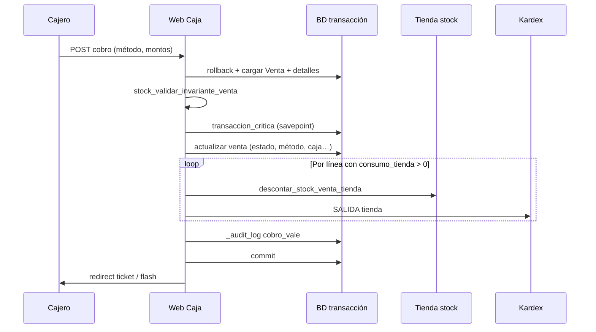
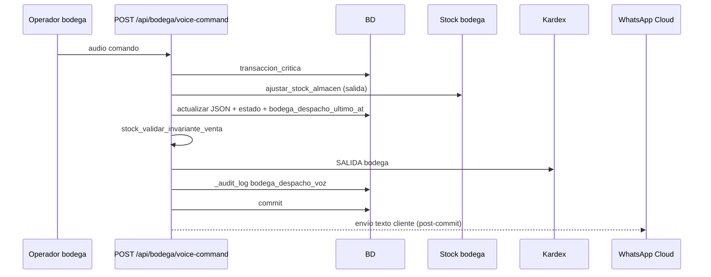
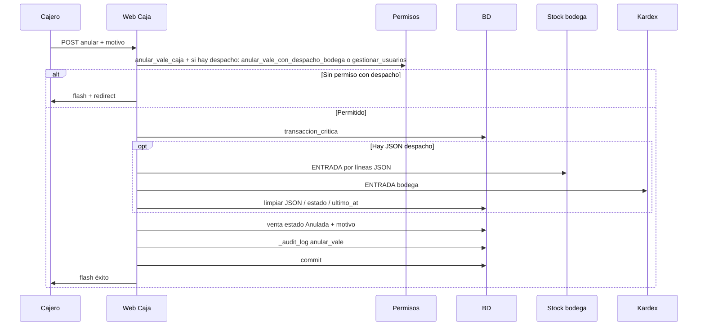
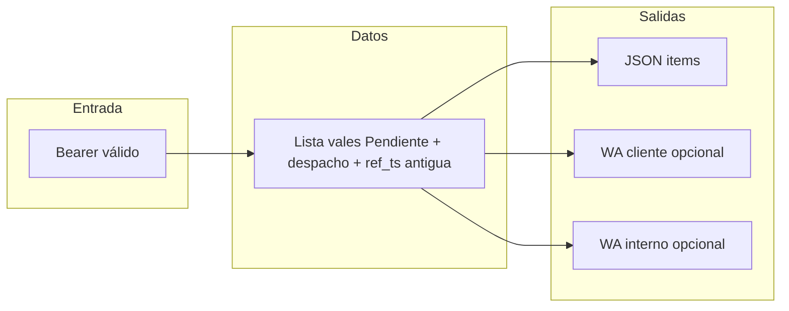

# Flujos críticos — stock, caja y bodega (ERP LhexIA)

Documento vivo alineado al [plan v2.0 Grok](./PLAN_TRABAJO_CONSOLIDADO_v2_GROK_10-10.md). Describe secuencias que **no deben romperse** al refactorizar.

---

## Invariante de stock por línea de vale

Para cada línea de `detalle_ventas`:

`consumo_registrado_bodega (JSON) + consumo_tienda_en_cobro ≤ consumo_total_en_unidades_stock`

- **Bodega (voz):** descuenta solo almacén bodega y acumula en `ventas.bodega_despacho_json`.
- **Caja (cobro):** descuenta tienda solo por el **remanente** no cubierto por bodega.
- **Validación:** `stock_validar_invariante_venta` (en `services/stock_service.py`) antes de persistir despacho o cobro.

---

## 1. Cobro de vale en caja (`procesar_cobro_caja`)

**Notas:** WhatsApp no forma parte de este flujo. Rollback ante cualquier error dentro del savepoint.

---

## 2. Despacho bodega por voz (`_bodega_voice_ejecutar` + API)

**Notas:** Si falla WA después del `commit`, el despacho **no** se revierte.

---

## 3. Anulación de vale en caja con despacho bodega (`anular_vale_caja`)

---

## 4. Cron alertas vales despachados sin cobro

`POST /api/ventas/alertas-despachos-pendientes` (Bearer). Opcional: `use_view` si existe `vista_vales_riesgo_despacho`, `send_wa` cliente, `send_wa_interno` a número operaciones.

---

## 5. Salud del sistema (operaciones)

`GET /api/sistema/salud` — requiere `gestionar_usuarios`. Implementación en `services/sistema_health_service.py`: conteo de vales en riesgo (misma lógica que el cron), vista SQL instalada, tabla `erp_audit_log`, eventos de auditoría últimas 24 h (si la tabla existe), hora de servidor y si hay webhook Slack configurado.

En el cron `POST /api/ventas/alertas-despachos-pendientes`, JSON opcional `notify_slack: true` envía un resumen a Slack (`SLACK_WEBHOOK_URL` o `ERP_SLACK_WEBHOOK_URL`) cuando los candidatos superan `VALES_RIESGO_SLACK_MIN` (default 1).

---

## Archivos relacionados

| Área | Ubicación |
|------|------------|
| Servicios stock / invariante | `services/stock_service.py` |
| Auditoría | `services/audit_service.py` |
| Savepoint crítico | `services/venta_service.py` → `transaccion_critica` |
| Rutas bodega registradas | `blueprints/bodega.py` + vistas en `app.py` |
| Rutas caja / cambios / cobro | `blueprints/caja.py` + vistas en `app.py` |
| Rutas POS | `blueprints/pos.py` + vistas en `app.py` |
| Rutas Customer 360 | `blueprints/c360.py` + `services/c360_service.py` |
| Salud / Slack cron | `services/sistema_health_service.py` |
| Vista SQL riesgo | `sql/2026_05_08_vista_vales_riesgo_despacho_*.sql` |
