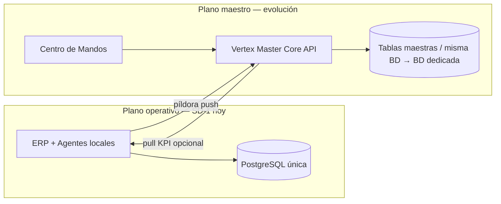
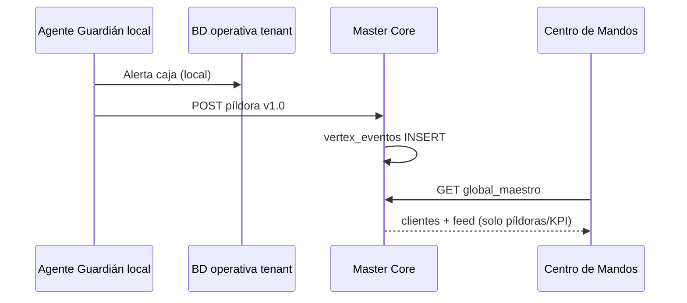
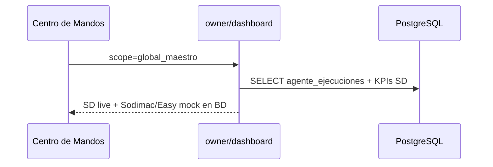

# VERTEX Master Core — Plano de control LhexIA

**Ecosistema:** LhexIA VERTEX · **Versión contrato píldora:** `1.0` · Mayo 2026  
**Estado SD-1:** Una sola PostgreSQL (pragmatismo piso) · **Aislamiento lógico:** `tenant_id` en payload y futuras tablas maestras

---

## 1. Qué es el Master Core

El **VERTEX Master Core** es el cerebro de plataforma de LhexIA: no vende tornillos ni mueve stock. Recibe **píldoras** (eventos de alta densidad) que los agentes y los ERP locales emiten, y alimenta:

- Centro de Mandos Global (`/owner/vertex-control`, `?scope=global_maestro`)
- Billing / contratos de módulos (futuro)
- Telemetría multi-cliente y heartbeat (futuro)

El **ERP transaccional** (Santo Domingo hoy) sigue en el **plano operativo**: ventas, caja, inventario, `agente_ejecuciones` local.



---

## 2. Contrato oficial: la píldora (`vertex_pildora` v1.0)

Una **píldora** es el JSON mínimo que cruza del cliente al Master Core. No incluye líneas de detalle de venta ni kardex completo.

### 2.1 Esquema

| Campo | Tipo | Obligatorio | Descripción |
|-------|------|-------------|-------------|
| `vertex_pildora_version` | string | Sí | `"1.0"` |
| `tenant_id` | string | Sí | Id lógico estable (`santo_domingo`, `sodimac_piloto`) |
| `tenant_slug` | string | Sí | URL-safe (`santo-domingo`) |
| `cliente_nombre` | string | Sí | Etiqueta UI |
| `agente_producto` | string | Sí | `vertex_guardian` \| `vertex_operador` \| `vertex_logistica` \| `vertex_inventario` |
| `agente_nombre` | string | No | Nombre técnico fila (`operador`, `vertex_hub`) |
| `codigo` | string | Sí | Código máquina (`caja_descuadre`, `sku_quiebre`, …) |
| `severidad` | string | Sí | `critical` \| `warning` \| `info` |
| `titulo` | string | Sí | Una línea para feed |
| `mensaje_corto` | string | No | Detalle ≤ 500 chars |
| `modo` | string | Sí | `live` \| `mock` \| `external` (Connect) |
| `origen` | string | Sí | `push_agente` \| `pull_sd1` \| `webhook_connect` |
| `occurred_at` | ISO8601 | Sí | Momento del hecho |
| `kpi_snapshot` | object | No | KPIs macro (ventas hoy, semáforos, etc.) |
| `semaforo_dominio` | string | No | `caja` \| `inventario` \| `credito` \| `compras` \| `logistica` |
| `nav_href` | string | No | Deep-link ERP (solo tenant live) |
| `registro_id` | int | No | `agente_ejecuciones.id` cuando persiste en BD |

### 2.2 Ejemplo — alerta crítica caja (live SD)

```json
{
  "vertex_pildora_version": "1.0",
  "tenant_id": "santo_domingo",
  "tenant_slug": "santo-domingo",
  "cliente_nombre": "Ferretería Santo Domingo",
  "agente_producto": "vertex_guardian",
  "agente_nombre": "operador",
  "codigo": "caja_descuadre",
  "severidad": "critical",
  "titulo": "Descuadre red +$8.168.790",
  "mensaje_corto": "Arqueo ciego con diferencia consolidada en red.",
  "modo": "live",
  "origen": "push_agente",
  "occurred_at": "2026-05-21T18:42:00-04:00",
  "semaforo_dominio": "caja",
  "kpi_snapshot": {
    "ventas_hoy_clp": 1250000,
    "estado_global": "rojo"
  },
  "nav_href": "/admin/control-center"
}
```

### 2.3 Ejemplo — piloto Sodimac (mock persistido)

```json
{
  "vertex_pildora_version": "1.0",
  "tenant_id": "sodimac_piloto",
  "tenant_slug": "sodimac-piloto",
  "cliente_nombre": "Sodimac Piloto",
  "agente_producto": "vertex_logistica",
  "agente_nombre": "vertex_hub",
  "codigo": "traslado_retrasado",
  "severidad": "warning",
  "titulo": "Traslado bodega norte +45 min vs SLA",
  "mensaje_corto": "Agente Logística — piloto retail zona norte.",
  "modo": "mock",
  "origen": "push_agente",
  "occurred_at": "2026-05-21T18:30:00-04:00",
  "semaforo_dominio": "logistica",
  "kpi_snapshot": {
    "ventas_hoy_clp": 18420000,
    "sucursales_activas": 4
  }
}
```

### 2.4 Persistencia SD-1 (misma BD)

Hoy la píldora vive en `agente_ejecuciones.payload_json` (campo completo o merge).  
Convención dedupe red demo: `vertex:maestro:{tenant_id}:{codigo}`.

Código: `services/vertex_pildora_contract.py`.

---

## 3. Tablas maestras (diseño post-SD-1)

En SD-1 **no** se migran tablas nuevas obligatorias; el feed usa `agente_ejecuciones` + payload. Tras sign-off SD-1:

| Tabla | Rol |
|-------|-----|
| `vertex_tenants` | Clientes: slug, nombre, vertical, activo, plan |
| `vertex_tenant_modulos` | Módulos contratados por tenant |
| `vertex_eventos` | Ingesta de píldoras (append-only, índice por tenant + occurred_at) |
| `vertex_kpi_rollup` | Snapshots horarios/diarios (ventas, semáforos) |
| `vertex_heartbeat` | Último ping agente/ERP por tenant |

Relación con operativo:

- `vertex_tenants.id` ↔ `tenant_id` lógico en ERP (columna nullable en ventas/caja/almacén — ver `VERTEX_MULTI_SUCURSAL.md`).
- **No** replicar `detalle_ventas` en Master.

---

## 4. Push vs Pull

| Estrategia | Cuándo | Cómo |
|------------|--------|------|
| **Push (objetivo)** | Post SD-1 | Agente detecta evento → escribe local + `POST /api/v1/vertex/events` (o outbox async) → `vertex_eventos` |
| **Pull (SD-1 hoy)** | Cierre SD-1 | Centro Global lee `agente_ejecuciones` + KPIs `owner_dashboard_service` del tenant `santo_domingo` |
| **Mock red** | Demo Chilemat | `vertex_hub` inserta píldoras `modo: mock` con dedupe fijo |

### 4.1 Flujo Push (fase LX-2)



### 4.2 Flujo Pull (SD-1 — actual)



**Regla:** el panel maestro nunca debe ejecutar scans de inventario completos; solo píldoras + rollups.

---

## 5. API y UI (implementado V3.0)

| Pieza | Ruta |
|-------|------|
| Dashboard maestro | `GET /api/v1/owner/dashboard?scope=global_maestro` |
| UI | `GET /owner/vertex-control` |
| Permiso | `gestionar_usuarios` (+ opcional `LHEXIA_VERTEX_MAESTRO_USERS`) |

Respuesta incluye: `clientes[]`, `feed_preview_global[]` (cada ítem con `pildora`), `grafo_agentes`, `resumen_red`, `meta.vertex_pildora_version`.

---

## 6. Endpoints futuros (Connect / Fase 3)

| Método | Ruta | Uso |
|--------|------|-----|
| POST | `/api/v1/vertex/events` | Ingesta píldora (API key por tenant) |
| POST | `/api/v1/vertex/heartbeat` | ERP/agente online |
| GET | `/api/v1/vertex/tenants` | Lista clientes (solo maestro) |

Defontana u otro ERP externo envía el mismo JSON §2 con `modo: external`, `origen: webhook_connect`.

---

## 7. Fases de evolución

| Fase | Infra | Master Core |
|------|-------|-------------|
| **SD-1 (ahora)** | 1× Postgres | Pull + píldoras en `agente_ejecuciones`; mock Sodimac/Easy sembrado |
| **SD-2 / LX-1** | `tenant_id` en tablas operativas | Tablas `vertex_*` en schema `master` (misma instancia) |
| **Multi-cliente** | Pool o BD dedicada por anchor | Push obligatorio; pull solo backup |
| **Connect** | Core separado opcional | BD Master dedicada; listener externo |

---

## 8. Referencias

- Biblia: [`LHEXIA_VERTEX_VISION.md`](LHEXIA_VERTEX_VISION.md)
- Multi-sucursal: [`VERTEX_MULTI_SUCURSAL.md`](VERTEX_MULTI_SUCURSAL.md)
- API Guardián: [`GUARDIAN_API_v1.md`](GUARDIAN_API_v1.md)
- Código contrato: `services/vertex_pildora_contract.py`
- Centro Global: `services/vertex_control_center_service.py`

---

*SD-1 cierra el piso transaccional; el Master Core crece por píldoras, no por copiar el ERP.*
