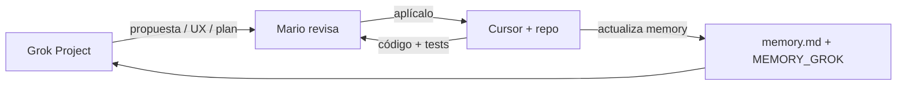

# Grok Project — LhexIA ERP (configuración recomendada)

**Para:** Mario Becerra Olea  
**Repo:** [github.com/mariobec/FERRETERIA](https://github.com/mariobec/FERRETERIA) · rama `main`  
**Actualizado:** 2026-05-17

Guía para crear un **proyecto persistente en Grok** con los planes fijos, alineado con Cursor y `MEMORY_GROK.md`.

---

## 1. Crear el proyecto en Grok

1. Abre Grok (app o web).
2. **Projects** / **Proyectos** → **New project**.
3. **Nombre sugerido:** `LhexIA ERP — Planes`
4. **Descripción:** `Alineación producto + Santo Domingo + índice planes. Repo FERRETERIA.`

---

## 2. Archivos fijos (5 — siempre en el proyecto)

Adjunta o “fija” estos archivos desde GitHub o desde tu PC. Son la **mínima verdad compartida** para los tres (Mario, Grok, Cursor).

| # | Archivo | Rol |
|---|---------|-----|
| 1 | `MEMORY_GROK.md` | Prioridades, nomenclatura SD/POS/IA/META, qué no proponer |
| 2 | `docs/planes/README.md` | Mapa carpetas `00`–`07` |
| 3 | `PLAN_INDICE_LHEXIA.md` | Índice técnico de fases y estado |
| 4 | `LHEXIA_PRODUCTO.md` | Portal producto LhexIA |
| 5 | `SANTO_DOMINGO_ENTREGA.md` | Portal entrega cliente #1 (SD-1) |

### Rutas en el repo

```
docs/planes/00-alineacion/MEMORY_GROK.md
docs/planes/README.md
docs/planes/00-alineacion/PLAN_INDICE_LHEXIA.md
docs/planes/02-producto-lhexia/LHEXIA_PRODUCTO.md
docs/planes/01-entrega-santo-domingo/SANTO_DOMINGO_ENTREGA.md
```

### Enlaces GitHub (vista)

| # | Abrir en GitHub |
|---|-----------------|
| 1 | [MEMORY_GROK.md](https://github.com/mariobec/FERRETERIA/blob/main/docs/planes/00-alineacion/MEMORY_GROK.md) |
| 2 | [planes/README.md](https://github.com/mariobec/FERRETERIA/blob/main/docs/planes/README.md) |
| 3 | [PLAN_INDICE_LHEXIA.md](https://github.com/mariobec/FERRETERIA/blob/main/docs/planes/00-alineacion/PLAN_INDICE_LHEXIA.md) |
| 4 | [LHEXIA_PRODUCTO.md](https://github.com/mariobec/FERRETERIA/blob/main/docs/planes/02-producto-lhexia/LHEXIA_PRODUCTO.md) |
| 5 | [SANTO_DOMINGO_ENTREGA.md](https://github.com/mariobec/FERRETERIA/blob/main/docs/planes/01-entrega-santo-domingo/SANTO_DOMINGO_ENTREGA.md) |

### Enlaces raw (para descargar / algunas integraciones)

```
https://raw.githubusercontent.com/mariobec/FERRETERIA/main/docs/planes/00-alineacion/MEMORY_GROK.md
https://raw.githubusercontent.com/mariobec/FERRETERIA/main/docs/planes/README.md
https://raw.githubusercontent.com/mariobec/FERRETERIA/main/docs/planes/00-alineacion/PLAN_INDICE_LHEXIA.md
https://raw.githubusercontent.com/mariobec/FERRETERIA/main/docs/planes/02-producto-lhexia/LHEXIA_PRODUCTO.md
https://raw.githubusercontent.com/mariobec/FERRETERIA/main/docs/planes/01-entrega-santo-domingo/SANTO_DOMINGO_ENTREGA.md
```

**Cómo adjuntar si Grok no lee el repo directo:** en cada enlace GitHub → botón **Raw** → copiar texto, o descargar los 5 `.md` desde tu clone local y subirlos al proyecto.

---

## 3. Prompt único (todo en uno — recomendado)

Si prefieres **un solo bloque** en lugar de instrucciones + 5 archivos por separado:

→ **[`GROK_PROMPT_UNICO.md`](GROK_PROMPT_UNICO.md)** — copia desde `=== LHEXIA ERP` hasta `=== FIN DEL PROMPT ===`

Ideal para **Custom instructions** del proyecto. Los 5 archivos siguen siendo útiles para detalle profundo.

---

## 4. Instrucciones personalizadas del proyecto (versión corta)

Alternativa corta si ya adjuntaste los 5 archivos. Pega en **Custom instructions**:

```
Eres el copiloto de producto y arquitectura de LhexIA ERP (ERP vertical ferretería Chile).

FUENTES DE VERDAD (archivos fijos del proyecto):
- MEMORY_GROK.md — prioridades y nomenclatura
- PLAN_INDICE_LHEXIA.md — fases SD, POS, TEC, CORE, LX, IA, META
- LHEXIA_PRODUCTO.md — visión producto
- SANTO_DOMINGO_ENTREGA.md — go-live cliente #1
- planes/README.md — estructura de documentación

REGLAS:
1. Prioridad HOY: SD-1 (POS + inventario Ferretería Santo Domingo). No bloquear con multi-tenant, refactor masivo de app.py ni agentes IA en producción sin OK explícito de Mario.
2. Usar prefijos: SD-, POS-, TEC-, CORE-, LX-, IA-, META- (no "Fase 3" suelta).
3. No inventar tablas, rutas API ni código: si hace falta detalle, indica que Cursor debe verificar en el repo https://github.com/mariobec/FERRETERIA
4. Grok propone → Cursor implementa y verifica → Mario aprueba alcance ("aplícalo").
5. Responde siempre en español, claro y accionable.

ROL DE GROK: UX POS, planes, review de propuestas, user stories, pitch producto, arquitectura IA. No ejecutar commits ni asumir deploy hecho.

Si el tema es solo operación en ferretería, prioriza SANTO_DOMINGO_ENTREGA.md. Si es producto comercial o agentes, LHEXIA_PRODUCTO.md y planes 06-agentes-ia / 07-agentes-meta-desarrollo.
```

---

## 5. Archivos opcionales (añadir según el chat)

| Tema del día | Añadir temporalmente |
|--------------|----------------------|
| UI POS vendedor | `docs/planes/03-pos-vendedor/POS_ALINEACION_CURSOR_GROK.md` |
| Optimización / core | `docs/planes/04-tecnico/ESTADO_OPTIMIZACION_APP.md` |
| Agentes negocio 24/7 | `docs/planes/06-agentes-ia/PLAN_AGENTES_IA_v1.md` |
| Agentes desarrollo (META) | `docs/planes/07-agentes-meta-desarrollo/PLAN_AGENTES_META_v1.md` |
| Runbook piso inventario | `docs/planes/01-entrega-santo-domingo/CLIENTE_SANTO_DOMINGO.md` |

---

## 6. Flujo de trabajo (los 3 alineados)



| Paso | Quién | Acción |
|------|-------|--------|
| 1 | Grok | Diseña o revisa usando archivos fijos del proyecto |
| 2 | Mario | Aprueba alcance o pide cambios |
| 3 | Cursor | Implementa en repo; `@MEMORY_GROK` + `@memory.md` |
| 4 | Cursor / Mario | Tras hito: actualizar `MEMORY_GROK` §12 y `memory.md` |
| 5 | Mario | Si cambió prioridad global: **re-subir** `MEMORY_GROK.md` al proyecto Grok |

---

## 7. Cuándo refrescar archivos en Grok

| Evento | Qué actualizar en el proyecto Grok |
|--------|-------------------------------------|
| Cierra SD-1 | `MEMORY_GROK`, `PLAN_INDICE`, `SANTO_DOMINGO_ENTREGA` |
| Cambia prioridad producto | `MEMORY_GROK`, `LHEXIA_PRODUCTO` |
| Nueva fase POS cerrada | Opcional: `POS_ALINEACION` en adjuntos del chat |
| Push grande a `main` | Re-descargar los 5 fijos desde GitHub (commit reciente) |

---

## 8. Primera pregunta de prueba (validar que Grok leyó)

Pega en un chat nuevo **dentro del proyecto**:

```
Resume en 5 bullets: prioridad actual, prefijos de fases activas, 
qué está prohibido proponer sin OK, y dónde está el runbook de inventario Santo Domingo.
```

**Respuesta esperada (checklist):**

- [ ] Menciona **SD-1** como prioridad
- [ ] Cita **SD-**, **POS-**, **IA-** o **META-** (no solo "fase 3")
- [ ] Dice no multi-tenant / no agentes prod sin OK
- [ ] Apunta a `CLIENTE_SANTO_DOMINGO` o enrolamiento `/inventario/enrolamiento`

---

## 9. Relación con Cursor

| Grok Project | Cursor |
|--------------|--------|
| 5 archivos planes | `@docs/planes/00-alineacion/MEMORY_GROK.md` + `@memory.md` |
| Instrucciones proyecto | `.cursor/rules/lhexia-producto.mdc` |

Mantener **misma prioridad** en ambos lados tras cada sprint.

---

*Documento de operación — no sustituye `MEMORY_GROK.md` (contenido), solo explica cómo montar el proyecto en Grok.*
