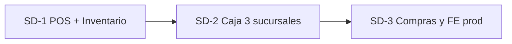

# Índice maestro de planes — LhexIA ERP

**Propósito:** Mapa de **todos los frentes/planes** del repo, con **nombres únicos** de fases y estado.

**Última actualización:** 2026-05-21  
**Product Owner:** Mario Becerra Olea  

## Entrada en dos documentos (leer según necesidad)

| Necesitas… | Documento único |
|------------|-----------------|
| **Todo el producto LhexIA** (visión, LX, IA, META, arquitectura) | [`../02-producto-lhexia/LHEXIA_PRODUCTO.md`](../02-producto-lhexia/LHEXIA_PRODUCTO.md) |
| **Toda la entrega Santo Domingo** (SD-1, POS, inventario, deploy) | [`../01-entrega-santo-domingo/SANTO_DOMINGO_ENTREGA.md`](../01-entrega-santo-domingo/SANTO_DOMINGO_ENTREGA.md) |
| **Carpeta planes (estructura 00–07)** | [`../README.md`](../README.md) |

Este archivo es el **índice técnico** de prefijos SD / POS / TEC / CORE / LX / IA / META / MOD.

---

## Visión (de este proyecto nace el producto)

**LhexIA ERP** — ERP vertical inteligente para ferreterías y retail en Chile:

| Pilar | Significado |
|-------|-------------|
| **Alma SAP** | Control de gestión, procesos robustos, trazabilidad |
| **Cuerpo Python** | Flask, PostgreSQL, despliegue ágil (Render + Neon) |
| **Agentes IA 24/7** | Mejoran inventario, riesgos, ventas (futuro producto) |

**Primer objetivo realista:** POS + Inventario en **Ferretería Santo Domingo** en producción (prototipo estable ≈ **2 semanas**).  
**Después:** producto comercial multi-tenant + agentes.

---

## Regla de nomenclatura

Cada frente usa un **prefijo de eje** + número:

| Prefijo | Eje | Documento principal |
|---------|-----|---------------------|
| **SD-** | Entrega Santo Domingo (operativo) | **`../01-entrega-santo-domingo/SANTO_DOMINGO_ENTREGA.md`** + este doc §1 |
| **POS-** | UI pantalla vendedor (Grok/Cursor) | `../03-pos-vendedor/POS_ALINEACION_CURSOR_GROK.md` |
| **TEC-** | Estabilidad monolito v2 (Grok 10/10) | `../04-tecnico/PLAN_TRABAJO_CONSOLIDADO_v2_GROK_10-10.md` |
| **CORE-** | Refactor dominio en `core/` | `../04-tecnico/ARQUITECTURA_CAPAS.md` + **`../04-tecnico/ESTADO_OPTIMIZACION_APP.md`** ← estado desarrollo |
| **LX-** | Producto LhexIA (SaaS) | **`../02-producto-lhexia/LHEXIA_PRODUCTO.md`** + `../02-producto-lhexia/PLAN_MAESTRO_LHEXIA.md` |
| **IA-** | Agentes IA 24/7 negocio (CrewAI) | `../06-agentes-ia/PLAN_AGENTES_IA_v1.md` |
| **META-** | Agentes meta desarrollo producto | `../07-agentes-meta-desarrollo/PLAN_AGENTES_META_v1.md` |
| **MOD-** | Módulos / roadmaps paralelos | Ver §8 |
| **TEC-OFFLINE-** | POS contingencia (IndexedDB + sync) | `../04-tecnico/ROADMAP_POS_CONTINUIDAD_OPERACIONAL.md` |

**Prioridad hoy:** solo **SD-1** (POS + inventario). El resto es referencia o backlog.

---

## 1. Eje SD — Entrega Santo Domingo (AHORA)

**Meta:** Prototipo estable en piso en ≈2 semanas. Un despliegue = un cliente (tenant implícito).



| Fase | Nombre | Objetivo | Estado | Notas |
|------|--------|----------|--------|-------|
| **SD-1** | **Go-live POS + Inventario** | Toma física + venta diaria en sucursal(es) piloto | 🟡 **En curso** | Inventario: herramientas listas; POS en prod |
| SD-1.1 | Inventario — toma física | Enrolamiento, sesiones, salud, kardex | 🟡 Operación mañana | `/inventario/enrolamiento`, `/inventario/salud` |
| SD-1.2 | POS — venta diaria | Vale → caja → cobro; búsqueda usable; TV cliente | 🟡 **Validar piso** | TV prod `4ae0292`; casuísticas QA repo `79220c9` + `CASUISTICAS_VENTAS_QA.md` |
| SD-1.3 | Infra y capacitación | Backup Neon, permisos, 3 almacenes, **índices + Render/Neon**, equipo inventario | ⏳ | `CLIENTE_SANTO_DOMINGO.md` · `PROPUESTA_EQUIPO_INVENTARIO_SANTO_DOMINGO.md` · `04-tecnico/PLAN_RENDIMIENTO_BD_SD1.md` |
| **SD-2** | Caja multi-sucursal | Cierre diario, cola cobro en 3 tiendas | ⏳ Post SD-1 | Caja madura en código |
| **SD-3** | Compras + FE producción | OC, recepción, DTE en operación real | ⏳ | FE 🟡 certificación |

**Criterio cierre SD-1:** Conteo registrado por sucursal + al menos 1 sucursal con flujo vale completo sin bloqueos críticos.

---

## 2. Eje POS — Pantalla vendedor (UI)

**Documento:** `../03-pos-vendedor/POS_ALINEACION_CURSOR_GROK.md`  
**Alcance:** Solo layout fullwidth vendedor (`pos_emitir_vale`). No confundir con POS clásico / Command Deck.

| Fase antigua | Nombre nuevo | Estado | Entregable clave |
|--------------|--------------|--------|------------------|
| Fase 1 | **POS-1** Hero búsqueda | ✅ | `unified_search_vendedor.html`, portal |
| Fase 2 | **POS-2** Carrito v3 | ✅ | `premium_cart_cards.html`, retiro línea |
| Fase 3 | **POS-3** Layout + dock 78vh | ✅ Prod | `5094d5d`, Mario aprobó |
| Fase 4 | **POS-4** Pulido F8/toasts/búsqueda | ✅ En `main` | `20260525f` — validar en piso |

**Backlog POS (post SD-1):** modo oscuro, animaciones, QA semáforo `POS-SEM-*`.

---

## 3. Eje TEC — Estabilidad monolito v2.0

**Documento:** `../04-tecnico/PLAN_TRABAJO_CONSOLIDADO_v2_GROK_10-10.md`  
**Estado global:** ✅ **Cerrado** (mayo 2026) para alcance v2.0.

| Fase antigua | Nombre nuevo | Estado |
|--------------|--------------|--------|
| 1A | **TEC-1A** Transacciones + audit + stock crítico | ✅ |
| 1B | **TEC-1B** Vales despachados sin cobro | ✅ |
| 2 | **TEC-2** Servicios extraídos | ✅ |
| 3 | **TEC-3** Blueprints (pos, caja, bodega, c360) | ✅ |
| 4 | **TEC-4** Salud + cron Slack | ✅ (alcance v2) |

**Backlog TEC v3+:** métricas finas, más rutas masivas en `transaccion_critica()`.

---

## 3b. Eje TEC-OFFLINE — Continuidad operacional (POS)

**Documentos:** `../04-tecnico/ROADMAP_POS_CONTINUIDAD_OPERACIONAL.md`, `ADR_OFFLINE_FIRST.md`, `OFFLINE_API_V1_CONTRACT.md`  
**Estado:** Fase 0 ✅ (`dbe03ed`, tag `checkpoint/offline-design-2026-05-20`). **Fase 1+ ⏸** hasta cerrar SD-1 piso o definir caja piloto.

| Fase | Nombre | Estado |
|------|--------|--------|
| **TEC-OFFLINE-0** | ADR + contrato API + paridad IVA JS | ✅ |
| TEC-OFFLINE-1 | Local Cache (IndexedDB + catálogo) | ⏳ Post SD-1 |
| TEC-OFFLINE-2 | Circuit Breaker | ⏳ |
| TEC-OFFLINE-3 | Reconciliation batch | ⏳ |
| TEC-OFFLINE-4 | Arqueo + panel conciliación DTE | ⏳ |

**Regla:** no competir con SD-1.1 inventario en la misma semana sin caja piloto nombrada.

---

## 4. Eje CORE — Refactor dominio (`core/`) / optimización `app.py`

**Documentos:**  
- **Estado desarrollo (leer primero):** `../04-tecnico/ESTADO_OPTIMIZACION_APP.md`  
- Detalle técnico fases: `../04-tecnico/ARQUITECTURA_CAPAS.md`  
- Plan estabilidad previo (cerrado): `../04-tecnico/PLAN_TRABAJO_CONSOLIDADO_v2_GROK_10-10.md` (TEC-*)

**Paralelo a SD-1:** solo cambios que no rompan piso.

| Fase | Nombre nuevo | Estado |
|------|--------------|--------|
| 1.2 | **CORE-1.2** Venta + cobro (estado vale) | ✅ |
| 1.3 | **CORE-1.3** Stock + kardex al cobro | ✅ |
| 1.4 | **CORE-1.4** Post-cobro crédito + saldo favor | ✅ |
| 1.5 | **CORE-1.5** Flags bodega + carrito Abierta | ⏳ Sugerida |

---

## 5. Eje LX — Producto LhexIA (comercial)

**Documento:** `../02-producto-lhexia/PLAN_MAESTRO_LHEXIA.md` + `../02-producto-lhexia/ROADMAP.md`  
**Regla:** **No bloquea SD-1.** Documentación y scaffold sí; multi-tenant en BD **después** de inventario.

| Fase antigua | Nombre nuevo | Estado | Cuándo |
|--------------|--------------|--------|--------|
| Fase 0 | **LX-0** Preparación (docs, reglas, `clients/`) | 🟡 Parcial | Paralelo liviano |
| Fase 1 | **LX-1** Core product (tenant, onboarding, licencias) | ⏳ | Post SD-1 |
| Fase 2 | **LX-2** Agentes IA (CrewAI) | ⏳ | 4–6 meses — detalle en eje **IA-*** |
| Fase 3 | **LX-3** Comercial SaaS (landing, pricing) | ⏳ | 6+ meses |

### LX-ACAD — Mentor Academy en piso (paralelo SD-1, 2026-05-23)

| Fase | Nombre | Objetivo | Estado |
|------|--------|----------|--------|
| **LX-ACAD-1** | Practicar Ahora | Deep links sidebar + hub → pantalla operativa | 📋 Listo para dev |
| **LX-ACAD-2** | Hub 3 caminos | `/academy` por rol + % vía telemetría | 📋 |
| **LX-ACAD-3** | Checklist persistente | `user_academy_progress` + `POST /api/mentor/save_step` | 📋 |
| **LX-ACAD-4** | Guía Activa | Toggle sidebar + `difficulty_level` / `estimated_time` | 📋 |

Doc: [`../02-producto-lhexia/LX_ACAD_TICKETS_SD1.md`](../02-producto-lhexia/LX_ACAD_TICKETS_SD1.md) · Prompt: [`../02-producto-lhexia/LX_ACAD_CURSOR_PROMPT_SD1.md`](../02-producto-lhexia/LX_ACAD_CURSOR_PROMPT_SD1.md)

---

## 6. Eje IA — Agentes IA 24/7

**Documento:** `../06-agentes-ia/PLAN_AGENTES_IA_v1.md`  
**Regla:** **No bloquea SD-1.** IA-0 (prep) en paralelo liviano; agentes en producción **después** de cerrar SD-1.


| Fase | Nombre | Duración ref. | Estado | Entregable clave |
|------|--------|---------------|--------|------------------|
| **IA-0** | Preparación | Semana 1 (actual) | 🟡 En curso | `agents/` scaffold, tools lectura, logging |
| **IA-1** | Agentes fundamentales | Semanas 2–5 | ⏳ Post SD-1 | Risk, Inventory, Sales, Orchestrator + Dashboard |
| **IA-1.1** | Risk & Vales Detective | Semana 2 | ⏳ | Vales pendientes, stock negativo, WhatsApp |
| **IA-1.2** | Inventory Optimizer | Semana 3 | ⏳ | Reórdenes, stock muerto, reporte diario |
| **IA-1.3** | Sales Analyst & Cross Seller | Semana 4 | ⏳ | VIP, productos cruzados |
| **IA-1.4** | Orchestrator + Dashboard | Semana 5 | ⏳ | Reporte ejecutivo diario |
| **IA-2** | Agentes avanzados | Semanas 6–10 | ⏳ | Purchasing, Retention, Financial, Pricing |
| **IA-3** | Sistema autónomo | Semanas 11–16 | ⏳ | Crews, human-in-the-loop, panel control |

**Stack:** CrewAI + LangGraph · Groq + Claude · Chroma/Qdrant · Celery + Redis · WhatsApp API.

**Roadmap 4 meses:** Mes 1 = IA-0 + Risk + Inventory · Mes 2 = Sales + Orchestrator · Mes 3 = Purchasing + Retention · Mes 4 = Financial + Pricing + IA-3.

---

## 7. Eje META — Agentes para desarrollar LhexIA

**Documento:** `../07-agentes-meta-desarrollo/PLAN_AGENTES_META_v1.md`  
**Regla:** Apoyan a Mario + Cursor + Grok **sin bloquear SD-1**. No son agentes runtime en ferretería (eso es **IA-***).

| Prioridad | ID | Agente | Impacto |
|-----------|-----|--------|---------|
| 1 | **META-ARCH** | Chief Architect | Muy alto |
| 2 | **META-QA** | Code Quality & Reviewer | Muy alto |
| 3 | **META-PO** | Product Owner | Alto |
| 4 | **META-DOC** | Documentation | Alto |
| 5 | **META-TEST** | Testing & QA | Alto |
| 6 | **META-OPS** | DevOps & Deployment | Medio-alto |
| 7 | **META-RES** | Research & Competitor | Medio |
| 8 | **META-MKT** | Marketing & Sales | Medio |
| 9 | **META-LEG** | Legal & Compliance | Medio |
| 10 | **META-ORCH** | Orchestrator / PM | Alto |

**Fase META-1 (próximas 3 semanas) — equipo mínimo viable:**

| Semana | Agentes activos | Entregable |
|--------|-----------------|------------|
| 1 | META-ARCH, META-QA | Review arquitectura + checklist PR/CI |
| 2 | META-DOC, META-PO | Planes actualizados + backlog SD/POS |
| 3 | META-ORCH | Reporte semanal riesgos y pendientes |

**Fase META-2 (semanas 4–8):** META-TEST, META-OPS, META-RES, META-MKT, META-LEG.

---

## 8. Módulos paralelos (MOD-) — backlog

Planes **válidos** pero **no prioritarios** para las 2 semanas de Santo Domingo.

| ID | Módulo | Documento | Estado resumido |
|----|--------|-----------|-----------------|
| MOD-C360 | Customer 360 | `../05-modulos-backlog/roadmap_customer_360_ferreteria_2026.md` | P0–P3 definido; parcial en prod |
| MOD-FE | Facturación electrónica SII | `docs/memory.md` §FE | 🟡 Servicios + cola; certificación |
| MOD-BODEGA | Bodega / despacho / voz | `../05-modulos-backlog/BODEGA_ULTRA_PREMIUM.md` | ✅ Operativo; Whisper opcional |
| MOD-OBS | Observabilidad 2026–2030 | `../05-modulos-backlog/roadmap_observabilidad_lhexia_2026_2030.md` | Largo plazo |
| MOD-AUD | Auditorías inventario | `../05-modulos-backlog/PLAN_TRABAJO_CONSOLIDADO_AUDITORIAS.md` | Referencia |
| MOD-CASU | Casuísticas QA | `docs/CASUISTICAS_PRUEBAS.md` | 200+ tests |
| **LX-FID** | Fidelización puntos → descuento caja | `../02-producto-lhexia/PLAN_FIDELIZACION_Y_PROMO_EXPERIENCE.md` §A | 📋 Post SD-1 |
| **LX-PROMO** | Sorteo aleatorio premio (TV Experience) | `../02-producto-lhexia/PLAN_FIDELIZACION_Y_PROMO_EXPERIENCE.md` §B | 📋 Post SD-1 |

---

## 9. Matriz “¿qué plan leo?”

| Si necesitas… | Abre |
|---------------|------|
| **Entrega completa Santo Domingo** | **`../01-entrega-santo-domingo/SANTO_DOMINGO_ENTREGA.md`** |
| **Runbook 1 página (piso)** | `../01-entrega-santo-domingo/CLIENTE_SANTO_DOMINGO.md` |
| **Producto LhexIA completo** | **`../02-producto-lhexia/LHEXIA_PRODUCTO.md`** |
| **Alineación Mario · Grok · Cursor** | [`../00-alineacion/MEMORY_GROK.md`](../00-alineacion/MEMORY_GROK.md) |
| **Configurar Grok Project** | [`../00-alineacion/GROK_PROJECT_SETUP.md`](../00-alineacion/GROK_PROJECT_SETUP.md) |
| **Estado pantalla vendedor** | `../03-pos-vendedor/POS_ALINEACION_CURSOR_GROK.md` |
| **Mapa técnico POS (auditoría)** | `../03-pos-vendedor/POS_PANTALLA_VENDEDORA_AUDITORIA.md` |
| **Visión producto / SAP+Python+IA** | `../02-producto-lhexia/PLAN_MAESTRO_LHEXIA.md` |
| **Plan Agentes IA negocio (IA-0…3)** | `../06-agentes-ia/PLAN_AGENTES_IA_v1.md` |
| **Plan Agentes Meta desarrollo (META-1…2)** | `../07-agentes-meta-desarrollo/PLAN_AGENTES_META_v1.md` |
| **Carpeta planes** | `../README.md` |
| **Transacciones / stock / caja seguras** | `../04-tecnico/PLAN_TRABAJO_CONSOLIDADO_v2_GROK_10-10.md` |
| **Optimización / refactor `app.py` (qué ya se hizo)** | `../04-tecnico/ESTADO_OPTIMIZACION_APP.md` |
| **Refactor `core/` (detalle fases)** | `../04-tecnico/ARQUITECTURA_CAPAS.md` |
| **Mapa general ERP** | `docs/ERP_MAESTRO.md` |
| **Bitácora sesiones** | `docs/memory.md` |
| **Este índice** | `../00-alineacion/PLAN_INDICE_LHEXIA.md` ← **empieza aquí** |

---

## 10. Línea de tiempo recomendada (una sola prioridad)

```
May 2026  ████████████████  SD-1  POS + Inventario (Santo Domingo)
May–Jun   ░░██░░░░░░░░░░░░  IA-0 + META-1  Prep / equipo dev (paralelo)
Jun 2026  ████░░░░░░░░░░░░  SD-2  + estabilización + LX-0
Jul–Ago   ░░░░████████░░░░  LX-1  Multi-tenant MVP
Sep–Dic   ░░░░░░░░████████  IA-1…3  Agentes IA (ver PLAN_AGENTES_IA_v1)
```

**En paralelo sin tocar prod crítico:** documentación LX-0, tests smoke en CI, CORE-1.5 si hay ventana.

---

## 10. Pendientes inmediatos (accionables)

| # | Acción | Eje | Responsable |
|---|--------|-----|-------------|
| 1 | Validar 3 almacenes + permisos enrolamiento | SD-1.1 | Mario / operación |
| 2 | Toma inventario con `/inventario/enrolamiento` | SD-1.1 | Piso |
| 3 | Validar **POS-4** en piso (`20260525f` en `main` desde `309f02f`) | POS-4 | Mario / piso |
| 4 | Piloto vale → caja sucursal 1 | SD-1.2 | Piso |
| 5 | No iniciar **LX-1** multi-tenant hasta cerrar SD-1 | LX | Decisión |
| 6 | IA-0: diseño `agents/` + tool lectura en QA (sin Celery prod) | IA-0 | Cursor / Grok |
| 7 | META-1 semana 1: checklist review PR + nota arquitectura `core/` | META-ARCH / META-QA | Cursor |

---

## 12. Equivalencias rápidas (evitar confusiones)

| Si alguien dice… | Significa en este índice |
|------------------|---------------------------|
| “Fase 3 POS” | **POS-3** (layout dock) ✅ |
| “Fase 3 Grok plan trabajo” | **TEC-3** (blueprints) ✅ |
| “Fase 3 producto” | No existe aún; ver **LX-*** |
| “Fase 1 operativa” | **SD-1** (Santo Domingo go-live) |
| “Plan maestro” | **LX-*** (`../02-producto-lhexia/`) |
| “Plan consolidado v2” | **TEC-*** (cerrado) |
| “Fase 2 agentes” / “LX-2” | **IA-1…IA-3** (`../06-agentes-ia/`) |
| “Risk Detective” | **IA-1.1** |

---

## 12. Documentos a mantener vs archivar

| Mantener vivos | Rol |
|----------------|-----|
| `PLAN_INDICE_LHEXIA.md` | **Entrada única** — este archivo |
| `product/PLAN_MAESTRO_LHEXIA.md` | Visión producto |
| `product/CLIENTE_SANTO_DOMINGO.md` | Runbook SD-1 |
| `POS_ALINEACION_CURSOR_GROK.md` | Detalle POS-* |
| `PLAN_TRABAJO_CONSOLIDADO_v2_GROK_10-10.md` | Histórico TEC-* cerrado |
| `planes/04-tecnico/ESTADO_OPTIMIZACION_APP.md` | **Seguimiento optimización app** |
| `ARQUITECTURA_CAPAS.md` | CORE-* detalle |
| `ERP_MAESTRO.md` | Referencia técnica |
| `memory.md` | Bitácora |
| `planes/06-agentes-ia/PLAN_AGENTES_IA_v1.md` | Detalle **IA-*** (negocio) |
| `planes/07-agentes-meta-desarrollo/PLAN_AGENTES_META_v1.md` | Detalle **META-*** (desarrollo) |

| Referencia / no editar cada sprint | Rol |
|-----------------------------------|-----|
| `product/ROADMAP.md` | Resumen fechas; debe alinearse con este índice |
| Roadmaps C360 / observabilidad | MOD-* backlog |

---

*Al cerrar SD-1, actualizar §1 y §11. Al renombrar fases en otros docs, usar prefijos SD-/POS-/TEC-/CORE-/LX-/IA-/META-.*
