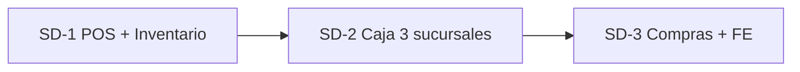

# Ferretería Santo Domingo — Documento único de entrega y desarrollo

**Cliente #1 LhexIA ERP** · **Alcance actual: SD-1** (POS + inventario)  
**URL producción:** [www.lhexia.cl](https://www.lhexia.cl)  
**Última actualización:** 2026-05-17

> **Este es el documento de entrada para todo lo operativo y técnico de Santo Domingo** (go-live, POS, inventario, infra, criterios de cierre).  
> **Visión producto LhexIA** (comercial, multi-tenant, agentes globales) → [`LHEXIA_PRODUCTO.md`](LHEXIA_PRODUCTO.md).  
> **Alineación Mario · Grok · Cursor:** [`MEMORY_GROK.md`](MEMORY_GROK.md).  
> **Mapa de planes cruzados:** [`PLAN_INDICE_LHEXIA.md`](PLAN_INDICE_LHEXIA.md).

---

## 1. Contexto del cliente

| Dato | Valor |
|------|-------|
| Negocio | Ferretería mediana, ~20 trabajadores |
| Sucursales | **3** |
| Rol en LhexIA | Cliente diseño, laboratorio real, caso de éxito |
| Tenant | Implícito único (una BD Neon, un Render) |
| Urgencia | Prototipo estable **POS + inventario** en ~2 semanas |
| Hito inmediato | **Toma de inventario físico** |

Santo Domingo **no es un fork**: cambios en repo deben servir al producto (`obtener_config_empresa()` hasta existir `tenant_settings`).

---

## 2. Fases de entrega (eje SD-)



| Fase | Objetivo | Estado | Documento detalle |
|------|----------|--------|-------------------|
| **SD-1** | Go-live POS + inventario | 🟡 **En curso** | Este doc §3–7 |
| SD-1.1 | Toma física | 🟡 Operación | §4 |
| SD-1.2 | POS venta diaria | 🟡 Validar piso | §5 |
| SD-1.3 | Infra + capacitación | ⏳ | §6 |
| **SD-2** | Caja multi-sucursal | ⏳ Post SD-1 | Caja ya madura en código |
| **SD-3** | Compras + FE producción | ⏳ | FE 🟡 certificación |

**Cierre SD-1:** conteo por sucursal registrado + ≥1 sucursal con flujo vale completo sin bloqueos críticos.

---

## 3. Módulos ERP usados en SD-1

| Módulo | Rutas clave | Estado repo |
|--------|-------------|-------------|
| **Inventario — enrolamiento** | `/inventario/enrolamiento` | ✅ |
| **Inventario — salud** | `/inventario/salud`, `?export=desajuste` | ✅ |
| **Kardex** | `/kardex` | ✅ |
| **Auditoría móvil** | `auditorias_inventario` + ajuste automático | ✅ |
| **POS vendedor** | `/punto_venta`, `/buscar_producto` | ✅ Prod |
| **Caja** | `/caja/*`, `procesar_cobro_caja` | ✅ |
| **Stock** | Tienda + bodega por almacén | ✅ |
| **Bodega / despacho** | Plataforma, cola retiros | ✅ (no bloqueante SD-1) |
| **FE SII** | Admin facturación | 🟡 No crítico SD-1 |

Permisos RBAC: `enrolamiento_inventario`, `admin_inventario`, `pos_emitir_vale`, caja según rol.

Mapa técnico completo: [`ERP_MAESTRO.md`](ERP_MAESTRO.md)

---

## 4. Inventario — desarrollo y operación

### Desarrollo entregado

- Sesiones de conteo por almacén/sucursal
- Escaneo código de barras / búsqueda producto
- Salud: desajustes maestro vs suma almacenes
- Export CSV desajustes
- Kardex en ajustes automáticos
- SQL: `sql/2026_05_06_enrolamiento_inventario.sql`, stock por almacén

### Runbook piso (D0 y durante toma)

Detalle paso a paso: [`product/CLIENTE_SANTO_DOMINGO.md`](product/CLIENTE_SANTO_DOMINGO.md)

**Resumen D0:**

1. Validar **3 almacenes** activos (Admin → Almacenes)
2. Permisos `enrolamiento_inventario` a encargados
3. **Backup Neon** antes de ajustes masivos
4. Aplicar SQL enrolamiento si falta tabla

**Flujo recomendado:** `/inventario/enrolamiento` → sesión por sucursal → escaneo → cierre → `/inventario/salud`

---

## 5. POS vendedor — desarrollo y operación

### Desarrollo entregado (eje POS-)

| Fase | Entregable | Estado |
|------|------------|--------|
| POS-1 | Hero búsqueda, portal | ✅ |
| POS-2 | Carrito v3, retiro por línea | ✅ |
| POS-3 | Layout dock, panel búsqueda ~78vh | ✅ Prod (`5094d5d`) |
| POS-4 | F8, toasts, búsqueda 2 chars | ✅ Código local — verificar push |

**Archivos clave:** `templates/punto_venta.html`, `static/js/pos.js`, `static/css/pos-premium-layout.css`  
**Detalle fases:** [`POS_ALINEACION_CURSOR_GROK.md`](POS_ALINEACION_CURSOR_GROK.md)  
**Auditoría técnica:** [`POS_PANTALLA_VENDEDORA_AUDITORIA.md`](POS_PANTALLA_VENDEDORA_AUDITORIA.md)  
**Revert layout:** [`POS_REVERT_DOCK_BUSQUEDA.md`](POS_REVERT_DOCK_BUSQUEDA.md)

### Operación en piso

1. `/punto_venta` — Ctrl+F5 tras cada deploy
2. Búsqueda: 2–3+ caracteres; si vacío probar filtro **Catálogo** (no solo Operativo)
3. Vale → caja → cobro; retiro Tienda / Bodega / Despacho

### APIs / backend POS

- `GET /buscar_producto` — enriquecido (`pos_busqueda_service`)
- Stock bodega al agregar: `_pos_puede_sumar_unidad` en `app.py`
- Blueprint: `blueprints/pos.py`

---

## 6. Infraestructura y deploy

| Ítem | Detalle |
|------|---------|
| Hosting | Render (web) |
| BD | PostgreSQL Neon |
| Deploy | Push `main` → auto-deploy (`render.yaml`) |
| Health | `/api/sistema/salud` |
| Backup | `scripts/sync_local_neon_render.py`, consola Neon |
| Entornos | Prod www.lhexia.cl · Local `.env.local` para pytest |

Docs: [`MIGRACION_RENDER_NEON.md`](MIGRACION_RENDER_NEON.md) · [`RESPALDO_PROYECTO.md`](RESPALDO_PROYECTO.md)

**Antes de cada deploy crítico POS:** smoke tests `pytest tests/ -m smoke`

---

## 7. Estabilidad backend (lo que sostiene SD-1)

No es visible en piso, pero evita pérdida de stock y vales inconsistentes:

| Eje | Qué aporta a Santo Domingo | Doc |
|-----|----------------------------|-----|
| **TEC-*** | `transaccion_critica`, audit log, alertas vales | `PLAN_TRABAJO_CONSOLIDADO_v2_GROK_10-10.md` |
| **CORE-*** | Cobro y stock al cobrar en `core/` | `planes/04-tecnico/ESTADO_OPTIMIZACION_APP.md` |

Flujos que no deben romperse: [`FLUJOS_CRITICOS.md`](FLUJOS_CRITICOS.md)

---

## 8. Criterios “prototipo OK” (fin semana 2)

| Área | Criterio |
|------|----------|
| Inventario | 3 sucursales con conteo o plan de corrección documentado |
| POS | ≥1 sucursal flujo vale completo sin bloqueos críticos |
| Datos | Códigos de barra críticos en catálogo |
| Equipo | ≥2 usuarios capacitados por módulo |

---

## 9. Fuera de alcance SD-1 (explícito)

- Multi-tenant en BD
- Onboarding comercial otra ferretería
- Agentes IA en producción (plan **IA-***, post SD-1)
- Landing SaaS / pricing
- Migrar todos los modelos fuera de `app.py`
- FE SII en operación real (SD-3)

---

## 10. Pendientes inmediatos

| # | Acción | Responsable |
|---|--------|-------------|
| 1 | Validar 3 almacenes + permisos enrolamiento | Mario / operación |
| 2 | Toma con `/inventario/enrolamiento` | Piso |
| 3 | Commit/push POS-4 si búsqueda OK en prueba | Cursor / Mario |
| 4 | Piloto vale → caja sucursal 1 | Piso |
| 5 | Backup Neon antes de ajustes masivos stock | Mario |

---

## 11. Tests y QA para SD-1

```bash
pytest tests/ -m smoke -q
pytest tests/test_routes_criticas.py -q --tb=no
pytest tests/test_pos_busqueda_semaforo.py -q
```

Casuísticas: [`CASUISTICAS_PRUEBAS.md`](CASUISTICAS_PRUEBAS.md)

---

## 12. Documentos hijos (detalle operativo)

| Tema | Archivo |
|------|---------|
| **Propuesta equipamiento + cotización (cliente)** | [`PROPUESTA_EQUIPO_INVENTARIO_SANTO_DOMINGO.md`](PROPUESTA_EQUIPO_INVENTARIO_SANTO_DOMINGO.md) |
| Runbook 1 página piso | [`CLIENTE_SANTO_DOMINGO.md`](CLIENTE_SANTO_DOMINGO.md) |
| Config cliente | `clients/santo_domingo/README.md` (si existe) |
| POS fases UI | `POS_ALINEACION_CURSOR_GROK.md` |
| Índice planes SD/POS | `PLAN_INDICE_LHEXIA.md` §1–2 |
| Bitácora sesiones | `memory.md` |
| **Vitácora reunión fidelización + sorteo TV** | [`VITACORA_REUNION_FIDELIZACION_PROMO_SD.md`](VITACORA_REUNION_FIDELIZACION_PROMO_SD.md) 📅 programada |
| Plan técnico LX-FID / LX-PROMO | [`../02-producto-lhexia/PLAN_FIDELIZACION_Y_PROMO_EXPERIENCE.md`](../02-producto-lhexia/PLAN_FIDELIZACION_Y_PROMO_EXPERIENCE.md) |

---

## 13. Contacto

- **Producto / técnico:** Mario Becerra Olea  
- **Implementación:** Cursor + repo en GitHub  

---

*Documento portal — actualizar al cerrar SD-1 o al abrir SD-2.*
