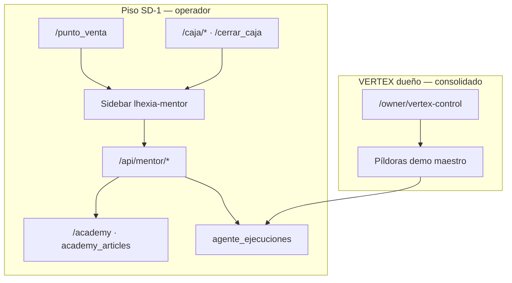

# LhexIA Academy + Mentor (piso operativo)

**Estado:** implementado en main (SD-1) · **Última revisión:** 2026-05-23  
**Audiencia:** desarrolladores, otra IA de revisión, capacitación técnica  
**Producto:** mismo agente de negocio **LhexIA Guía** (`vertex_mentor`) — ver [`../06-agentes-ia/CONSOLIDACION_4_AGENTES_ASESORIA.md`](../06-agentes-ia/CONSOLIDACION_4_AGENTES_ASESORIA.md) Agente 3

---

## 1. Resumen

| Pieza | Qué hace |
|-------|----------|
| **LhexIA Academy** | Biblioteca de capacitación: Manual V2 en BD (`academy_articles`), hub `/academy`, sección en `/ayuda` |
| **Mentor (piso)** | Sidebar contextual en POS/caja: artículo principal, biblioteca, atajos, píldora prioritaria según URL |
| **API** | `GET /api/mentor/context`, `POST /api/mentor/log_read` (+ alias legacy `/api/pos/mentor/*`) |
| **Telemetría** | Lecturas/expansiones → tabla `agente_ejecuciones` (`agente_nombre='mentor'`, `tipo=log`) |
| **Mentor (VERTEX dueño)** | Nodo en `/owner/vertex-control` — demo píldoras maestro; **no sustituye** el sidebar de piso |

**Invariante de negocio (POS):** el POS no recauda dinero; el cobro es solo en caja. Constante `INVARIANTE_FINANCIERA` en `services/academy_format.py`.

---

## 2. Dos capas del Mentor (no confundir)



| Capa | Ruta UI | Código principal | Usuario |
|------|---------|------------------|---------|
| **Piso** | POS, vales pendientes, cambios, cerrar caja | `vertex_mentor_service.py`, `academy_service.py`, partials `lhexia_mentor_*` | Vendedor, cajera |
| **VERTEX** | Centro de Mandos | Feed `scope=global_maestro`, píldoras `vertex:maestro:*` | Dueño / admin red |

Documentación VERTEX (mapa neuronal): `docs/ERP_MAESTRO.md` §19.6.1. Este documento cubre **Academy + Mentor en piso**.

---

## 3. Archivos del repositorio

| Archivo | Rol |
|---------|-----|
| `app.py` | Modelo `AcademyArticle`, `_asegurar_tabla_academy_articles()`, rutas `/academy`, handlers `api_mentor_*` |
| `blueprints/academy.py` | Registro canónico `/api/mentor/context`, `/api/mentor/log_read` |
| `blueprints/pos.py` | Alias legacy `/api/pos/mentor/contexto`, `/api/pos/mentor/telemetria` |
| `services/academy_bootstrap.py` | Seed idempotente Manual V2 (`MANUAL_V2_ARTICLES`) |
| `services/academy_service.py` | Contexto API, filtro por rol, telemetría `registrar_lectura_academy` |
| `services/academy_format.py` | Markdown → HTML HUD, invariante financiera, normalización atajos |
| `services/vertex_mentor_service.py` | Detección contexto URL, `ACADEMY_GUIDES`, píldoras prioritarias |
| `services/agente_ejecuciones_service.py` | `registrar_ejecucion_mentor`, tabla `agente_ejecuciones` |
| `templates/academy_hub.html` | Hub `/academy` |
| `templates/ayuda/academy_manual_v2.html` | Fragmento en centro de ayuda |
| `templates/partials/lhexia_mentor_sidebar.html` | Panel lateral |
| `templates/partials/lhexia_mentor_init.html` | JSON config + `initLhexiaMentorAcademy` |
| `static/js/academy-format.js` | Cliente formateo / expandir tarjetas |
| `static/js/pos.js` | `initLhexiaMentorAcademy` (cache-bust `mentor-academy-20260523`) |
| `sql/2026_05_23_academy_articles.sql` | DDL PostgreSQL referencia |

---

## 4. Rutas HTTP

### 4.1 Páginas (HTML)

| Método | Ruta | Permiso | Descripción |
|--------|------|---------|-------------|
| GET | `/academy` | `@login_required` | Hub LhexIA Academy (Manual V2 por categoría) |
| GET | `/ayuda` | según ayuda | Incluye artículos Academy vía `listar_manual_v2_para_ayuda()` |

Anclas hub: `#academy-pos`, `#academy-caja`, `#academy-bodega`, `#lhexia-academy`.

### 4.2 API Mentor (JSON)

| Método | Ruta canónica | Alias legacy | Auth |
|--------|---------------|--------------|------|
| GET | `/api/mentor/context` | `/api/pos/mentor/contexto` | `login_required` + al menos uno: `pos_emitir_vale`, `caja_cobrar_vale`, `gestionar_usuarios` |
| POST | `/api/mentor/log_read` | `/api/pos/mentor/telemetria` | Igual |
| POST | `/api/mentor/save_step` | — | Igual (LX-ACAD-3 checklist) |

**Query/body:**

- Context: `?url=/punto_venta` (o `path`; fallback `Referer`).
- Log read (JSON): `{ "dedupe_key": "...", "accion": "cargar|expandir", "url": "/..." }` — también acepta `componente` como alias de `dedupe_key`.
- Save step (JSON): `{ "dedupe_key": "...", "step_id": "step-0", "checked": true }` → persiste en `user_academy_progress`.

**Respuesta contexto (`ok: true`):**

```json
{
  "ok": true,
  "contexto": "pos",
  "categoria_academy": "pos",
  "url": "/punto_venta",
  "caja_dia_anterior": false,
  "articulo_principal": { "dedupe_key": "...", "title": "...", "pasos": [], "content_html": "..." },
  "pildora_prioritaria": { "codigo": "mentor_capacitacion", "agente_producto": "vertex_mentor", "nav_href": "..." },
  "biblioteca": [],
  "atajos_teclado": [{ "tecla": "F2", "accion": "..." }],
  "invariante_financiera": "Invariante Financiera: ...",
  "agente_producto": "vertex_mentor"
}
```

Errores: `403 sin_permiso`, `500 contexto|telemetria`, `400` si falta `dedupe_key` en log.

---

## 5. Modelo de datos

### 5.1 `academy_articles`

| Columna | Tipo | Notas |
|---------|------|-------|
| `id` | SERIAL PK | |
| `dedupe_key` | VARCHAR(128) UNIQUE | Clave estable para seed y telemetría |
| `category` | VARCHAR(32) | `pos`, `caja`, `bodega` |
| `title`, `summary` | | |
| `content_markdown` | TEXT | Manual operativo (secciones A/B/C) |
| `permissions_required` | VARCHAR(120) | Rol lógico: `vendedor`, `cajera`, `bodega` |
| `video_url` | opcional | Reservado |
| `created_at`, `updated_at` | | |

Creación: `_asegurar_tabla_academy_articles()` al arranque / primer uso → `AcademyArticle.__table__.create` + `asegurar_academy_seed()`.

### 5.2 Manual V2 (seed)

| `dedupe_key` | Categoría | Rol | Tema |
|--------------|-----------|-----|------|
| `academy:manual_v2:seccion_a_pos_semaforos` | pos | vendedor | POS y semáforos de stock |
| `academy:manual_v2:seccion_b_arqueo_ciego_plat11` | caja | cajera | Arqueo ciego PLAT-1.1 |
| `academy:manual_v2:seccion_c_telemetria_v3` | bodega | bodega | Estanterías telemetría V3 |

Fuente: `services/academy_bootstrap.py` — actualización idempotente por campo si el registro ya existe.

### 5.3 Biblioteca virtual (sin fila DB)

Guías cortas en `ACADEMY_GUIDES` (`vertex_mentor_service.py`):

| `dedupe_key` | Contextos |
|--------------|-----------|
| `academy:pos:emitir_vale` | pos |
| `academy:caja:cobrar_vale` | caja, pos |
| `academy:caja:cambios_devoluciones` | cambios_devoluciones |
| `academy:caja:caja_dia_anterior` | caja_dia_anterior, caja, cerrar_caja |
| `academy:caja:abrir_cerrar` | caja, cerrar_caja |

Se fusionan en `biblioteca` del API si no duplican `dedupe_key` de artículos DB.

### 5.4 `user_academy_progress` (LX-ACAD-3)

| Columna | Notas |
|---------|--------|
| `user_id`, `dedupe_key` | Unique juntos |
| `article_id` | Opcional (FK artículo DB) |
| `completed_steps_json` | JSON array `["step-0", "step-1"]` |
| `completed_at` | Set cuando todos los pasos están marcados |

DDL: `sql/2026_05_23_user_academy_progress.sql`

### 5.5 Telemetría `agente_ejecuciones`

Al expandir/leer una tarjeta: `registrar_lectura_academy` → `registrar_ejecucion_mentor` con:

- `agente_nombre`: `mentor`
- `agente_producto` / módulo: `vertex_mentor`
- `codigo`: `mentor_consulta_academy`
- `origen` en payload: `academy_sidebar`
- `estado`: `ejecutado`, `tipo`: `log`

Filtro feed VERTEX: `fila_es_telemetria_academy()` en `vertex_mentor_service.py`.

---

## 6. Lógica de contexto (servidor)

### 6.1 Detección de pantalla (`detectar_contexto_pantalla`)

| Fragmento en URL | `contexto` |
|------------------|------------|
| `/caja/cambios`, `/cambios` | `cambios_devoluciones` |
| `/caja/vales`, `/caja/pendientes` | `caja` |
| `/cerrar_caja`, `/caja/cerrar` | `cerrar_caja` |
| `/punto_venta`, `/pos` | `pos` |
| otro | `general` |

### 6.2 Categoría Academy (`resolver_categoria_academy`)

Mapea contexto → `pos` | `caja` | `bodega` (paths con `/bodega`, `/enrolamiento`, `/inventario` fuerzan bodega).

### 6.3 Píldora prioritaria (`resolver_pildora_prioritaria`)

| Condición | Código píldora | `nav_href` |
|-----------|----------------|------------|
| contexto = cambios | `mentor_guia_nota_credito` | `/caja/cambios` |
| caja abierta día anterior | `mentor_caja_dia_anterior` | `/cerrar_caja` |
| contexto = cerrar_caja | `mentor_consulta_academy` (cierre) | `/cerrar_caja` |
| contexto = pos | `mentor_capacitacion` | `/punto_venta` |

`caja_dia_anterior`: `fecha_apertura` de caja activa &lt; hoy (`_caja_dia_anterior_abierta`).

### 6.4 Permisos artículos por rol

`PERMISO_POR_ROL_ACADEMY` en `academy_service.py` — admin con `gestionar_usuarios` ve todo.

---

## 7. Integración UI (piso)

Templates que incluyen el sidebar Mentor:

| Pantalla | Template | Init script |
|----------|----------|-------------|
| POS | `templates/punto_venta.html` | sidebar (init vía pos.js en flujo POS) |
| **Abrir caja** | `templates/abrir_caja.html` | sidebar + init |
| Vales pendientes | `templates/caja_pendientes.html` | sidebar + `lhexia_mentor_init.html` |
| **Movimientos caja** | `templates/movimiento_caja.html` | sidebar + init |
| Cambios / NC | `templates/caja_cambios.html` | sidebar + init + enlace Academy |
| Cerrar caja | `templates/caja/cerrar_caja.html` | sidebar + init |

Contextos URL adicionales: `abrir_caja`, `movimiento_caja`. Manual V2 secciones D (apertura) y E (movimientos). Botón **Practicar ahora** (`practicar_href`) en guías del sidebar.

Marcadores HTML esperados en tests: `lhexia-mentor-sidebar`, `lhexia-mentor-config`, `initLhexiaMentorAcademy`.

---

## 8. Pruebas automatizadas

```bash
pytest tests/test_academy_mentor_api.py tests/test_pos_mentor_academy.py -v
```

| Archivo | Tests | Qué valida |
|---------|-------|------------|
| `test_academy_mentor_api.py` | 5 | Seed Manual V2, markdown POS, API v2, alias legacy |
| `test_pos_mentor_academy.py` | 11 | Servicio contexto/NC, telemetría, API legacy, sidebar en 4 pantallas |

Marcador smoke: clase `TestMentorApiV2` y `TestMentorApi`.

Relacionados (VERTEX dueño, no Academy piso):

```bash
pytest tests/test_owner_dashboard_api.py -k mentor -q
```

---

## 9. Roadmap SD-1 (tickets LX-ACAD)

| Ticket | Entrega | Doc |
|--------|---------|-----|
| LX-ACAD-1 | Practicar Ahora (deep links) | ✅ [`LX_ACAD_TICKETS_SD1.md`](LX_ACAD_TICKETS_SD1.md) |
| LX-ACAD-2 | Hub 3 caminos + progreso telemetría | ✅ idem |
| LX-ACAD-3 | Checklist + `user_academy_progress` | ✅ idem |
| LX-ACAD-4 | Modo Guía Activa + `difficulty_level` | idem |

Prompt Cursor (un ticket por sesión): [`LX_ACAD_CURSOR_PROMPT_SD1.md`](LX_ACAD_CURSOR_PROMPT_SD1.md)

---

## 10. Pendiente (post SD-1, no bloquea piso)

| Ítem | Notas |
|------|-------|
| RAG / chat LLM | Sobre `ERP_MAESTRO.md` + `CASUISTICAS_VENTAS_QA.md` — plan IA- en `PLAN_AGENTES_IA_v1.md` |
| Videos Academy | Campo `video_url` reservado |
| Multi-tenant en queries Academy | Post SD-1 (diseño VERTEX) |
| FAB móvil dedicado | Sidebar ya cubre desktop; PWA caja puede extenderse |

---

## 11. Handoff — checklist para otra IA

1. Leer este documento y ejecutar los **16 tests** de §8.
2. Trazar un flujo: `GET /api/mentor/context?url=/caja/cambios` → verificar `pildora_prioritaria.codigo == mentor_guia_nota_credito`.
3. `POST /api/mentor/log_read` con `dedupe_key` de Manual V2 → fila en `agente_ejecuciones`.
4. No mezclar cambios de §19.6.1 VERTEX (owner) con sidebar piso en el mismo commit crítico POS.
5. Cualquier cambio en copy operativo: editar `MANUAL_V2_ARTICLES` o `ACADEMY_GUIDES` + actualizar tests si cambian `dedupe_key` o títulos assertados.

---

## 12. Referencias cruzadas

| Documento | Enlace |
|-----------|--------|
| ERP maestro §19.6.1 + §19.6.2 | [`../../ERP_MAESTRO.md`](../../ERP_MAESTRO.md) |
| Agentes asesoría (Guía = Mentor) | [`../06-agentes-ia/CONSOLIDACION_4_AGENTES_ASESORIA.md`](../06-agentes-ia/CONSOLIDACION_4_AGENTES_ASESORIA.md) |
| Manuales operadores | [`../../manuales/README.md`](../../manuales/README.md) |
| Contrato píldoras VERTEX | [`../../arquitectura/VERTEX_MASTER_CORE.md`](../../arquitectura/VERTEX_MASTER_CORE.md) |
| POS vendedor | [`../03-pos-vendedor/POS_ALINEACION_CURSOR_GROK.md`](../03-pos-vendedor/POS_ALINEACION_CURSOR_GROK.md) |

---

*Mantenimiento: al cambiar API, seed o pantallas con sidebar, actualizar este archivo y la fecha en `ERP_MAESTRO.md` §19.6.2.*
