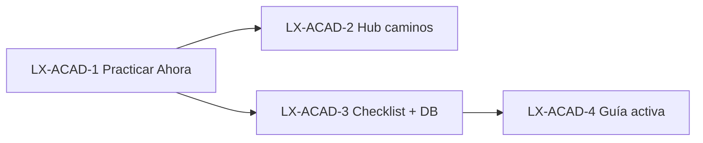

# Tickets LX-ACAD — Academy + Mentor (fase SD-1)

**Eje:** **LX-ACAD-** (producto capacitación en piso, paralelo a SD-1)  
**Alineación:** Mario + Cursor (2026-05-23) — sin big-bang; no bloquear POS/inventario  
**Doc técnica base:** [`LHEXIA_ACADEMY_MENTOR.md`](LHEXIA_ACADEMY_MENTOR.md)  
**Prompt implementación:** [`LX_ACAD_CURSOR_PROMPT_SD1.md`](LX_ACAD_CURSOR_PROMPT_SD1.md)

**Regla SD-1:** cada ticket con cambio en POS/caja/UI visible → checkpoint git antes de merge (ver `.cursor/rules/punto-restauracion-cambios-drasticos.mdc`).

---

## Resumen ejecutivo

| Ticket | Nombre | Impacto usuario | Riesgo piso | Depende de |
|--------|--------|-----------------|-------------|------------|
| **LX-ACAD-1** | Practicar Ahora | Alto | Bajo | ✅ 2026-05-23 |
| **LX-ACAD-2** | Hub 3 caminos + progreso | Alto | Bajo | ✅ 2026-05-23 |
| **LX-ACAD-3** | Checklist + progreso usuario | Muy alto | Medio | ✅ 2026-05-23 |
| **LX-ACAD-4** | Modo Guía Activa + metadata artículo | Medio | Medio-bajo | ACAD-3 |

**Fuera de alcance SD-1 (backlog):** leaderboard, badges públicos, RAG/chat, simuladores, reseed atomic masivo, hub estilo Duolingo completo, Mentor predictivo ML, `/mi-capacitacion` ruta nueva (usar sección en `/academy` primero).

---

## LX-ACAD-1 — Practicar Ahora (deep links operativos)

### Objetivo
Que cada guía en sidebar y hub lleve en un clic a la **pantalla real** donde se practica (vale, cobro, NC, cerrar caja).

### Alcance
- Campo estable en payload API: `practicar_href` (o reutilizar `ancla_ayuda` / `nav_href` unificado).
- Mapa `dedupe_key` → ruta en `academy_service.py` o `vertex_mentor_service.py` (Manual V2 + `ACADEMY_GUIDES`).
- Botón **「Practicar ahora」** en:
  - `templates/partials/lhexia_mentor_sidebar.html` (artículo expandido + píldora prioritaria).
  - `templates/academy_hub.html` (tarjetas por artículo).
- Sin cambiar flujos de venta/cobro.

### Criterios de aceptación
- [ ] Desde `/punto_venta`, guía POS abre o enlaza a `/punto_venta` o búsqueda según artículo.
- [ ] Guía NC enlaza a `/caja/cambios`.
- [ ] Guía arqueo enlaza a `/cerrar_caja`.
- [ ] Cobro de vale enlaza a `/caja/vales_pendientes`.
- [ ] Tests nuevos o ampliados en `test_pos_mentor_academy.py` / `test_academy_mentor_api.py` (assert `practicar_href` en JSON).

### Archivos probables
`services/academy_service.py`, `services/vertex_mentor_service.py`, `static/js/pos.js` (solo render botón), partials mentor, `academy_hub.html`.

### Tests
```bash
pytest tests/test_academy_mentor_api.py tests/test_pos_mentor_academy.py -v
```

### Riesgo
**Bajo** — solo enlaces y contrato JSON.

### Estimación
0,5–1 día.

### Checkpoint git sugerido
`checkpoint/lx-acad-1-practicar-ahora-YYYY-MM-DD`

---

## LX-ACAD-2 — Hub tres caminos + progreso (proxy telemetría)

### Objetivo
Reorganizar `/academy` en **3 rutas visibles**: Vendedor · Cajero · Bodeguero, con **% completado** sin gamificación pública.

### Alcance
- `templates/academy_hub.html`: tres columnas o tabs por `category` (`pos`, `caja`, `bodega`).
- Progreso **v1 (sin tabla nueva):**  
  `completados / total` por rol donde “completado” = al menos un evento `mentor_consulta_academy` o `log_read` con ese `dedupe_key` para `current_user.id` en `agente_ejecuciones` (últimos 90 días opcional).
- Lista de artículos del Manual V2 + enlaces **Practicar ahora** (ACAD-1).
- Copy sobrio (sin “Legend” ni leaderboard). Opcional subtítulo producto: **LhexIA Mentor Academy** solo en H1.
- Servicio: `obtener_progreso_academy_usuario(user_id) -> dict` en `academy_service.py`.

### Criterios de aceptación
- [ ] Usuario vendedor ve camino POS con barra o fracción (ej. 1/3 artículos).
- [ ] Cajera ve camino Caja; bodega ve camino Bodega (filtro permisos existente).
- [ ] Admin ve los tres caminos.
- [ ] No se crea tabla `user_academy_progress` en este ticket (reservado ACAD-3).

### Archivos probables
`academy_hub.html`, `academy_service.py`, `app.py` (`lhexia_academy`), CSS existente LhexIA.

### Tests
- [ ] Test GET `/academy` 200 y presencia de anclas `academy-pos`, `academy-caja`, `academy-bodega`.
- [ ] Test unitario `obtener_progreso_academy_usuario` con fixture telemetría.

### Riesgo
**Bajo** — página hub; no toca cobro.

### Estimación
1–1,5 días.

### Checkpoint git
`checkpoint/lx-acad-2-hub-caminos-YYYY-MM-DD`

---

## LX-ACAD-3 — Checklist interactivo + `user_academy_progress` ✅ (2026-05-23)

### Objetivo
**Learning while doing:** pasos del manual como checkboxes en sidebar; progreso persistido por usuario y artículo.

### Alcance
- Tabla `user_academy_progress`:
  - `user_id` (FK `usuarios.id`)
  - `article_id` (FK `academy_articles.id`, nullable si solo guía virtual)
  - `dedupe_key` (VARCHAR 128, index)
  - `completed_steps_json` (JSON array de ids de paso, ej. `["step-0","step-1"]`)
  - `completed_at` (nullable, cuando todos los pasos marcados)
  - `updated_at`
  - Unique `(user_id, dedupe_key)`
- `_asegurar_tabla_user_academy_progress()` idempotente (patrón `academy_articles`).
- API `POST /api/mentor/save_step` — body: `{ dedupe_key, step_id, checked: true|false, url? }`.
- Registrar en `blueprints/academy.py`; mismos permisos que `log_read`.
- `static/js/pos.js` + `academy-format.js`: render pasos como `<input type="checkbox" class="lhexia-step-check">`; debounce POST.
- Al completar todos los pasos: feedback visual discreto (borde verde / ícono ✓), **sin** badge público ni confeti.
- Incluir pasos desde `_extraer_pasos()` con ids estables (`step-0`, `step-1`, …).

### Criterios de aceptación
- [ ] Marcar paso en POS persiste; recargar página mantiene checks.
- [ ] Usuario A no ve checks de usuario B.
- [ ] Completar artículo no altera ventas ni caja.
- [ ] 16 tests previos siguen verdes + ≥3 tests nuevos save_step/progress.

### Archivos probables
`app.py` (modelo), `sql/2026_05_XX_user_academy_progress.sql`, `academy_service.py`, `blueprints/academy.py`, `pos.js`, partials mentor.

### Tests
```bash
pytest tests/test_academy_mentor_api.py tests/test_pos_mentor_academy.py -v
# nuevo: tests/test_academy_progress.py (recomendado)
```

### Riesgo
**Medio** — JS en sidebar POS/caja; probar en QA con `app_client` y smoke manual piso.

### Estimación
2–3 días.

### Checkpoint git (obligatorio)
`checkpoint/lx-acad-3-checklist-progress-YYYY-MM-DD`

---

## LX-ACAD-4 — Modo Guía Activa + metadata artículo

### Objetivo
Toggle **Guía activa** vs **Biblioteca** en sidebar; artículos con nivel y tiempo estimado para priorizar lectura.

### Alcance
- Columnas en `academy_articles` (migración idempotente):
  - `difficulty_level` VARCHAR(20) default `Principiante` (`Principiante` | `Operativo` | `Experto` | `Maestro`)
  - `estimated_time` INTEGER default 2 (minutos)
  - **No** `micro_quiz_json` en SD-1 (post sign-off).
- Seed Manual V2: rellenar niveles/tiempos en `academy_bootstrap.py`.
- Sidebar: toggle localStorage `lhexia_mentor_modo_activa` (default `true` en caja/cerrar_caja, `false` en POS si se prefiere).
  - **Guía activa:** expande píldora prioritaria + checklist si hay artículo.
  - **Biblioteca:** lista compacta sin auto-expand.
- API context: devolver `modo_sugerido` según contexto (`cerrar_caja` → activa).

### Criterios de aceptación
- [ ] Toggle no rompe layout POS en 1366×768.
- [ ] Seed idempotente actualiza columnas sin duplicar filas.
- [ ] Tests regresión Academy 16/16 + test columnas seed.

### Riesgo
**Medio-bajo**.

### Estimación
1–2 días (puede ir en mismo PR que ACAD-3 si el equipo prefiere un solo checkpoint).

### Checkpoint git
`checkpoint/lx-acad-4-guia-activa-YYYY-MM-DD`

---

## Backlog post SD-1 (no numerar como SD-1)

| ID | Tema | Notas |
|----|------|-------|
| LX-ACAD-5 | Feedback «útil / no útil» + sugerencia | Extender `log_read` o endpoint dedicado |
| LX-ACAD-6 | `micro_quiz_json` + UI quiz corto | Después de checklist estable |
| LX-ACAD-7 | RAG chat (`IA-` plan) | `ERP_MAESTRO` + `CASUISTICAS_VENTAS_QA` |
| LX-ACAD-8 | Simulador arqueo / cobro aislado | Sin tocar caja real |
| LX-ACAD-9 | Ruta `/mi-capacitacion` o sección dueño | Progreso + racha en `user_academy_stats` |
| LX-ACAD-10 | PWA capacitación offline | Post LX-1 |

---

## Orden de implementación recomendado



1. ACAD-1 → merge + smoke piso  
2. ACAD-2 en paralelo si hay capacidad (no depende de DB nueva)  
3. ACAD-3 → checkpoint obligatorio  
4. ACAD-4  

---

## Definición de hecho (todos los tickets)

- [ ] `pytest tests/test_academy_mentor_api.py tests/test_pos_mentor_academy.py` verde.
- [ ] Sin regresión smoke POS/caja si el ticket tocó templates mentor.
- [ ] Doc [`LHEXIA_ACADEMY_MENTOR.md`](LHEXIA_ACADEMY_MENTOR.md) actualizada si cambia API o tablas.
- [ ] Mario validó en QA local o piso (checklist 5 min por ticket).

---

*Mantenimiento: al cerrar un ticket, marcar ✅ en este archivo y una línea en `docs/memory.md`.*
