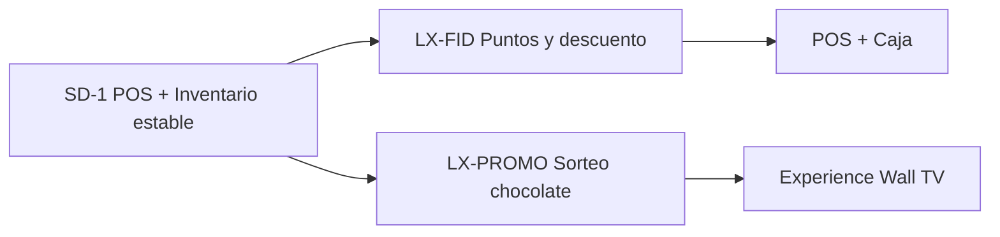
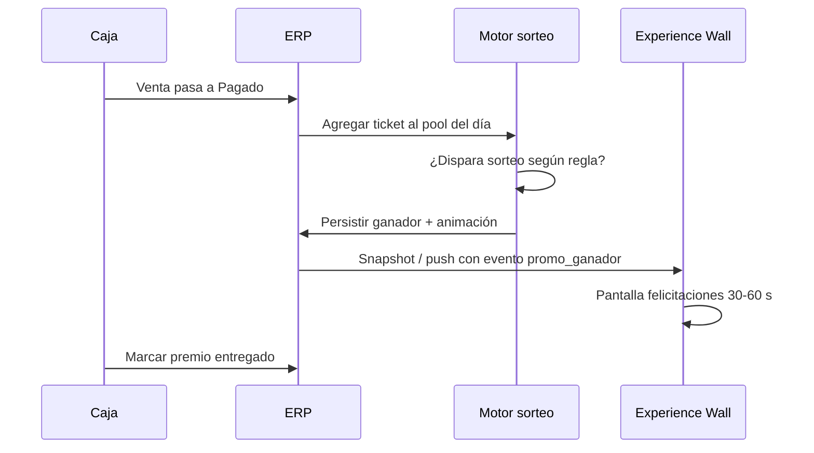

# Plan de trabajo — Fidelización (puntos) y promoción sorteo (Experience Wall)

**Prefijos:** **LX-FID** (fidelización) · **LX-PROMO** (sorteo / premio en TV)  
**Estado:** 📋 **Backlog diseño** — desarrollar **después de cerrar SD-1** (POS + inventario estables)  
**Última actualización:** 2026-05-19  
**Product Owner:** Mario Becerra Olea  

**Vitácora reunión Santo Domingo (preguntas + acta):** [`../01-entrega-santo-domingo/VITACORA_REUNION_FIDELIZACION_PROMO_SD.md`](../01-entrega-santo-domingo/VITACORA_REUNION_FIDELIZACION_PROMO_SD.md) 📅 programada

**Relación con código actual:**

| Tema | Hoy en ERP | Flag / nota |
|------|------------|-------------|
| Descuento con tarjeta supervisor | ✅ Producción local / pendiente deploy | `services/pos_autorizacion_descuento_service.py` |
| Descuento por comportamiento cliente | ❌ Diseño | `pos_descuento_autorizacion_por_cliente: "0"` en config empresa |
| TV cliente | ✅ `/pos/experience-wall` | Token por caja + vendedor; snapshot JSON |
| Saldo a favor | ✅ Caja | **No** confundir con puntos de fidelización |

---

## Prioridad y regla

1. **No mezclar** con el cierre de SD-1 (vale, descuento %, tarjeta supervisor, inventario).
2. Implementar con **feature flags**; en producción apagado hasta piloto acordado con Santo Domingo.
3. Cada iniciativa debe tener **tests smoke** en flujo venta/cobro y no romper autorización actual de descuentos.

---

# Parte A — LX-FID: Fidelización por puntos → descuento en caja

## A.1 Objetivo de negocio

El cliente identificado (RUT) **acumula puntos** por compras pagadas. En caja/POS la vendedora ve cuánto **% de descuento** puede aplicar **sin tarjeta de supervisor**, consumiendo puntos y dejando traza auditable.

**Diferencia con saldo a favor:** el saldo a favor es dinero abonado (devoluciones, notas de crédito, etc.). Los puntos son **derecho a % máximo** en la venta, no pesos en el total.

## A.2 Reglas de negocio (definir con Santo Domingo)

> Respuestas en reunión: vitácora §A — [`VITACORA_REUNION_FIDELIZACION_PROMO_SD.md`](../01-entrega-santo-domingo/VITACORA_REUNION_FIDELIZACION_PROMO_SD.md)

| # | Pregunta | Propuesta por defecto |
|---|----------|------------------------|
| 1 | ¿Cuándo suman puntos? | Al pasar venta a **Pagado** (cobro en caja), no al emitir vale |
| 2 | ¿Quién acumula? | Solo ventas con **cliente identificado** (RUT distinto de cliente final) |
| 3 | ¿Base de cálculo? | Monto **neto pagado** del mes calendario (o saldo acumulado sin vencer — elegir uno) |
| 4 | ¿Tasa? | Ej. **1 punto por cada $1.000** CLP (configurable) |
| 5 | ¿Canje? | Tabla tramos: puntos → **% máximo** en esa venta (ej. 500 pts → 5 %, 1.000 → 10 %) |
| 6 | ¿Vencimiento? | Puntos válidos **12 meses** desde acumulación (configurable) |
| 7 | ¿Con crédito? | Definir si venta a crédito suma al pagar cuota o al emitir vale |
| 8 | ¿Convive con tarjeta supervisor? | Si % solicitado **> tope por puntos** → flujo tarjeta actual |
| 9 | ¿Convive con producto preautorizado? | Sí; aplicar la regla **más favorable al cliente** o la más restrictiva (definir) |

## A.3 Experiencia POS / caja

1. Vendedora identifica cliente (RUT) — flujo actual.
2. Strip o badge: **«1.240 pts · puede usar hasta 10 % (canje 1.000 pts)»**.
3. En menú descuento de línea (o descuento global si más adelante): tope automático según puntos.
4. Al guardar descuento autorizado por puntos:
   - `descuento_autorizado_metodo = 'cliente_fidelizacion'`
   - Movimiento en ledger de puntos (canje).
5. **Emitir vale** bloqueado si hay descuento sin traza (igual que hoy con supervisor).

## A.4 Diseño técnico (borrador)

| Capa | Componente |
|------|------------|
| **BD** | `cliente_puntos_saldo` (cliente_id, saldo, actualizado_en) |
| | `cliente_puntos_movimiento` (tipo: acumula / canje / ajuste / vence, venta_id, puntos, saldo_despues) |
| | `fidelizacion_config` en `config_empresa` o tabla reglas (tasa, tramos JSON, vencimiento meses) |
| **Servicio** | `services/fidelizacion_service.py`: acumular_post_cobro, consultar_cliente, canjear_en_venta, simular_tope_pct |
| **POS API** | `GET /api/pos/cliente-fidelizacion?cliente_id=` |
| **Integración** | Extender `requiere_autorizacion_supervisor_pos()` cuando `pos_descuento_autorizacion_por_cliente == "1"` |
| **Admin** | Pantalla reglas + consulta saldo por cliente (v1 mínima) |
| **Auditoría** | `erp_audit_log` en acumulación y canje relevantes |

## A.5 Fases LX-FID

| Fase | Entregable | Criterio aceptación |
|------|------------|---------------------|
| **LX-FID-0** | Documento reglas firmado SD + config JSON ejemplo | Mario + cliente OK |
| **LX-FID-1** | Tablas + servicio acumular al cobrar | Test: cobro suma puntos |
| **LX-FID-2** | API consulta + UI strip POS | Con RUT se ven puntos y tope % |
| **LX-FID-3** | Canje en `actualizar_item` + método `cliente_fidelizacion` | 10 % con puntos sin tarjeta; traza en ticket |
| **LX-FID-4** | Admin reglas + reporte movimientos | Operación puede ajustar tasa/tramos |

**Estimación orientativa:** 2–3 semanas dev después de SD-1, según reglas finales.

---

# Parte B — LX-PROMO: Sorteo aleatorio «ganaste un chocolate» (Experience Wall)

## B.1 Objetivo de negocio

Incentivar compra y experiencia en tienda: tras una compra elegible, un **algoritmo** puede seleccionar **aleatoriamente** un ticket/venta reciente y mostrar en la **pantalla Experience Wall** (TV cliente) un mensaje festivo, por ejemplo:

> **¡Felicitaciones, [Nombre]!**  
> **Te has ganado un chocolate por tu compra.**  
> Acércate al mostrador con tu vale N° **12345**.

La cajera en piso entrega el premio físico (chocolate); el sistema solo **selecciona, muestra y registra** el ganador.

## B.2 Reglas de negocio (definir con Santo Domingo)

> Respuestas en reunión: vitácora §B — [`VITACORA_REUNION_FIDELIZACION_PROMO_SD.md`](../01-entrega-santo-domingo/VITACORA_REUNION_FIDELIZACION_PROMO_SD.md)

| # | Pregunta | Propuesta por defecto |
|---|----------|------------------------|
| 1 | ¿Cuándo entra al sorteo? | Ventas **Pagado** del día, monto mínimo ej. **$5.000** |
| 2 | ¿Frecuencia del sorteo? | Cada **N ventas** pagadas o cada **X minutos** con al menos 1 ticket en pool |
| 3 | ¿Probabilidad? | 1 ganador cada **K ventas** (ej. 1 cada 25) o % configurable |
| 4 | ¿Un ganador por día/sucursal? | Límite **1 premio / cliente / día** y **1 premio activo en pantalla** |
| 5 | ¿Cliente anónimo? | Solo ventas con **nombre** en TV (RUT identificado o primer nombre en vale) |
| 6 | ¿Premio solo visual? | Pantalla + **estado en BD** `premio_pendiente_entrega` para lista cajera |
| 7 | ¿Privacidad? | Mostrar solo primer nombre + inicial apellido si se desea |

## B.3 Experiencia TV (Experience Wall)

**Ruta existente:** `GET /pos/experience-wall?token=…`

**Flujo propuesto:**

**UI TV (borrador):**

- Fondo celebración (confeti / marca LhexIA).
- Texto principal configurable: «¡Felicitaciones! Te has ganado un chocolate por tu compra».
- Subtexto: nombre cliente + N° vale.
- Sonido opcional (flag).
- Volver a modo normal (carrito / identificación) tras timeout.

## B.4 Diseño técnico (borrador)

| Capa | Componente |
|------|------------|
| **BD** | `promo_sorteo_config` (activo, cada_n_ventas, monto_minimo, premio_texto, sucursal_id) |
| | `promo_sorteo_pool` (venta_id, caja_id, fecha, elegible) |
| | `promo_sorteo_ganador` (venta_id, cliente_id, mostrado_en, entregado_en, usuario_entrega_id) |
| **Servicio** | `services/promo_sorteo_service.py`: registrar_elegible, ejecutar_sorteo_si_corresponde, obtener_ganador_activo |
| **Hook** | Tras cobro exitoso (`procesar_cobro_caja` o post-cobro venta) |
| **API TV** | Extender snapshot live-wall / experience-wall con `evento_promo` |
| **Caja** | Widget «Premio pendiente» en caja o lista en staff wall |
| **Admin** | Activar/desactivar campaña, textos, parámetros N/K |

**Aleatoriedad:** usar `secrets.SystemRandom()` sobre lista de `venta_id` elegibles del pool no sorteados; semilla no reproducible; log del sorteo en auditoría.

## B.5 Fases LX-PROMO

| Fase | Entregable | Criterio aceptación |
|------|------------|---------------------|
| **LX-PROMO-0** | Reglas campaña + copy pantalla | OK Santo Domingo |
| **LX-PROMO-1** | Pool + algoritmo + tabla ganadores | Test unitario distribución y límites |
| **LX-PROMO-2** | Animación Experience Wall | TV muestra ganador tras cobro simulado |
| **LX-PROMO-3** | Lista entrega en caja + marcar entregado | Cajera cierra premio |
| **LX-PROMO-4** | Admin campaña (texto, N, monto mín) | Operación activa sin deploy |

**Estimación orientativa:** 1,5–2 semanas dev después de SD-1 (puede ir en paralelo con LX-FID-1 si equipos separados).

---

# Parte C — Orden recomendado y sinergias

| Orden | Iniciativa | Motivo |
|-------|------------|--------|
| 1 | Cerrar **SD-1** + deploy descuentos supervisor | Base estable |
| 2 | **LX-PROMO-1…2** (solo TV + sorteo) | Alto impacto marketing, poca lógica de precios |
| 3 | **LX-FID-1…3** (puntos) | Más reglas contables; conviene con POS descuento ya estable |
| 4 | Integrar ambos en ticket e informes | Traza única en `detalle_ventas` / auditoría |

**Sinergia:** cliente identificado en POS alimenta **puntos** (FID) y **nombre en TV** (PROMO). Misma identificación RUT, distintos motores.

---

# Parte D — Checklist antes de desarrollar

- [ ] SD-1 cerrado en piso (vale completo, descuento %, sin bloqueos críticos)
- [ ] Reunión 30 min Santo Domingo: tablas A.2 y B.2
- [ ] Definir si chocolate es **siempre** el premio o campaña cambiable
- [ ] Definir sucursal piloto (1 TV Experience Wall)
- [ ] Flag en prod: `fidelizacion_activa=0`, `promo_sorteo_activa=0` hasta piloto

---

# Referencias

| Documento | Uso |
|-----------|-----|
| `docs/planes/04-tecnico/CHECKLIST_DEPLOY_POS_SD1.md` | Deploy POS actual |
| `docs/memory.md` § POS autorización descuentos | Estado tarjeta supervisor |
| `docs/ERP_MAESTRO.md` § Experience Wall | Rutas TV |
| `app.py` → `pos_experience_wall`, `api_pos_live_wall_snapshot` | Implementación actual |

---

*Backlog producto LhexIA — no implementar en SD-1 sin acuerdo explícito.*

---

## Nota 2026-07-11 — Distinción de prefijos

| Prefijo | Qué es |
|---------|--------|
| **LX-FID** | Puntos / canje % |
| **LX-PROMO** | Sorteo Experience Wall (este documento) |
| **LX-PROMO-COM** | Motor de promociones retail (2x1, pack, ticket) — ver [PLAN_MOTOR_PROMOCIONES_COMERCIALES.md](./PLAN_MOTOR_PROMOCIONES_COMERCIALES.md) |

