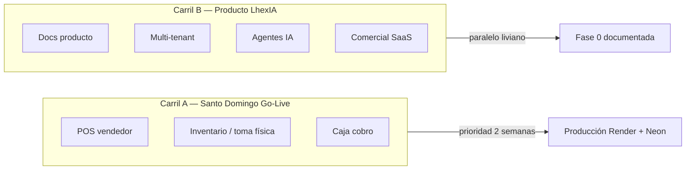

# Plan Maestro LhexIA ERP — Transformación a producto

> **Documento único producto:** [`../02-producto-lhexia/LHEXIA_PRODUCTO.md`](../LHEXIA_PRODUCTO.md)  
> **Entrega Santo Domingo:** [`../01-entrega-santo-domingo/SANTO_DOMINGO_ENTREGA.md`](../SANTO_DOMINGO_ENTREGA.md)  
> **Índice técnico prefijos:** `../00-alineacion/PLAN_INDICE_LHEXIA.md`

**Versión:** 1.1  
**Fecha:** 2026-05-17  
**Product Owner / Arquitecto:** Mario Becerra Olea  
**Implementación principal:** Cursor (repo) · **Revisión / IA:** Grok y agentes auxiliares  

---

## 1. Historia y decisión (contexto de negocio)

### Oportunidad original

**Ferretería Santo Domingo** — ferretería local mediana (~20 trabajadores, **3 sucursales**) necesitaba software para crecer. Mario fue contratado para apoyo en implementación funcional sobre **SAP**.

### Giro estratégico

| Etapa | Qué pasó |
|-------|----------|
| Modelo de negocio | Se levantó propuesta de valor; el cliente decidió **no seguir con SAP** |
| Alternativa Chile | **Defontana** — experiencia mala en ERP y posventa |
| Decisión técnica | Mario (ingeniero, programador, consultor **SAP BW / HANA / BO** senior) levanta un ERP **distinto**: predictivo, con **agentes IA 24/7** |
| Evolución | El potencial de agentes llevó de “ERP para un cliente” a **producto comercial** **LhexIA ERP** |
| Primer cliente diseño | **Ferretería Santo Domingo** — referencia, caso de éxito y laboratorio real |
| Urgencia operativa | Entrada rápida a producción: **POS + inventario** como **Fase 1 operativa** |
| Hito inmediato | **Toma de inventario físico** (inicio estimado: mayo 2026) |

### Visión en una frase

> **LhexIA ERP** = robustez y trazabilidad tipo SAP + velocidad Python + agentes autónomos que mejoran el negocio del ferretero/chileno 24/7.

### Diferenciadores objetivo (producto)

- Multi-tenant (multi-empresa) — **fase producto, no bloqueante para Santo Domingo**
- Vertical ferretería: vales, tienda + bodega, despacho, stock por ubicación
- Agentes IA (inventario, riesgos, ventas cruzadas, orquestador)
- Facturación electrónica SII nativa
- Arquitectura limpia y escalable (refactor progresivo desde monolito actual)

---

## 2. Dos carriles de trabajo (decisión clave)

No mezclar en el mismo sprint lo **operativo** y lo **producto**.



| Carril | Objetivo | Plazo |
|--------|----------|-------|
| **A — Santo Domingo** | POS + inventario en **prueba prototipo** estable para operación diaria | **~2 semanas** |
| **B — Producto LhexIA** | Documentación, convenciones, tenant futuro; **sin romper** carril A | Paralelo, **sin big-bang** |

**Regla de oro:** hasta cerrar Carril A, no migrar modelos fuera de `app.py` ni activar multi-tenant en queries de producción.

---

## 3. Estado técnico real del repo (Mayo 2026)

Referencia viva: `docs/ERP_MAESTRO.md`, `../04-tecnico/ARQUITECTURA_CAPAS.md`, `memory.md`.

| Área | Estado | Notas |
|------|--------|-------|
| **Monolito Flask** | ✅ Producción | `app.py` ~22k líneas + `blueprints/` |
| **POS vendedor** | ✅ En producción | Layout fullwidth, búsqueda 78vh, dock, retiro línea — commit `5094d5d` |
| **Caja / vales** | ✅ Maduro | Cobro, anulación, crédito, tests críticos |
| **Stock multi-almacén** | ✅ | `productos.stock` + `stock_por_almacen` (tienda/bodega) |
| **Kardex** | ✅ | `/kardex`, movimientos auditables |
| **Enrolamiento inventario** | ✅ | `/inventario/enrolamiento` — escaneo, sesiones, conteo por línea |
| **Salud inventario** | ✅ | `/inventario/salud` — desajustes maestro vs almacenes |
| **Auditoría móvil** | ✅ | `auditorias_inventario` + ajuste automático + kardex |
| **Bodega / despacho** | ✅ | Plataforma, voz (Whisper), SLA |
| **FE SII** | 🟡 Avanzado | Servicios + cola; certificación según cliente |
| **Capas `core/`** | 🟡 Parcial | Venta, cobro, stock cobro, post-cobro crédito |
| **Multi-tenant** | ❌ | No existe `tenant_id`; config empresa = JSON en disco |
| **Agentes CrewAI** | ❌ | Plan **IA-*** documentado; implementación post SD-1 |

---

## 4. Sprint 2 semanas — Santo Domingo (Carril A)

### Semana 1 (inventario + POS estable)

| Día / bloque | Entregable | Dueño |
|--------------|------------|-------|
| D0 | **Toma inventario:** almacenes 3 sucursales creados/validados; permisos `enrolamiento_inventario` | Mario + operación |
| D0 | Capacitación corta: `/inventario/enrolamiento`, sesión por sucursal, pistola | Mario |
| D0–2 | Fix buscador POS si bloquea ventas (filtro Catálogo, errores sesión, min. caracteres) | Cursor |
| D1–3 | Checklist salud: `/inventario/salud` export desajustes; plan corrección | Operación |
| D3–5 | POS: flujo vale → caja → cobro con stock tienda/bodega en 3 sucursales (piloto) | Operación + Cursor |

### Semana 2 (prototipo prueba cerrado)

| Entregable | Criterio de “listo prototipo” |
|------------|-------------------------------|
| Inventario | Conteo por sucursal registrado; kardex refleja ajustes; desajustes < umbral acordado |
| POS | Vendedor arma vale, retiro por línea, emite; caja cobra sin “sin stock” falso |
| Datos | Catálogo con códigos de barra consistentes en sucursal piloto |
| Respaldo | Export / snapshot Neon documentado antes de masivos ajustes |
| Tests | Smoke POS + rutas inventario en CI verdes |

### Fuera del sprint 2 semanas (explícito)

- Multi-tenant en BD
- Onboarding wizard comercial
- Landing SaaS
- Agentes CrewAI en producción
- Migrar todos los modelos fuera de `app.py`

---

## 5. Fases producto LhexIA (Carril B)

### Fase 0 — Preparación (2 semanas, paralelo liviano)

- [x] Este plan maestro + `PRODUCT_VISION.md`, `ARCHITECTURE.md`, `ROADMAP.md`
- [ ] Reglas Cursor `lhexia-producto.mdc`
- [ ] Carpeta `clients/santo_domingo/` (branding, checklist go-live)
- [ ] Checkpoint git antes de cambios estructurales
- [ ] **No** `tenant_id` en producción hasta post–go-live inventario

### Fase 1 — Core product (3–5 semanas, post go-live)

- Tabla `tenants` + `tenant_id` en tablas piloto (default `1` = Santo Domingo)
- Onboarding empresa, licencias, auth por tenant
- Dashboard ejecutivo multi-empresa

### Fase 2 — Agentes IA (4–6 semanas) → eje **IA-***

**Plan detallado:** `../06-agentes-ia/PLAN_AGENTES_IA_v1.md`

| Fase producto | Fase agentes | Contenido |
|---------------|--------------|-----------|
| LX-2 (inicio) | **IA-0** | Prep: `agents/`, tools lectura, logging |
| LX-2 | **IA-1** | Risk, Inventory, Sales, Orchestrator + Dashboard |
| LX-2+ | **IA-2 / IA-3** | Purchasing, Retention, Financial, Pricing, autonomía |

- Infra CrewAI + LangGraph + Celery/Redis
- Agente **Risk & Vales Detective** (prioridad IA-1.1)
- Inventory Optimizer, Sales Analyst, Orchestrator (IA-1.2–1.4)

### Fase 3 — Comercial

- Demo pública, docs instalación, pricing, Docker + Render templates

---

## 6. Arquitectura objetivo (sin romper hoy)

```
sistema_ventas_limpio/          # repo actual (nombre puede evolucionar)
├── lhexia/                     # núcleo producto (futuro namespace unificado)
│   ├── tenant/
│   ├── domain/
│   ├── application/
│   ├── infrastructure/
│   └── agents/
├── app.py                      # composition root (hoy: monolito)
├── clients/santo_domingo/      # primer tenant: config, seeds, runbook
├── ../02-producto-lhexia/               # este plan y roadmap
└── core/                       # refactor en curso → converger en lhexia/
```

**Santo Domingo hoy** = un despliegue Render + una BD Neon = **tenant implícito único**. Multi-tenant es capa **después** del go-live operativo.

---

## 7. Roles y gobernanza

| Rol | Responsabilidad |
|-----|-----------------|
| **Mario** | Prioridades, validación en piso, almacenes/sucursales, “sí aplícalo” |
| **Cursor** | Código, tests, deploy, docs técnicas; valida propuestas Grok contra repo |
| **Grok** | UX, arquitectura IA, review; no ejecuta en repo |
| **Agentes META-*** | Equipo virtual desarrollo — ver `../07-agentes-meta-desarrollo/PLAN_AGENTES_META_v1.md` |
| **Agentes IA-*** | Agentes negocio 24/7 en ferretería — ver `../06-agentes-ia/PLAN_AGENTES_IA_v1.md` |

Flujo: **Grok propone → Cursor verifica en repo → META-QA/ARCH review → Mario aprueba alcance → META-DOC actualiza planes.**

---

## 8. Riesgos y mitigaciones

| Riesgo | Mitigación |
|--------|------------|
| Mezclar refactor producto con toma inventario | Carril A/B separados; tag git antes de cambios |
| 3 sucursales sin almacenes bien mapeados | Validar `Almacen` activos antes de D0 |
| Buscador POS vacío (filtro Operativo) | Probar con **Catálogo**; fix en hotfix |
| Defontana/SAP: expectativas de “todo listo” | Comunicar **prototipo 2 sem** = POS + inventario, no ERP completo |
| BD producción = datos reales | Backup Neon; no tests contra prod sin override |

---

## 9. Próxima decisión recomendada (Mario)

1. **Confirmar almacenes** para las 3 sucursales (nombres, IDs, quién enrola mañana).  
2. **Aprobar Carril A** como única prioridad de código 14 días.  
3. **Posponer** implementación `tenant_id` a después del cierre de toma inventario.  
4. **Hotfix POS búsqueda** en los próximos días si sigue sin datos en piso.

---

## 10. Documentos relacionados

| Documento | Contenido |
|-----------|-----------|
| `../02-producto-lhexia/PRODUCT_VISION.md` | Visión corta |
| `../02-producto-lhexia/ROADMAP.md` | Calendario y checklist |
| `../02-producto-lhexia/ARCHITECTURE.md` | Stack y módulos existentes |
| `../01-entrega-santo-domingo/CLIENTE_SANTO_DOMINGO.md` | Runbook primer cliente |
| `docs/ERP_MAESTRO.md` | Mapa técnico operativo |
| `../03-pos-vendedor/POS_ALINEACION_CURSOR_GROK.md` | POS vendedor |
| `../06-agentes-ia/PLAN_AGENTES_IA_v1.md` | Agentes negocio (**IA-0…3**) |
| `../07-agentes-meta-desarrollo/PLAN_AGENTES_META_v1.md` | Agentes desarrollo (**META-1…2**) |

---

*Documento vivo — actualizar al cerrar sprint 2 semanas o al cambiar prioridad producto vs cliente.*
