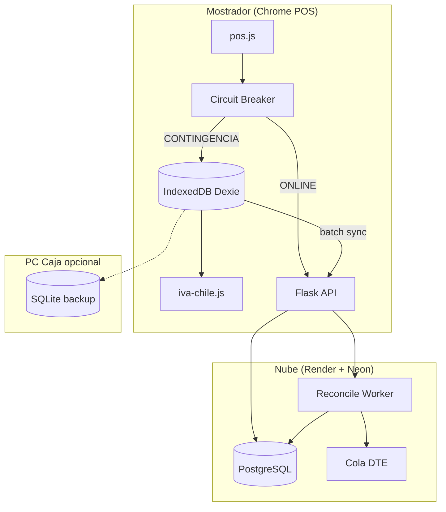

# Roadmap Técnico — Módulo de Continuidad Operacional (POS Offline-First)

**Código plan:** `TEC-OFFLINE`  
**Versión:** 1.0  
**Fecha:** 2026-05-20  
**Estado:** Fase 0 **completada** (2026-05-20) — Fase 1 (IndexedDB) pendiente  
**Documento relacionado:** [`PLAN_RESILIENCIA_OFFLINE_Y_CUADRATURA.md`](PLAN_RESILIENCIA_OFFLINE_Y_CUADRATURA.md)

**Principio rector:** El mostrador no depende del enlace a Neon ni de la disponibilidad del SII para **registrar ventas y cobrar**. La nube es fuente de verdad **eventual**; la caja es fuente de verdad **operativa** en contingencia.

---

## Resumen de fases y complejidad

Escala de complejidad: **C1** (baja) → **C5** (muy alta).  
Esfuerzo: días-persona desarrollo (1 dev senior familiarizado con el repo).

| Fase | Nombre | Complejidad | Esfuerzo | Dependencias |
|------|--------|-------------|----------|--------------|
| **0** | Preparación (contratos + paridad IVA) | **C2** | 3–4 d | `desglosar_iva_clp` (`d9a9594`) |
| **1** | Persistencia local (Local Cache) | **C4** | 10–12 d | Fase 0 |
| **2** | Conmutación de estado (Circuit Breaker) | **C3** | 6–8 d | Fase 1 |
| **3** | Sincronización (Data Reconciliation) | **C5** | 12–15 d | Fases 1–2 |
| **4** | Auditoría (Arqueo + conciliación híbrida) | **C4** | 8–10 d | Fase 3 parcial |
| | **Total MVP offline + auditoría base** | — | **~39–49 d** | ~8–10 semanas calendario |

**Orden obligatorio:** 0 → 1 → 2 → 3; la Fase 4 puede iniciar diseño de entidades en paralelo a Fase 3 (semana 5+).

---

## Arquitectura objetivo (vista de componentes)



---

# Fase 0 — Preparación (previa al Local Cache)

**Complejidad: C2** | **3–4 días**

| Actividad | Entregable |
|-----------|------------|
| ADR persistencia híbrida | `ADR_OFFLINE_FIRST.md` |
| Contrato OpenAPI `offline/v1` | Catálogo, ping, batch ventas |
| Paridad `desglosar_iva_clp` Python ↔ JS | Tests 10+ montos CLP |
| Checkpoint | `git tag checkpoint/offline-design-*` |

**Definición de Done:** tests paridad en CI; ADR firmado por negocio.

---

# Fase 1 — Persistencia Local (Local Cache)

**Complejidad: C4** | **10–12 días**  
**Objetivo:** Espejo matinal del maestro de productos + almacén local de ventas en contingencia.

## 1.1 Estrategia de almacenamiento (decisión ADR)

| Rol | Tecnología | Justificación |
|-----|------------|---------------|
| **Primario POS** | **IndexedDB** + **Dexie.js 4.x** | Nativo en Chrome del mostrador; sin instalación |
| **Secundario / backup** | **SQLite 3** vía agente Windows opcional | Persiste cola si cierran el browser; reintentos nocturnos |
| **No usar en v1** | localStorage para ventas | Límite 5 MB; sin índices |
| **No usar en v1** | Service Worker como DB | Solo assets estáticos en v1.1 |

**Adapter local (a implementar tras aprobar roadmap):**

```
static/js/offline/adapters/
  indexeddb-store.js      ← implementación primaria (Dexie)
  sqlite-store.js         ← stub / fase 1.2 opcional (agente)
  offline-store-port.js   ← interfaz común (Port/Adapter)
```

La interfaz `OfflineStorePort` desacopla POS de la tecnología:

```typescript
// Contrato conceptual (documentación)
interface OfflineStorePort {
  syncCatalogo(snapshot): Promise<void>
  getProductoPorBarcode(codigo): Promise<ProductoEspejo | null>
  guardarVentaContingencia(venta: VentaOffline): Promise<void>
  listarVentasPendientesSync(): Promise<VentaOffline[]>
  marcarVentaSincronizada(clientUuid, serverVentaId): Promise<void>
}
```

## 1.2 Esquema IndexedDB (Dexie v1)

**Base:** `lhexia_pos_offline`  
**Versión schema:** `1`

### Store `meta_sync`

| Campo | Tipo | Descripción |
|-------|------|-------------|
| `key` | string (PK) | `'catalogo'`, `'config_pos'`, `'corr_contingencia'` |
| `updated_at` | ISO8601 | Última sync exitosa |
| `checksum` | string | SHA256 del snapshot catálogo |
| `modo` | enum | `ONLINE` \| `CONTINGENCIA` |
| `caja_id` | int | Caja del turno |
| `corr_dia` | int | Último correlativo contingencia del día |

### Store `productos` (índices)

| Campo | Tipo | Índice |
|-------|------|--------|
| `id` | int (PK servidor) | primary |
| `sku` | string | `sku` |
| `codigo_barra` | string | **unique** `barcode` |
| `nombre_corto` | string (≤80) | — |
| `precio_bruto_clp` | int | — |
| `precio_mayoreo_clp` | int | opcional |
| `stock_referencial` | int | no bloquea venta offline |
| `unidad_venta` | string | — |
| `pos_descuento_preautorizado` | bool | — |
| `pos_descuento_preautorizado_pct` | int | 0–100 |
| `activo` | bool | — |
| `updated_at` | ISO8601 | `updated_at` |

**Regla precio offline:** `precio_efectivo_clp = max(precio_bruto_clp, precio_mayoreo_clp)` (réplica de `precio_efectivo_pos_producto`).

### Store `reglas_descuento` (liviano)

| Campo | Tipo | Descripción |
|-------|------|-------------|
| `id` | string (PK) | ej. `preauth:{producto_id}` |
| `tipo` | enum | `PREAUTORIZADO`, `UMBRAL_PIN` |
| `producto_id` | int? | null = global |
| `pct_max` | int | % máximo sin PIN |
| `requiere_pin` | bool | según `pos_descuento_umbral_pin_pct` config |

Sync de config POS (solo claves offline-relevantes) en `meta_sync` key `config_pos`:

- `pos_descuento_umbral_pin_pct`
- `pos_descuento_autorizacion_por_cliente`
- `pos_retiro_por_linea` (flag)

### Store `ventas_contingencia`

| Campo | Tipo | Descripción |
|-------|------|-------------|
| `client_uuid` | string (PK) | UUID v4 |
| `numero_local` | string | `OFF-20260520-0001` |
| `created_at_local` | ISO8601 | Orden sync |
| `caja_id` | int | |
| `usuario` | string | |
| `cliente_rut` | string? | opcional |
| `metodo_pago` | string | Efectivo, Debito, … |
| `lineas` | JSON[] | ver abajo |
| `monto_bruto_clp` | int | |
| `neto_clp`, `iva_clp`, `total_clp` | int | `desglosar_iva_clp` |
| `estado_sync` | enum | `PENDIENTE_SINCRONIZACION` \| `ENVIADA` \| `ERROR` |
| `server_venta_id` | int? | post-batch |
| `intentos_sync` | int | |

**Línea de venta (`lineas[]`):**

```json
{
  "producto_id": 123,
  "codigo_barra": "7801234567890",
  "cantidad": 2,
  "precio_unitario_bruto_clp": 1990,
  "descuento_pct": 10,
  "subtotal_bruto_clp": 3582,
  "punto_retiro_linea": "Tienda"
}
```

## 1.3 Sync matinal y periódico (descarga al servidor)

| Trigger | Endpoint | Comportamiento |
|---------|----------|----------------|
| Apertura de caja / login POS | `GET /api/offline/catalogo?full=1` | Snapshot completo gzip |
| Cada 60 min (timer) | `GET /api/offline/catalogo?since={checksum}` | Delta si existe |
| Manual “Actualizar catálogo” | full=1 | Supervisor |

**Payload servidor (réplica liviana):** ~4k SKU × ~120 bytes ≈ 500 KB gzip (objetivo &lt; 2 MB).

**Actividades de implementación:**

| ID | Tarea | Módulo |
|----|-------|--------|
| 1.1 | `offline_catalog_service.py` — query optimizada | `services/` |
| 1.2 | Blueprint `GET /api/offline/catalogo` | `blueprints/offline_sync.py` |
| 1.3 | `indexeddb-store.js` + Dexie schema | `static/js/offline/adapters/` |
| 1.4 | Hook `abrir_caja` → sync inicial | `app.py` + template POS |
| 1.5 | Banner “Catálogo: hace X min” | UI POS |

**Criterios de aceptación (Fase 1):**

- [ ] Apertura de turno descarga catálogo en &lt; 30 s (red normal, 4k SKU).
- [ ] Búsqueda por barcode &lt; 200 ms con API caída.
- [ ] Precios y flags de descuento preautorizado coinciden con 10 SKU muestra vs Neon.
- [ ] `pytest -m offline_catalog` en verde.

---

# Fase 2 — Conmutación de Estado (Circuit Breaker)

**Complejidad: C3** | **6–8 días**  
**Objetivo:** Detectar fallo Neon/API/SII timeout y operar en **Modo Contingencia** sin congelar UI.

## 2.1 Modelo de circuito

Estados del breaker (por destino):

```
CLOSED ──(fallos ≥ umbral)──► OPEN ──(timeout recuperación)──► HALF_OPEN ──(éxito)──► CLOSED
```

| Circuito | Target | Umbral OPEN | Timeout half-open |
|----------|--------|-------------|-------------------|
| `ERP_API` | `GET /api/health/ping` | 3 fallos en 45 s | 30 s |
| `ERP_WRITE` | POST venta / cobro | 2 timeouts 5 s | 60 s |
| `SII_FE` | diagnóstico SOAP (opcional) | 1 timeout 8 s | no bloquea POS venta |

**Modo POS global:**

| Modo | Condición | UX |
|------|-----------|-----|
| `ONLINE` | Ping OK + `navigator.onLine` | Operación normal |
| `CONTINGENCIA` | Ping falla o ERP_WRITE OPEN | Banner rojo; ventas → IndexedDB |
| `DEGRADADO` | Ping OK pero SII_FE OPEN | Venta online; DTE en cola (estado actual) |

## 2.2 Correlativo temporal local

Formato: `OFF-{YYYYMMDD}-{caja_id}-{seq4}`  
- `seq4`: incremento atómico en `meta_sync.corr_contingencia` (IndexedDB transaction).  
- Visible en ticket impreso y pantalla cajero.

## 2.3 Flujo venta en contingencia

1. Escanear → resolver producto desde `productos` (IndexedDB).  
2. Aplicar descuento % (reglas locales; PIN offline **solo** si política ADR lo permite — v1: descuentos &gt; umbral **bloqueados** sin red).  
3. `subtotal_linea_bruto_clp` → sumar → `desglosar_iva_clp` (JS).  
4. `guardarVentaContingencia` con `client_uuid`.  
5. Imprimir / mostrar comprobante **“NO VALIDO TRIBUTARIO”** (sin DTE).

**Bloqueos v1 (sin red):**

- Crédito con validación de cupo remota.  
- Emisión DTE / consulta SII.  
- Anulación de vale remoto.  
- Descuento supervisor PIN si requiere API.

## 2.4 Actividades

| ID | Tarea | Archivo |
|----|-------|---------|
| 2.1 | `pos-connectivity.js` — breaker + ping | `static/js/offline/` |
| 2.2 | Máquina estados `PosModoOperacion` | integración `pos.js` |
| 2.3 | Template ticket contingencia | `templates/` |
| 2.4 | Endpoint `GET /api/health/ping` (DB opcional liviana) | `blueprints/offline_sync.py` |
| 2.5 | Tests E2E simulación offline DevTools | `tests/test_pos_offline_mode.py` |

**Criterios de aceptación (Fase 2):**

- [ ] 3 pings fallidos → modo CONTINGENCIA en &lt; 45 s.  
- [ ] Recuperación ping → banner “Sincronizando…” sin bloquear nueva venta online.  
- [ ] 20 ventas offline seguidas sin error UI.  
- [ ] Correlativo único por caja/día.

---

# Fase 3 — Sincronización (Data Reconciliation)

**Complejidad: C5** | **12–15 días**  
**Objetivo:** Worker que sube ventas locales en orden, resuelve stock y encola DTE.

## 3.1 Arquitectura del Worker

Dos implementaciones complementarias:

| Componente | Tipo | Cuándo corre |
|------------|------|--------------|
| **Sync Client** | JS en POS (`pos-offline-sync.js`) | Al detectar `ONLINE`; dispara batch |
| **Reconcile Worker** | Python (`services/offline_reconcile_service.py`) | Invocado por API; idempotente |

No se requiere Celery en v1: el **cliente POS** empuja batches; el servidor procesa en transacción.

## 3.2 Protocolo batch

`POST /api/offline/ventas/batch`

```json
{
  "caja_id": 3,
  "ventas": [
    {
      "client_uuid": "550e8400-e29b-41d4-a716-446655440000",
      "numero_local": "OFF-20260520-0003-0007",
      "created_at_local": "2026-05-20T14:32:01-04:00",
      "metodo_pago": "Efectivo",
      "cliente_rut": null,
      "lineas": [ ... ],
      "montos": { "bruto": 11900, "neto": 10000, "iva": 1900, "total": 11900 }
    }
  ]
}
```

**Respuesta:**

```json
{
  "procesadas": [
    { "client_uuid": "...", "venta_id": 98123, "estado": "OK" }
  ],
  "rechazadas": [
    { "client_uuid": "...", "motivo": "STOCK_INSUFICIENTE", "detalle": "..." }
  ]
}
```

## 3.3 Orden cronológico

- Ordenar por `created_at_local` ASC.  
- Procesar secuencialmente por `client_uuid` (no paralelo en v1).  
- Idempotencia: índice único `ventas.offline_client_uuid` (migración SQL).

## 3.4 Política de conflictos

| Dominio | Política v1 | Acción |
|---------|-------------|--------|
| **Duplicado UUID** | Ignorar reenvío | Retornar `venta_id` existente |
| **Stock tienda** | Servidor gana | Si falta stock post-sync: venta `Pagado` + alerta kardex + flag `sync_stock_ajustado` |
| **Precio** | Local gana si diff &lt; 1% | Registrar precio aplicado en detalle |
| **Precio** | Diff &gt; 1% | Rechazar línea; queda `ERROR` en cola local |
| **Caja cerrada** | Rechazar | Mantener `PENDIENTE` hasta caja abierta |

## 3.5 Gatillo cola DTE

Tras insertar venta `Pagado` con `tipo_documento` Factura/Boleta:

1. Reutilizar `post_cobro_emision_fe` si hay red y CAF.  
2. Si `FALLO_MATEMATICO` → no reintentar automático; panel Fase 4.  
3. Marcar venta offline source: `venta.origen_sync = 'OFFLINE_CONTINGENCIA'`.

## 3.6 Actividades

| ID | Tarea | Módulo |
|----|-------|--------|
| 3.1 | Migración `offline_client_uuid` UNIQUE | `sql/` |
| 3.2 | `offline_reconcile_service.py` | `services/` |
| 3.3 | Integración stock + kardex | `stock_service.py` |
| 3.4 | `pos-offline-sync.js` worker cliente | `static/js/offline/` |
| 3.5 | Panel admin ventas recuperadas | admin template |
| 3.6 | Tests: duplicado, stock, orden | `tests/test_offline_sync.py` |

**Criterios de aceptación (Fase 3):**

- [ ] 100 ventas offline → Neon en &lt; 15 min post-red.  
- [ ] 0 duplicados por UUID.  
- [ ] Orden cronológico verificado en auditoría.  
- [ ] DTE encolado para ventas que lo requieran (con timbraje activo).

---

# Fase 4 — Auditoría (Arqueo de Caja y conciliación híbrida)

**Complejidad: C4** | **8–10 días**  
**Objetivo:** El dueño compara **efectivo físico**, **ERP (online + offline sync)** y **SII (Track ID)**.

## 4.1 Entidades de datos (PostgreSQL)

### Extensión `Caja`

| Campo nuevo | Tipo | Descripción |
|-------------|------|-------------|
| `fondo_apertura_clp` | int | Sencillo apertura |
| `efectivo_contado_cierre_clp` | int | Arqueo a ciegas |
| `transbank_contado_clp` | int | |
| `transferencia_contado_clp` | int | |
| `efectivo_teorico_clp` | int | Calculado ERP |
| `diferencia_arqueo_clp` | int | físico − teórico |
| `arqueo_cerrado_en` | timestamp | |
| `tiene_ventas_offline_pendientes` | bool | Bloqueo cierre |

### Nueva tabla `conciliacion_caja_turno`

| Campo | Tipo |
|-------|------|
| `id` | PK |
| `caja_id` | FK |
| `fecha_turno` | date |
| `ventas_online_cnt` | int |
| `ventas_offline_sync_cnt` | int |
| `total_efectivo_erp_clp` | int |
| `total_efectivo_fisico_clp` | int |
| `diferencia_clp` | int |
| `estado` | `CUADRADO` \| `CON_DIFERENCIA` \| `BLOQUEADO` |

### Nueva vista materializada / query `conciliacion_dte_mensual`

| Campo | Fuente |
|-------|--------|
| `venta_id` | ventas |
| `folio` | nro_documento |
| `dte_tipo` | ventas.dte_tipo |
| `dte_estado` | ventas.dte_estado |
| `dte_track_id` | ventas |
| `monto_total_clp` | ventas |
| `semáforo` | calculado |
| `origen_sync` | NULL \| OFFLINE |

**Semáforo:**

| Color | Condición |
|-------|-----------|
| 🟢 Verde | `dte_estado IN (ENVIADO, ACEPTADO)` y `track_id` presente |
| 🟡 Amarillo | `PENDIENTE_ENVIO` o sin `track_id` |
| 🔴 Rojo | `FALLO_MATEMATICO`, `RECHAZADO`, folio sin venta |

### Tabla `auditoria_sync_offline` (trazabilidad)

| Campo | Tipo |
|-------|------|
| `client_uuid` | string |
| `venta_id` | int? |
| `evento` | `RECIBIDO` \| `STOCK_AJUSTE` \| `DTE_ENCOLADO` \| `ERROR` |
| `detalle_json` | jsonb |
| `created_at` | timestamp |

## 4.2 Ecuaciones de control

```
efectivo_teorico = fondo_apertura
                 + Σ ventas Pagado (efectivo, origen ONLINE u OFFLINE sincronizado)
                 + movimientos_caja (ingresos - retiros)

diferencia = efectivo_fisico_contado - efectivo_teorico
```

**Bloqueo cierre:** si existe venta en IndexedDB con `PENDIENTE_SINCRONIZACION` (consulta vía API “¿POS reporta cola?” o flag en sesión).

## 4.3 Panel dueño / contador

| Vista | Ruta | Usuario |
|-------|------|---------|
| Arqueo turno | `/cerrar_caja` (mejorado) | Cajero supervisor |
| Conciliación DTE | `/admin/conciliacion-dte` | Admin / contador |
| Resumen híbrido | `/admin/auditoria-operacional` | Dueño |

## 4.4 Actividades

| ID | Tarea | Módulo |
|----|-------|--------|
| 4.1 | Migración campos `Caja` | `sql/` |
| 4.2 | `cuadratura_caja_service.py` | `services/` |
| 4.3 | `conciliacion_dte_service.py` | `services/` |
| 4.4 | Templates arqueo ciego + panel | `templates/` |
| 4.5 | Export CSV Form. 29 prep | admin |
| 4.6 | Tests + casuística CAS-AUD* | `tests/` |

**Criterios de aceptación (Fase 4):**

- [ ] Cierre exige fondo apertura y conteo físico.  
- [ ] Diferencia visible y persistida.  
- [ ] Panel lista 100 % folios del mes con semáforo.  
- [ ] Procedimiento contador documentado en `ERP_MAESTRO.md`.

---

## Cronograma (Gantt)

```
Sem 1     [F0: ADR + paridad IVA]
Sem 2-3   [F1: Local Cache ████████]
Sem 4     [F2: Circuit Breaker ████]
Sem 5-7   [F3: Reconciliation ████████████]
Sem 7-8   [F4: Auditoría ████████] (parcialmente paralelo a F3)
```

---

## Riesgos y mitigación (resumen)

| Riesgo | Complejidad impactada | Mitigación |
|--------|----------------------|------------|
| Divergencia IVA JS/Python | Alta | Fase 0 obligatoria |
| Doble venta sync | Muy alta | UUID + UNIQUE constraint |
| Cierre con cola pendiente | Media | Bloqueo + API reporte cola |
| Catálogo obsoleto offline | Media | TTL visible + sync 60 min |

---

## Gate de aprobación antes del primer adapter

**No escribir `indexeddb-store.js` ni `offline-store-port.js` hasta:**

1. ✅ Aprobación explícita de este roadmap (Mario / negocio).  
2. ✅ ADR Fase 0 mergeado (`ADR_OFFLINE_FIRST.md`, `OFFLINE_API_V1_CONTRACT.md`).  
3. ✅ Tag `checkpoint/offline-design-2026-05-20` en `main`.  
4. ⏳ Capacidad QA: 1 caja piloto identificada (definir con Santo Domingo).

**Primer código tras gate:** `offline-store-port.js` (interfaz) + `indexeddb-store.js` (implementación) + test Dexie en browser headless (Playwright opcional fase 1.1).

---

## Índice de documentos del módulo

| Documento | Propósito |
|-----------|-----------|
| Este roadmap | Fases 1–4 + complejidad |
| `PLAN_RESILIENCIA_OFFLINE_Y_CUADRATURA.md` | Plan maestro + plazos negocio |
| `ADR_OFFLINE_FIRST.md` | *(pendiente Fase 0)* Decisiones finales |
| `RUNBOOK_OFFLINE_POS.md` | *(pendiente Fase 3)* Operación piso |

---

*LhexIA ERP — Módulo Continuidad Operacional. Política IVA: `core/domain/shared/iva_chile.py`. FE SII en pausa hasta timbraje Form. 3230.*
