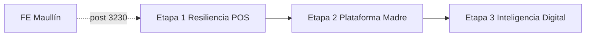

# Roadmap Plataforma Madre — LhexIA ERP Premium

**Versión:** 1.0 (canónico)  
**Fecha:** 2026-05-21  
**Estado estratégico:** Tres etapas secuenciales · **FE Maullín congelado** hasta alta Formulario 3230 (folio SII **77326378627**, *Recepcionada*).

**Documentos relacionados:**

| Tema | Ruta |
|------|------|
| Entrega operativa cliente #1 | [`01-entrega-santo-domingo/SANTO_DOMINGO_ENTREGA.md`](01-entrega-santo-domingo/SANTO_DOMINGO_ENTREGA.md) |
| Offline / resiliencia POS (detalle técnico) | [`04-tecnico/ROADMAP_POS_CONTINUIDAD_OPERACIONAL.md`](04-tecnico/ROADMAP_POS_CONTINUIDAD_OPERACIONAL.md) |
| Memoria viva | [`../memory.md`](../memory.md) |
| Índice prefijos | [`00-alineacion/PLAN_INDICE_LHEXIA.md`](00-alineacion/PLAN_INDICE_LHEXIA.md) |

---

## Directrices estratégicas (congeladas)

1. **Retail premium, multi-producto, alta disponibilidad** — el mostrador no depende solo de Neon/Render.
2. **Sin envíos a Maullín** hasta timbraje SII oficial; código FE (`d9a9594`) listo en pausa.
3. **Ejecución secuencial** por hitos; no iniciar Etapa 2 hasta cerrar hitos críticos de Etapa 1.
4. **Montos en CLP enteros** en nuevos módulos — política `desglosar_iva_clp` (`core/domain/shared/iva_chile.py`).



---

## ETAPA 1 — Resiliencia en punto de venta (prioridad inmediata)

**Código eje:** `PLAT-1-*` · complementa `TEC-OFFLINE-*` (Fase 0 ✅ `dbe03ed`).

| Hito | Nombre | Entregable | Estado |
|------|--------|------------|--------|
| **1.1** | **Arqueo ciego en Caja** | Campos en `caja` + `/cerrar_caja` + `sql/2026_05_23_add_arqueo_ciego_cajas.sql` | ✅ **Fusión** (sin tabla `arqueo_caja` paralela) |
| 1.2 | Offline Cache | IndexedDB + `GET /api/offline/catalogo` + Dexie | ⏳ |
| 1.3 | Modo degradado | Circuit breaker + cola ventas local | ⏳ |

### Hito 1.1 — Arqueo fusionado en Caja

- **Modelo:** columnas en `Caja` (`monto_declarado_cajero`, contadores SII)
- **Migración:** `sql/2026_05_23_add_arqueo_ciego_cajas.sql`
- **Cierre:** `/cerrar_caja` — `monto_declarado_cajero` a ciegas vs `monto_teorico` (fórmula única en servicio)
- **Sin cambios** en `Venta`, `DetalleVenta` ni flujos POS existentes

### Hito 1.2 — Offline Cache (detalle)

- Persistencia local: **IndexedDB** (POS) + contrato [`OFFLINE_API_V1_CONTRACT.md`](04-tecnico/OFFLINE_API_V1_CONTRACT.md).
- Sync diaria / apertura: maestro SKU, barcode, precio bruto, descuentos preautorizados.
- SQLite opcional en PC caja (backup).

### Hito 1.3 — Modo degradado (detalle)

- Circuit breaker `GET /api/health/ping`.
- Ventas → `PENDIENTE_SINCRONIZACION` + correlativo `OFF-…`.
- Batch `POST /api/offline/ventas/batch` al reconectar.

**Criterio cierre Etapa 1:** piloto caja 8 h offline + arqueo ciego firmado + 0 ventas perdidas.

---

## ETAPA 2 — La plataforma madre (Dashboard & Control)

**Prerequisito:** Etapa 1 hitos 1.1–1.3 en QA o producción piloto.

| Hito | Nombre | Entregable |
|------|--------|------------|
| **2.1** | Logs de IA | Tabla `agente_ejecuciones` (estado, costo API, tokens, I/O prompts) |
| **2.2** | Admin View | Panel Flask: rendimiento agentes + **Bandeja aprobación obligatoria** (HITL) |
| **2.3** | Vector Pipeline | `pgvector` en Neon + `scripts/marketing_ingest_knowledge.py` |

---

## ETAPA 3 — Inteligencia digital multi-producto

| Hito | Nombre | Entregable |
|------|--------|------------|
| **3.1** | RAG Engine | Prompts + retrieval dolores/normativas retail Chile |
| **3.2** | Agent Rollout | Agente Contenidos por vertical + marketing dinámico |

---

## Orden de ejecución actual (2026-05-21)

```
✅ FE pausa SII
✅ TEC-OFFLINE Fase 0 (ADR + IVA JS)
→ PLAT-1.1 ArqueoCaja  ✅ modelo + servicio
→ PLAT-1.2 Offline cache  ← SIGUIENTE
→ PLAT-1.2 Offline cache
→ PLAT-1.3 Modo degradado
⏸ Etapa 2
⏸ Etapa 3
```

---

## Gate Maullín (no ejecutar)

- `GET /api/admin/facturacion/enviar-prueba-sii`
- Reintentos automáticos SOAP
- Hasta folio **77326378627** → estado distinto de *Recepcionada*

---

*Plan canónico LhexIA — actualizar `docs/memory.md` al cerrar cada hito.*
