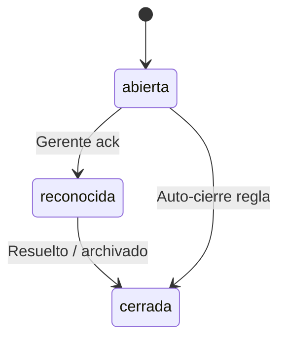
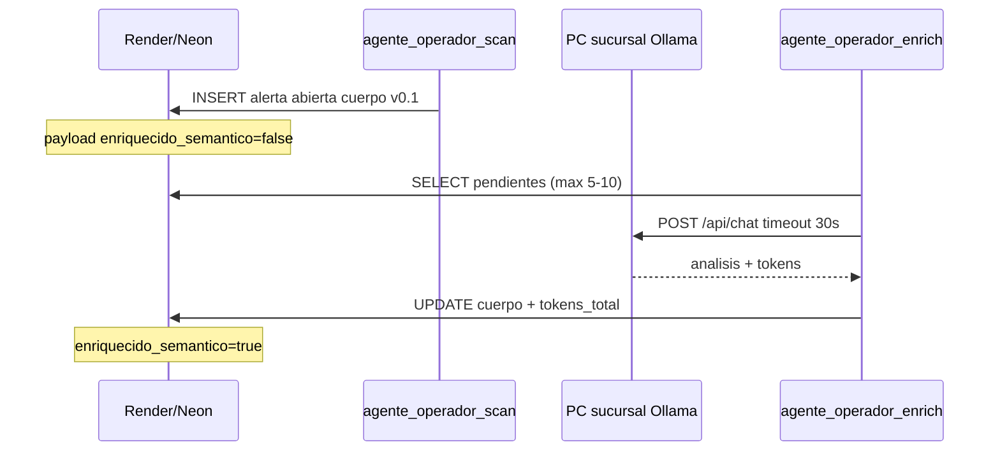

# Estados — tabla `agente_ejecuciones`

**Versión:** 1.1 · **2026-05-21** (v0.2 worker Ollama + pgvector)  
**Tabla única** para LhexIA Operador, Comercial, Guía y telemetría LLM.

---

## 1. Campos clave

| Campo | Valores | Uso |
|-------|---------|-----|
| `agente_nombre` | `operador`, `comercial`, `guia`, `sistema` | Quién generó la fila |
| `tipo` | Ver §2 | Familia de registro |
| `estado` | Ver §3 por tipo | Ciclo de vida |
| `severidad` | `info`, `warning`, `critical` | Solo `alerta_operativa` |
| `codigo` | `vale_pendiente_horas`, `caja_descuadre`, … | Regla de negocio |
| `dedupe_key` | Único mientras alerta/HITL abierto | Evita duplicados |
| `payload_json` | JSON texto | IDs, montos, `enriquecido_semantico`, `cuerpo_base_v01` |

---

## 2. Tipos (`tipo`)

| Tipo | Descripción |
|------|-------------|
| `alerta_operativa` | Supervisor digital (Operador v0.1): vales, caja, stock |
| `borrador_hitl` | Copy/comercial/marketing — requiere aprobación humana |
| `log_ejecucion` | Traza técnica (tokens, costo, prompt) cuando exista LLM |

---

## 3. Estados por tipo

### 3.1 `alerta_operativa` (Operador)

| Estado | Significado |
|--------|-------------|
| `abierta` | Visible en Control Center; requiere atención |
| `reconocida` | Usuario vio la alerta (`reconocido_por`) |
| `cerrada` | Ya no aplica o fue resuelta en ERP |

**No usa** `pendiente_aprobacion` — las alertas de caja no se “publican”.

### 3.2 `borrador_hitl` (Comercial / marketing)

| Estado | Significado |
|--------|-------------|
| `nueva` | Recién generada (opcional) |
| `pendiente_aprobacion` | En cola Control Center |
| `aprobada` | Humano autorizó envío/publicación |
| `rechazada` | Descartada |

### 3.3 `log_ejecucion`

| Estado | Significado |
|--------|-------------|
| `completada` | Ejecución OK |
| `error` | Falló tool/LLM |

---

## 4. Códigos Operador v0.1 (sin GPU)

| Código | Regla | Severidad típica |
|--------|-------|------------------|
| `vale_pendiente_horas` | Vale `Pendiente` > N h sin cobrar | `warning` / `critical` |
| `caja_descuadre` | Caja `Cerrada` con `diferencia_cierre` ≠ 0 | `critical` si faltante |
| `caja_abierta_sin_movimiento` | Reservado v0.2 | — |

Variables: `AGENTE_VALE_HORAS_UMBRAL` (default 3), `AGENTE_CIERRE_DIF_UMBRAL_CLP` (default 5000).

---

## 5. API / rutas

| Método | Ruta | Acción |
|--------|------|--------|
| GET | `/admin/control-center` | Lista alertas + HITL |
| POST | `/admin/control-center/alertas/<id>/reconocer` | `abierta` → `reconocida` |
| POST | `/admin/control-center/alertas/<id>/cerrar` | → `cerrada` |
| POST | `/admin/agente-operador/escanear` | Cron manual: reglas SQL |

Script CLI: `python scripts/agente_operador_scan.py`

---

## 6. Operador v0.2 — enriquecimiento semántico (Ollama local)

**Patrón:** detección SQL en cloud (v0.1) → enriquecimiento **async** en PC sucursal (sin bloquear POS).

| Paso | Componente | Falla |
|------|------------|-------|
| 1 | `escanear_y_registrar_alertas` | Solo SQL; nunca llama Ollama |
| 2 | `empaquetar_contexto_alerta` | Historial venta/caja en JSON |
| 3 | `enriquecer_alerta_operativa` | Si Ollama cae → **conserva cuerpo v0.1** |
| 4 | `aplicar_enriquecimiento_semantico` | Guarda `cuerpo_base_v01` en payload |

**Variables v0.2:**

| Variable | Default | Dónde |
|----------|---------|-------|
| `AGENTE_OLLAMA_ENABLED` | `0` | `1` solo en PC worker |
| `OLLAMA_BASE_URL` | `http://127.0.0.1:11434` | PC sucursal |
| `OLLAMA_MODEL` | `qwen2.5:7b` | Tag Ollama |
| `AGENTE_ENRICH_BATCH_SIZE` | `5` | Máx. 10 por pasada |

Script worker: `python scripts/agente_operador_enrich.py`  
Manual terreno: `docs/manuales/INSTALACION_OLLAMA_LOCAL.md`  
Vectorial: `sql/2026_05_21_lhexia_vector.sql` → tabla `lhexia_vector_chunks`

**Transiciones de estado:** el enriquecimiento **no cambia** `estado` (`abierta` sigue hasta reconocer/cerrar en UI).

---

## 7. Relación con otros docs

- Consolidación agentes: `CONSOLIDACION_4_AGENTES_ASESORIA.md`
- Roadmap PLAT-2.1: `../05-roadmap_plataforma_madre.md`
- Plan IA histórico: `PLAN_AGENTES_IA_v1.md` (Risk → subsumido en Operador)
- Instalación Ollama PC: `../../manuales/INSTALACION_OLLAMA_LOCAL.md`
