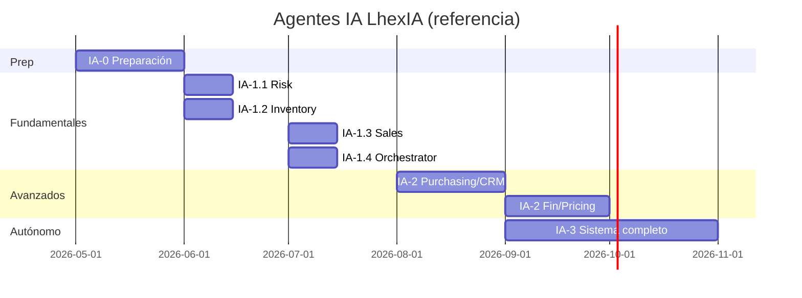

# Plan de trabajo — Agentes IA LhexIA ERP

**Versión:** 1.0  
**Fecha:** Mayo 2026  
**Prefijo de fases:** **IA-** (índice: `../00-alineacion/PLAN_INDICE_LHEXIA.md` §6)  
**Product Owner:** Mario Becerra Olea  
**Implementación:** Cursor (repo) · **Revisión / diseño IA:** Grok  

---

## Objetivo general

Crear un sistema de **agentes IA autónomos** que trabajen **24/7** para optimizar inventario, reducir pérdidas, aumentar ventas y mejorar la toma de decisiones en ferreterías.

**Relación con otros ejes:**

| Eje | Relación |
|-----|----------|
| **SD-1** | No bloquear go-live POS + inventario. Agentes en **producción** solo después de cerrar SD-1. |
| **LX-2** | En producto comercial, “Agentes IA” = este plan (**IA-***). LX-2 apunta aquí. |
| **META-** | Agentes para **desarrollar** LhexIA (arquitectura, QA, docs) — ver `../07-agentes-meta-desarrollo/PLAN_AGENTES_META_v1.md`. **No son** agentes de negocio en ferretería. |
| **MOD-OBS** | Logging y métricas de agentes alinean con observabilidad futura. |

---

## Regla de prioridad

```
SD-1 (operación piso)  →  IA-0 solo prep liviana (docs, scaffold, tools lectura)
SD-1 cerrado           →  IA-1 agentes fundamentales en staging → prod
```

**IA-0** puede avanzar en paralelo **sin** Celery en producción ni escritura automática en BD hasta acuerdo explícito.

---

## Fases del plan

### IA-0 — Preparación (Semana 1 — actual)

**Duración:** 5–7 días  
**Estado:** 🟡 En curso (documentación + diseño)

| # | Entregable | Detalle |
|---|------------|---------|
| 0.1 | Arquitectura técnica | CrewAI (principal) + LangGraph (flujos complejos) |
| 0.2 | Estructura repo | Carpeta `agents/` y módulos base (`tools/`, `crews/`, `memory/`) |
| 0.3 | Tools seguros ERP | Conexión BD con lectura/escritura **controlada** y audit log |
| 0.4 | Proveedor LLM | Groq (velocidad) + Claude 3.5 Sonnet / Opus (razonamiento); Grok para revisión |
| 0.5 | Logging y monitoreo | Traza por agente: prompt, tools, resultado, errores |
| 0.6 | Memoria de negocio | Base histórica: ventas, stock, vales (vector store + SQL) |

**Responsable:** Cursor + Grok (revisión)

**Criterio cierre IA-0:** Repo con `agents/` scaffold, al menos 1 tool de **solo lectura** probada en QA, diseño de dashboard acordado.

---

### IA-1 — Agentes fundamentales (Semanas 2–5)

**Entregable fase:** Dashboard de Agentes + **4 agentes** operando automáticamente (staging → prod).

| Semana | Agente | Objetivo principal | Estado esperado | Impacto |
|--------|--------|-------------------|-----------------|--------|
| 2 | **Risk & Vales Detective** | Vales pendientes, stock negativo, anomalías, posibles fraudes | Funcional + notificaciones WhatsApp | Muy alto |
| 3 | **Inventory Optimizer** | Pronóstico demanda, reórdenes, stock muerto y lento movimiento | Funcional + reportes diarios | Alto |
| 4 | **Sales Analyst & Cross Seller** | Ventas, productos cruzados, clientes VIP, patrones | Funcional | Alto |
| 5 | **Orchestrator Agent (Jefe)** | Coordinar agentes + reporte ejecutivo diario | Funcional | Alto |

**Sub-fases (nomenclatura):**

| ID | Nombre |
|----|--------|
| IA-1.1 | Risk & Vales Detective |
| IA-1.2 | Inventory Optimizer |
| IA-1.3 | Sales Analyst & Cross Seller |
| IA-1.4 | Orchestrator + Dashboard v1 |

---

### IA-2 — Agentes avanzados (Semanas 6–10)

| ID | Agente | Función |
|----|--------|---------|
| IA-2.1 | **Purchasing Agent** | Sugerir y generar órdenes de compra |
| IA-2.2 | **Customer Retention Agent** | Campañas WhatsApp y fidelización |
| IA-2.3 | **Financial Health Agent** | Márgenes, flujo de caja, alertas financieras |
| IA-2.4 | **Pricing Strategist** | Precios dinámicos y promociones |

---

### IA-3 — Sistema autónomo completo (Semanas 11–16)

| # | Capacidad |
|---|-----------|
| 3.1 | Multi-agent crews (equipos coordinados) |
| 3.2 | Human-in-the-loop (aprobación acciones críticas: OC, ajustes stock, precios) |
| 3.3 | Mejora continua (feedback del negocio → memoria) |
| 3.4 | Panel de control Agentes IA (estado, rendimiento, intervenciones) |
| 3.5 | Exportación automática reportes PDF / Excel / WhatsApp |

---

## Stack tecnológico recomendado

| Capa | Tecnología |
|------|------------|
| Framework agentes | **CrewAI** (principal) + **LangGraph** (flujos complejos) |
| LLM | **Groq** (velocidad) + **Claude 3.5 Sonnet** (razonamiento) |
| Vector store | Chroma o Qdrant (memoria semántica) |
| Base de datos | PostgreSQL (actual Neon) |
| Ejecución programada | Celery + Redis (tareas 24/7) |
| Notificaciones | WhatsApp Business API (existente `whatsapp_service`) |
| ERP | Flask monolito + `services/` + tools acotados |

**Integración repo objetivo** (ver `../02-producto-lhexia/ARCHITECTURE.md`):

```
agents/
├── tools/           # wrappers seguros sobre services/ y SQL lectura
├── crews/           # definiciones CrewAI por agente
├── memory/          # Chroma/Qdrant + snapshots SQL
├── schedulers/      # Celery tasks
└── api/             # endpoints dashboard (futuro blueprint)
```

---

## Roadmap resumido (4 meses)

| Mes | Contenido |
|-----|-----------|
| **Mes 1** | IA-0 Preparación + IA-1.1 Risk + IA-1.2 Inventory Optimizer |
| **Mes 2** | IA-1.3 Sales Analyst + IA-1.4 Orchestrator + Dashboard |
| **Mes 3** | IA-2.1 Purchasing + IA-2.2 Customer Retention |
| **Mes 4** | IA-2.3 Financial + IA-2.4 Pricing + IA-3 autonomía |



*Fechas desplazables según cierre **SD-1** y **LX-1**.*

---

## Human-in-the-loop (acciones críticas)

Siempre requieren aprobación humana antes de ejecutar en BD:

- Generación / envío órdenes de compra
- Ajustes masivos de stock o precios
- Anulación de vales o movimientos de caja
- Campañas WhatsApp masivas a clientes

Los agentes en IA-1 operan en modo **sugerencia + alerta**; escritura automática solo tras IA-3 y política por tenant.

---

## Métricas de éxito

| Métrica | Objetivo IA-1 |
|---------|----------------|
| Vales pendientes > N horas detectados | 100% en reporte diario |
| Stock negativo | Alerta < 1 h desde detección |
| SKUs sin movimiento 90d | Lista semanal Inventory Optimizer |
| Reporte ejecutivo | 1 PDF/WhatsApp diario vía Orchestrator |

---

## Documentos relacionados

| Documento | Uso |
|-----------|-----|
| `../00-alineacion/PLAN_INDICE_LHEXIA.md` | Índice maestro todos los ejes |
| `../02-producto-lhexia/PLAN_MAESTRO_LHEXIA.md` | Carril B producto; LX-2 → este plan |
| `../02-producto-lhexia/ARCHITECTURE.md` | Stack y carpeta `agents/` |
| `../02-producto-lhexia/ROADMAP.md` | Calendario alto nivel |
| `services/whatsapp_service.py` | Canal notificaciones |
| `../05-modulos-backlog/roadmap_observabilidad_lhexia_2026_2030.md` | MOD-OBS — métricas agentes |

---

*Documento vivo — actualizar al cerrar IA-0 o al cambiar proveedor LLM / framework.*
