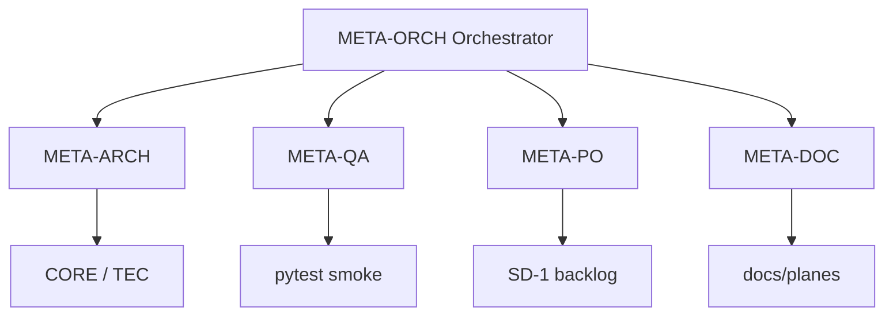

# Plan de trabajo — Agentes Meta (desarrollo de LhexIA)

**Versión:** 1.0  
**Fecha:** Mayo 2026  
**Prefijo de fases:** **META-** (índice: `../00-alineacion/PLAN_INDICE_LHEXIA.md` §7)  
**Product Owner:** Mario Becerra Olea  

---

## Objetivo general

Crear un **equipo virtual de agentes** que apoyen el **desarrollo del producto LhexIA ERP**: arquitectura, calidad de código, documentación, priorización, pruebas, DevOps y gobernanza del proyecto.

**No confundir con el eje IA-*** (`../06-agentes-ia/PLAN_AGENTES_IA_v1.md`):

| Eje | Para quién | Dónde viven | Ejemplo |
|-----|------------|-------------|---------|
| **META-** | Mario + Cursor + Grok **construyendo** el ERP | Prompts, reglas Cursor, skills, subagentes IDE | Chief Architect revisa PR |
| **IA-** | Ferreterías **usando** el ERP en operación | `agents/` + Celery + BD producción | Risk Detective alerta vales |

---

## Catálogo de agentes (priorizado)

| Prioridad | ID | Nombre del agente | Rol principal | Qué hace por el proyecto | Impacto |
|-----------|-----|-------------------|---------------|--------------------------|---------|
| 1 | **META-ARCH** | Chief Architect Agent | Arquitecto senior | Revisa arquitectura, propone mejoras, consistencia estándares SAP, detecta deuda técnica | Muy alto |
| 2 | **META-QA** | Code Quality & Reviewer Agent | Revisor de código | Revisa PRs, bugs, refactor, estándares y seguridad | Muy alto |
| 3 | **META-PO** | Product Owner Agent | Gestor de producto | Prioriza backlog, user stories, requisitos, alinea roadmap | Alto |
| 4 | **META-DOC** | Documentation Agent | Documentador | Docs técnicas, manuales, API, changelogs, índice de planes | Alto |
| 5 | **META-TEST** | Testing & QA Agent | Tester automático | Unit, integration, e2e; sugiere casos (`CASUISTICAS_PRUEBAS`) | Alto |
| 6 | **META-OPS** | DevOps & Deployment Agent | Ingeniero DevOps | Docker, CI/CD, Render/Neon, monitoreo, optimización | Medio-alto |
| 7 | **META-RES** | Research & Competitor Agent | Investigador | Defontana, Clami, SAP B1, tendencias ferretería, stack IA | Medio |
| 8 | **META-MKT** | Marketing & Sales Agent | Comercial | Pitch, landing, propuestas, cotizaciones, contenido | Medio |
| 9 | **META-LEG** | Legal & Compliance Agent | Asesor legal/tributario | SII, FE, contratos, protección de datos Chile | Medio |
| 10 | **META-ORCH** | Orchestrator / Project Manager Agent | Jefe de proyecto | Coordina agentes meta, reporte semanal, alerta riesgos | Alto |

---

## Fases de implementación

### META-0 — Definición (paralelo a SD-1)

**Duración:** 3–5 días  
**Estado:** 🟡 Documentación

| # | Entregable |
|---|------------|
| 0.1 | Este plan + prefijos en `PLAN_INDICE_LHEXIA.md` |
| 0.2 | Mapeo agente → regla Cursor / skill / prompt maestro |
| 0.3 | Convención: cuándo invocar cada agente (checklist en PR y sprint) |

---

### META-1 — Equipo mínimo viable (próximas 3 semanas)

**Objetivo:** 5 agentes operativos en el flujo de desarrollo (Cursor + Grok + Mario).

| ID agente | Fase META-1 | Entregable concreto |
|-----------|-------------|---------------------|
| **META-ARCH** | Semana 1 | Review arquitectura: `core/`, blueprints, deuda `app.py`; informe en `../04-tecnico/ARQUITECTURA_CAPAS.md` |
| **META-QA** | Semana 1 | Checklist review PR (seguridad, transacciones, RBAC); integración con CI smoke |
| **META-DOC** | Semana 2 | Mantener `PLAN_INDICE`, `ERP_MAESTRO`, changelogs por sprint |
| **META-PO** | Semana 2 | Backlog SD/POS/LX priorizado; user stories SD-1.1–1.3 |
| **META-ORCH** | Semana 3 | Reporte semanal: riesgos, pendientes §10 índice, estado ejes |



**Criterio cierre META-1:** Al menos 1 ciclo completo (propuesta Grok → review Architect + QA → doc actualizada → reporte Orchestrator) sin bloquear SD-1.

---

### META-2 — Equipo extendido (semanas 4–8, post SD-1 o en paralelo liviano)

| ID agente | Cuándo | Entregable |
|-----------|--------|------------|
| **META-TEST** | Semana 4–5 | Cobertura rutas críticas; casos nuevos en `tests/` |
| **META-OPS** | Semana 5–6 | Runbook deploy, health checks, `.github/workflows` |
| **META-RES** | Semana 6 | Nota competencia + diferenciadores LhexIA |
| **META-MKT** | Semana 7 | Borrador landing + pitch (LX-3) |
| **META-LEG** | Semana 8 | Checklist FE SII + Ley 19.628 datos |

---

## Mapeo a herramientas actuales

Los agentes meta **no requieren** CrewAI en producción al inicio. Se implementan como:

| Agente | Implementación sugerida |
|--------|-------------------------|
| META-ARCH | Regla Cursor + revisión en PR; subagente `explore` para mapa código |
| META-QA | Skill review + `pytest` en CI; subagente `ci-investigator` |
| META-PO | `PLAN_INDICE_LHEXIA.md` + `CLIENTE_SANTO_DOMINGO.md` |
| META-DOC | Este repo `docs/` + `memory.md` |
| META-ORCH | Reporte en `memory.md` § semanal; coordinación Grok ↔ Cursor |
| META-TEST | `tests/`, markers `pytest.ini`, `CASUISTICAS_PRUEBAS.md` |
| META-OPS | `render.yaml`, `MIGRACION_RENDER_NEON.md`, GitHub Actions |
| META-RES | Doc competencia en `../02-producto-lhexia/` (futuro) |
| META-MKT | `../02-producto-lhexia/PRODUCT_VISION.md`, landing futura |
| META-LEG | `docs/memory.md` §FE, servicios `facturacion_*` |

**Futuro:** prompts CrewAI locales en `agents/meta/` solo si se automatiza el pipeline de desarrollo (opcional, distinto de `agents/` negocio IA-*).

---

## Reglas de prioridad

1. **SD-1** manda sobre cualquier agente meta (no retrasar go-live por “perfect architecture”).
2. **META-ARCH** y **META-QA** deben **aprobar** cambios en flujos críticos (POS, caja, stock, inventario).
3. **META-PO** traduce necesidades de piso (Mario) a fases SD-/POS-.
4. **META-ORCH** no implementa código; consolida estado y riesgos.
5. Separación clara: agentes **META-** = construir producto · agentes **IA-** = valor en ferretería.

---

## Flujo de trabajo recomendado

```
Mario (prioridad) 
    → META-PO (historia / criterio aceptación)
    → Cursor implementa
    → META-QA + META-ARCH (review)
    → META-DOC (actualiza planes)
    → META-ORCH (reporte semanal)
```

Grok: diseño UX, propuestas IA negocio (**IA-***), revisión externa.  
Cursor: código, tests, deploy.  
Mario: “aplícalo”, validación piso, decisión alcance.

---

## Métricas de éxito META-1

| Métrica | Objetivo |
|---------|----------|
| PRs críticos con review checklist | 100% |
| `PLAN_INDICE` actualizado tras cada sprint | Sí |
| Smoke CI verde en `main` antes de deploy | Sí |
| Reporte Orchestrator semanal | 1 por semana |
| Regresiones POS/inventario en piso | 0 críticas post-deploy |

---

## Documentos relacionados

| Documento | Uso |
|-----------|-----|
| `../00-alineacion/PLAN_INDICE_LHEXIA.md` | Índice todos los ejes |
| `../06-agentes-ia/PLAN_AGENTES_IA_v1.md` | Agentes **negocio** (IA-*) |
| `../02-producto-lhexia/PLAN_MAESTRO_LHEXIA.md` | Visión producto |
| `.cursor/rules/lhexia-producto.mdc` | Prioridad SD-1 |
| `.cursor/rules/aprobacion-antes-de-implementar.mdc` | Human-in-the-loop |
| `docs/PROMPT_MAESTRO_ERP.md` | Prompt base desarrollo |

---

*Documento vivo — actualizar al cerrar META-1 o al añadir agentes al pipeline automatizado.*
